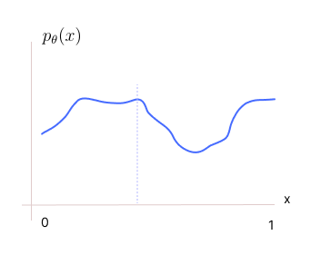

Given a likelihood, how can we produce samples from it? Does the method guarantee the notion of correctness and the notion of efficiency? Any sampling algorithm should have a notion of correctness and notion of efficiency (computational efficiency). 

* TOC
{:toc}

## Introduction

Say our likelihood $p^*$ is uniform over $[0,1]$. How do we produce samples from it? There are standard algorithms coded to generate uniform pseudo-random numbers efficiently. They statistically behave the same way similar to the samples actually produced from the uniform distribution. Such pseudo-random number generators are easy to write for simple distributions.

  
Note

  
Here we will assume that algorithms are provided that generates uniform and Gaussian pseudo-random numbers.

With these algorithms at our discretion, if we have a general energy-based model $p_{\theta}(x)$, how can we produce samples from it?

### Transformation of RVs
If $U$ is a uniform random variable, then we take functions of this random variable, say $f_{\theta}(U) = X$, which is parameterized by $\theta$ (maybe by NNs), to produce new RVs. Here $X$ is the desired random variable with desired distribution. We learn $\theta$ so that we get $X$.

We have standard well-known functions to apply to $U$ to get standard distributions. But if $X$ is a new distribution (not studied yet), we don't know the transformations to apply to $U$. In such cases, figuring out a method to find $f_{\theta}$ is one way of solving the sampling problem. This is exactly what GANs do.

### Approximation
We can approximate $p_{\theta}(x)$ by a Gaussian mixture model. There is an important result: Given any density function, we can always approximate it using a Gaussian mixture model with enough number of components. Let's assume

$$
p_{\theta}(x) \approx \sum_{i=1}^M \lambda_i p_i(x)
$$

where $p_i(x)$ are Gaussians. Then, how can we sample from this Gaussian mixture model?

Assume $i$ is from a random variable $y$. That is, imagine a discrete random variable $y$ whose values are $i=1, \dots, M$ with probabilities $\lambda_1, \dots, \lambda_M$. Then, we can write the above expression as:

$$
p_{\theta}(x) \approx \sum_{y} p(y) \, p(x \, | \, y)
$$

When $y=i$, then $p(x \, | \, y) = p_i(x)$. The first term is Multinoulli distributed and the second term is Gaussian. We generate a $y$ first from $p(y)$, and then generate a sample from the corresponding Gaussian component. This gives us a single sample $x$ from this Gaussian mixture model. We repeat this several times, throw away $y$, and store only $x$ to get samples from the marginal over $X$. These samples follow $p_{\theta}(x)$ distribution.

Say $p_{\theta}(x)$ is approximated by a GMM with two Gaussian components with probability 0.1 and 0.9 respectively. That is, we should pick the first component with 0.1 probability and the second one with 0.9 probability. Therefore, $Y$ is a Bernoulli RV with values 1 and 2.

To generate samples from such a Bernoulli distribution, we first sample a number between 0 and 1 from the uniform distribution. If this number is less than 0.1, then we say $y=1$, otherwise $y=2$. A similar thing can be done for Multinoulli too. After selecting a Gaussian component, we then use the pseudo-random generator for the chosen Gaussian (with a specific mean and covariance) to get a sample $x$.

A uniform and a Gaussian sampler are used to create a sampler for the Gaussian mixture model.

This idea of approximating the model by a proxy distribution (for e.g., GMM) is used in variational inference.

**Practical Issues with this approach:**

* Sampling from a very high-dimensional Gaussian is always a problem.
* Even in single dimension case, if the given density or likelihood function is very complex, then we require a GMM with a lot of Gaussian components. In such cases, the multinoulli RV takes so many values with almost equal probabilities for most of the components. Therefore, we end up picking the high likely components more often, and the less likely ones may never get picked at all (in finite sample case). So, we loose diversity in samples.

### Rejection Sampling
In Rejection sampling, we are generalizing the method we used to sample a Bernoulli or Multinoulli RV to any general distribution $p_{\theta}(x)$.

Say we have oracle access to $p_{\theta}(x)$, that is, we have a piece code that takes $x$ as input and gives the likelihood $p_{\theta}(x)$ for the provided $x$. Using this and a uniform sampler, can we come up with a sampler that samples from $p_{\theta}(x)$?

Assume that the random variable $X$ which is distributed as $p_{\theta}(x)$ lies between 0 and 1.

Suppose $p_{\theta}(x)$ is a discrete distribution. The likelihood of seeing an $x$ in our generation process is $p_{\theta}(x)$: intuitively if we keep sampling points from this distribution $p_{\theta}(x)$, the point $x$ is likely to be seen $p_{\theta}(x)$ fraction of times.

If we now pick a random number (according to uniform distribution) between 0 and 1, say 0.6. We look at $p_{\theta}(0.6) = 0.5$. This means that when we generate samples from $p_{\theta}$, we should see $x=0.6$, $0.5$ fraction times. We reject this sample with probability 0.5 and select with probability 0.5. That is, as a second step, we sample a number between 0 and 1 uniformly. If the chosen number is below 0.5, we accept it, else we reject it.

Now, the probability of picking $x=0.6$ is the probability of choosing a number less than 0.5 (i.e., $p_{\theta}(0.6) = 0.5$) from a uniform distribution * probability of choosing 0.6 from a uniform distribution.

We repeat this process and our samples will be as per the target distribution $p_{\theta}(x)$.

<figure markdown="0" class="figure zoomable">
<figcaption>
  <strong>Figure 1.</strong> Distribution of $p_{\theta}(x)$
  </figcaption>
</figure>

Suppose $p_{\theta}(x)$ is an un-normalized density. Say $p_{\theta}(x)=0.6$. An unnormalized density value (e.g., 0.6) is not a probability or likelihood; it only has meaning relative to other values, indicating how strongly the model favors one region of the space over another. But the idea is the same (refer to Rejection sampling in Bayesian Analysis).

### Qualities of a Sampler:

* The sampler should be computational efficient. It should not take a lot of time to produce samples.

* The sampler shouldn't be restrictive in terms of the likelihood we are sampling from. It should work for sampling from any likelihoods.

* We know that

  $$
  p_{\theta}(x) = \frac{e^{-f_\theta(x)}}{Z(\theta)}
  $$

  Given the parameters $\theta$, we may sometime only know the numerator, and it may be difficult to compute the denominator. We typically won't have a closed form expression for $Z$. So, in most of the cases, the likelihood is available only up to a normalization constant.

  Therefore, any sampling algorithm should not use $Z$.
