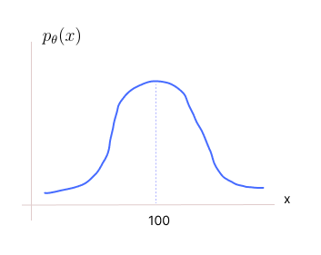
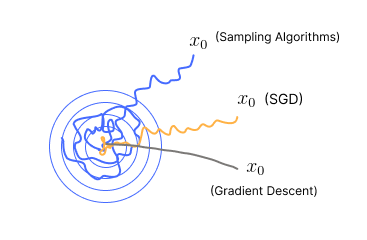
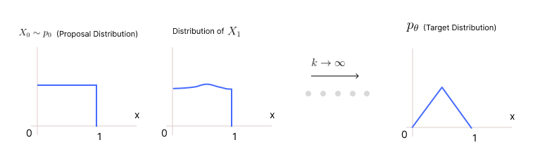

* TOC
{:toc}

## Introduction
The key inefficiency in rejection sampling is exposed when the target likelihood is quite different from the proposal likelihood. This is because most proposal samples will be rejected. One way efficiency can be brought in is when instead of rejecting low likelihood samples, the (local) gradient information is used to ascend the log-likelihood hill. This way the subsequent samples will have higher likelihood and better chance for acceptance.

Say we are given a likelihood $p_{\theta}(x)$ from which we need to sample.

<figure markdown="0" class="figure zoomable">
<figcaption>
  <strong>Figure 1.</strong> A Gaussian likelihood
  </figcaption>
</figure>

If we were to produce samples from this distribution, then it is better to produce samples that are of higher likelihood in that distribution. So, we have to be near 100 because it has a higher likelihood in the target distribution. That is, there is a higher chance of picking a valid sample when our sample is near 100.

Let's try to build some procedures for travelling towards the peak (modes) of the given likelihood. We already know standard algorithms such as gradient descent that try to go to the modes of the likelihoods to find the minimizer or maximizer of a function.

We will pick a random number between 0 and 1, say $x_0$. The likelihood of $x_0$, according to the target distribution, that is $p_{\theta}(x_0)$ might be low. We then make a gradient step:

$$
x_1 := x_0 + \nabla \log p_{\theta}(x_0) \tag{1}
$$

This gradient is with respect to $x$. But when we take the gradient of the log-likelihood in MLE, the gradient is respect to $\theta$. Both are different. Here we are trying to find those $x$ that have higher likelihood.

* The gradient $\nabla_x \log p_{\theta}(x_0)$ is known as the **Stein Score**. 
* The gradient $\nabla_{\theta} \log p_{\theta}(x)$ is known as the **Fischer's Score**.

In the computation of the Stein score, the partition function $Z(\theta)$ is not involved.

$$
\begin{align*}
\nabla_x \log p_{\theta}(x_0) & = \nabla_x \log \frac{e^{-f_{\theta}(x)}}{Z(\theta)} \\
& = - \nabla_x f_{\theta}(x) - \nabla_x \log Z(\theta) \\
& = - \nabla_x f_{\theta}(x)
\end{align*}
$$

Since the second term is independent of $x$, it will be 0. So, we are left only with a gradient of the energy, which is force. In physical meaning, the Stein score is just a force on the particles located at $x$.

Equation <a href="#eq:eq1">(1)</a> will make us move in the direction such that the function value will be increasing. NOTE: If $x_0$ is very far from 100, then $\nabla \log p_{\theta}(x_0)$ will be close to 0. But if it is at some reasonable distance from 100, then we get meaningful direction to move. 

If we keep taking just the Stein score step, we will probably reach $x$ that has the highest likelihood (the peak of the distribution). At that $x$, the gradient will be 0. Then there won't be any movement; we get stuck at a local maxima. But our objective is not to do optimization; our goal is not to reach the peaks exactly. We want to explore occasionally and visit low likelihood regions as well. The gradient descent algorithms are good for optimization, but not good for sampling.

One way to achieve this is by adding a noise component (random force). So, we keep moving up the hill, but randomly we might go elsewhere as well with this small perturbation (e.g., Gaussian noise). At iteration $k$

$$
x_{k+1} := x_k + \nabla \log p_{\theta}(x_k) + n_k \tag{2}
$$

The noise $n_k$ doesn't need to be additive. It is taken to be additive for simplification. The noise component makes it a random walk. The gradient component is purely a planned walk, it steadily takes us up the hill. We are combining these two (i.e., applying steady force and random force on the particles) and have to balance them properly. We must assign the weightages accordingly. By controlling their weightages, we can control how the samples $x$ evolve. The hope is that the limiting likelihood of $x_k$ as $k$ tends to infinity will be the target likelihood $p_{\theta}(x)$.

Doing just equation <a href="#eq:eq2">(2)</a> with some arbitrary weightages for the gradient and the noise terms behaves like Stochastic gradient descent. Because typically, we will be assigning weightages of the same order such as $(s, s), (s, \frac{s}{100}), (s, 100s)$ etc. These guarantees the convergence to the modes of the distribution. So, the arbitrary combination of the gradient and noise terms doesn't work for sampling. There is a special combination:

$$
x_{k+1} := x_k + s \nabla \log p_{\theta}(x_k) + \sqrt{2s}\, n_k \tag{3}
$$

Where $s$ is a small number (learning rate) and $\sqrt{2s}$ will be a large number. That is, the magnitude of the noise term should be an order of magnitude times more than the magnitude of the Stein's score such as $(s, \sqrt{s})$. So, here we are adding more noise than normal SGD.

We can show that on continuing this process, after a lot of iterations, the sample $x_k$ will a very faithful sample from the target distribution $p_{\theta}$. The distribution of the samples $x_k$ at $k$ very large, will actually be $p_{\theta}$.

In general, the algorithms based on this idea have the formula:

$$
x_{k+1} := x_k + s \cdot v_k(x_k) + \sqrt{s} \, \sigma_k(x_k) n_k
$$

where 

* $s$ is the step size

* $v_k$ is a direction like Stein score which is a deterministic direction. In equation <a href="#eq:eq3">(3)</a>, $v_k = \nabla \log p_{\theta}(x_k)$. This is deterministic in the sense, it doesn't depend on iteration $k$; given the likelihood and a data point, the Stein score can be computed. It depends on $k$ only through $x_k$. Physically this quantity denotes velocity (force to be exact, but we use the notion of velocity). If $\mathbf{x}_k \in \mathbb{R}^d$, then $v_k(\mathbf{x}_k) \in \mathbb{R}^d$ which represents a **velocity field**, assigning a direction and magnitude of motion at every point in space.

* Instead of $\sqrt{s}$, we can also use some other function of $s$ that are of higher order of magnitude than $s$. But $\sqrt{s}$ is more common in practice.

* Instead of $\sqrt{2}$, we can have some complicated function of $x_k$ denoted by $\sigma_k(x_k)$. The quantity $\sigma_k(x_k)$ controls the placement of noise.

* $x_0$ can be from some proposal distribution (probably from uniform or Gaussian), $x_0 \sim p_0$. This will be a likelihood from which we already know how to sample.

* $n_1, n_2, \dots$ are all independently chosen.

We are starting with a random variable, and in each iteration we get a random variable. So,

$$
\begin{align*}
X_0 & \sim p_0 \\
X_{k+1} & := X_k + s \cdot v_k(X_k) + \sqrt{s} \, \sigma_k(X_k) \, N_k \tag{4}
\end{align*}
$$

This equation is known as Stochastic Equation. In a single trial, i.e., when we unfold this algorithm once, we get:

<figure markdown="0" class="figure zoomable">
<figcaption>
  <strong>Figure 2.</strong> A Sampling Trajectory
  </figcaption>
</figure>

$x_0, x_1, \dots, x_k, \dots$ forms one trajectory. This traces a piece-wise linear path. Physically consider this as a (single) particle taking these positions and flowing in this path. Sampling algorithms will wander around the mode according to the likelihood. But SGD will wander just near the mode.

We can get several trajectories by unfolding this algorithm multiple times. Then,

$$
X_0, X_1, \dots, X_k, \dots
$$

is a chain of distribution of $X$ over time. At each time step, there is a distribution of $X$. This is in fact a random process in discrete time. It gives us the distribution of the trajectories $x_0, x_1, \dots, x_k, \dots$.

To compute the joint $p(x_0, x_1, \dots, )$: We know that

$$
p(x_0, x_1, \dots, ) = p(x_0) \, p(x_1 \, | \, x_0) \, p(x_2 \, | \, x_1, x_0), \dots
$$

But in our process, we can observe that $x_1$ is generated from $x_0$, $x_2$ is generated from $x_1$, etc. Given $x_1$, it doesn't matter to know $x_0$ to generate $x_2$. Such sequence of random variables where the joint factorizes into terms which are based only on the previous random variable are called **Markov chains**. In equation <a href="#eq:eq4">(4)</a>, we are essentially defining a Markov chain.

After choosing $v$ and $\sigma$ properly, we run the iterations for a large $k$, and after that, the $x_k$ we get can be considered as the sample from the target distribution. The hope is that the limiting likelihood of thus constructed Markov chain is indeed the target. If this is the case, in practice, we can initialize randomly, unfold the Markov chain for enough number of steps (so that convergence to target is nearly achieved) to obtain a sample from the target. The number of steps unfolded to obtain such a sample is called as the burn-in. Lower the burn-in, better the sampler. Such methods that construct Markov chains and sample from their limiting likelihood are known as MCMC (Markov Chain Monte Carlo) methods.

We start considering $x_k$ as valid samples once the chain reaches the steady state or the limiting distribution. That is, after a large $k$, the distributions of $X_{k+1}, X_{k+2}, \dots$ remain the same across time.

<figure markdown="0" class="figure zoomable">
<figcaption>
  <strong>Figure 3.</strong> Distribution of a Markov Chain
  </figcaption>
</figure>

(assume the proposal and the target distribution are between 0 and 1)

Therefore, we can follow this procedure, generate a trajectory by unfolding equation <a href="#eq:eq4">(4)</a>. For practical purpose, let's assume $k=1000$, then $x_{1001}, x_{1002}, \dots$ will all be from the same target distribution, $p_{\theta}$. They all are identically distributed, but technically we also need independent samples. Here the sample $x_{1002}$ is dependent on its previous sample. So, we don't consider consecutive samples as the valid ones. We can either start a new chain to get the next sample or leave 50 samples (till $x_{1051}$) and consider $x_{1052}$ as the next sample. After 50 iterations, the dependence of $x_{1052}$ on $x_{1001}$ will become very low, so we believe $x_{1052}$ to be independent of $x_{1001}$.

A clever choice of $v_k$ and $\sigma_k$ will make the chain reach the desired target distribution. There is no unique choice of $v_k$ and $\sigma_k$ to get a desired steady state distribution. There can be many of such choices leading to the same steady state distribution.

In equation <a href="#eq:eq4">(4)</a>, if we consider $v_k$ the Stein score and $\sigma_k = \sqrt{2}$, then the algorithm is known as **Langevin Diffusion**.

