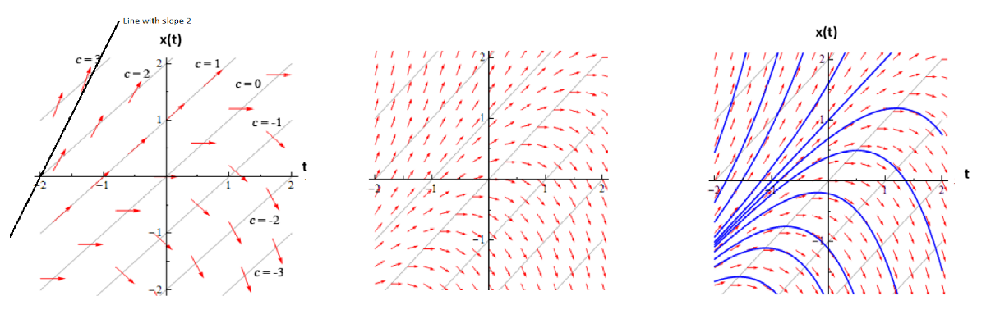
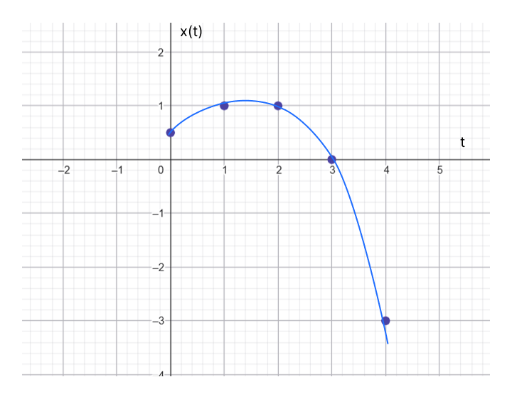
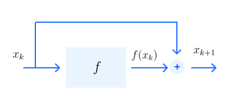
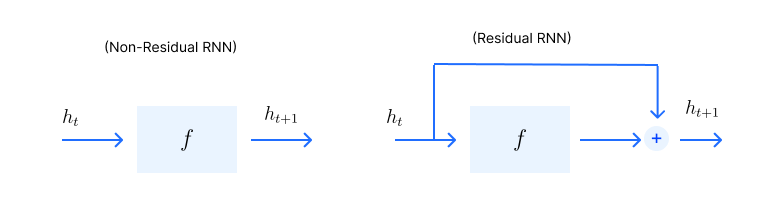
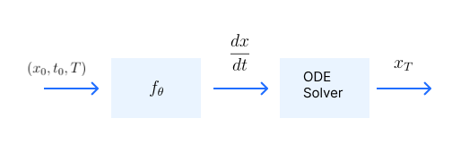

A really powerful modern ML architecture for modelling ordinary differential equation

* TOC
{:toc}

## Direction Field for ODE
In physics and calculus, many systems are described by a continuous differential equation:

$$
\frac{dx}{dt} = f(x(t), t)
$$

This equation tells us how a state $x$ changes over an infinitesimal slice of time $t$. Solving this ODE or integrating the ODE means "finding the function $x(t)$ whose derivative satisfies the equation". It involves reversing the process of differentiation, moving from an equation describing a rate of change (derivatives) to a function that defines the actual value of a quantity.

In the world of physics, think of it like $x$ the displacement, $t$ time step, and $f$ is the velocity. We know displacement = velocity x time. The rate of change of position over time is the velocity. Suppose let the function be $f(x(t), t) = x(t)-t$. Then, the equation is

$$
\frac{dx}{dt} = x(t)- t
$$

Direction field (or slope field) is a graphical representation, used to visualize solutions to a first-order ODE. We assign a vector $(1, \frac{dx}{dt})$ to each point $(x,t)$, representing the tangent slope or velocity of solutions at that point. Each arrow shows the direction in which the solution curve would move if it passed through that point. To sketch the direction fields, we need to find where the derivative will be constant: $c = x(t)- t$.

<figure markdown="0" class="figure zoomable">
<figcaption>
  <strong>Figure 1.</strong> Direction fields for the given ODE
  </figcaption>
</figure>

The arrows are the velocities for each point $x$ for different time steps (say $t=1,2,\dots$). Given these velocities, we need to find the particle positions (trajectory) across time. For any given condition, we can get the solution curve for this ODE. The trajectory of the particle should be tangent to these arrows at every point.

## Numerical ODE Solver
The Forward Euler method is the simplest numerical way to find an approximate solution to the ODE above. If we want to find the next state $x(t + \Delta t)$, we approximate it by taking the current state and adding the rate of change multiplied by the step size $\Delta t$:

$$
x(t + \Delta t) \approx x(t) + \Delta t \cdot f(x(t), t)
$$

Assume $\Delta t=1$ and the initial condition $x(0)=0.5$. Then,

* $x(1) = x(0) + x(0)-0 = 1$
* $x(2) = x(1) + x(1)-1 = 1$
* $x(3) = x(2) + x(2)-2 = 0$
* $x(4) = x(3) + x(3)-3 = -3$

<figure markdown="0" class="figure zoomable">
<figcaption>
  <strong>Figure 2.</strong> Discretized solution to the given ODE
  </figcaption>
</figure>

To find the position at any time $t$, we sum the velocity function:

$$
x(t) = x(0) + \sum_{\tau=0}^t f(x(\tau), \tau) \cdot \Delta t
$$

This is discretized version of integration, using the Euler method.

### Comparison with ResNet
The fundamental building block of a ResNet:

$$
x_{k+1} = x_k + f_{\theta}(x_k, k)
$$

Assume a neural network that takes $x_k$ and $k$ and gives $f(x_k, k)$. If we set the step size $\Delta t = 1$, the ResNet equation becomes identical to the Euler integrator. This is actually the Euler numerical integrator for the given ODE where we take a time step of 1 and integrate the velocity function from time step 0 to $T$.

<figure markdown="0" class="figure zoomable">
<figcaption>
  <strong>Figure 3.</strong> A ResNet Block
  </figcaption>
</figure>

* $x_k$: The input.
* $f_{\theta}(x_k, k)$: The neural network with parameters $\theta$.
* $x_{k+1}$: The output of the network (the next state).

The idea of ResNet is that if we want to model the relationship between $x_k$ and $x_{k+1}$, we can actually copy the input directly over and only model the difference between the input $x_k$ and the output $x_{k+1}$. We are modeling the residual with our neural network, thus the name Residual Network. The residual the neural network learns can be thought of as the vector field of an ODE.

We start with the initial condition $x_0=0$, feed this to the neural network to get $x_1$, feed this again to get $x_2$, etc. To get to $x_5$, we need to repeat this block 5 times. Running five blocks is equivalent to integrating the velocity function from $t=0$ to $t=5$.

* Step 1: $x_1 = x_0 + f_{\theta}(x_0, 0)$
* Step 2: $x_2 = x_1 + f_{\theta}(x_1, 1)$
* Step 3: $x_3 = x_2 + f_{\theta}(x_2, 2)$
* Step 4: $x_4 = x_3 + f_{\theta}(x_3, 3)$
* Step 5: $x_5 = x_4 + f_{\theta}(x_4, 4)$

We can use the same parameters (weights and biases) for all the steps. This is more like a traditional physics simulation where the rules of motion ($f$) don't change as time passes.

Why this "Repeating" is powerful?

In a traditional Deep Network (without skip connections), $x_5$ would be $f(f(f(f(f(x_0)))))$. If any of those functions "break" the data or vanish the gradient, the whole chain fails. Because ResNet uses the Euler approach, $x_5$ is the original $x_0$ plus the sum of all changes. This makes the network much more stable because the identity (the original data) is preserved.

## Comparison with RNNs

A vanilla RNN is defined as

$$
\begin{align*}
h_{t+1} & = \phi(\mathbf{W}_h h_t + \mathbf{W}_x x_{t+1} + b) \\
y_{t+1} & = \mathbf{W}_y h_{t+1} + c \\
\end{align*}
$$

where $h_t$ is the hidden state, $x_t$ is the input at time $t$, $\phi(\cdot)$ is the activation function. In RNNs, weights are shared across all time steps. If there is no input sequence (autonomous RNN) is

$$
\begin{align*}
h_{t+1} & = \phi(\mathbf{W}_h h_t + b) \\
h_{t+1} & = f(h_t)
\end{align*}
$$

This is a non-residual RNN. On making a residual (skip) connection, we get

$$
h_{t+1} = h_t + f(h_t)
$$

<figure markdown="0" class="figure zoomable">
<figcaption>
  <strong>Figure 1.</strong> A Residual RNN Block
  </figcaption>
</figure>

An RNN without input is a ResNet with shared weights across layers (by default, ResNet has different parameters per layer). This is the form typically compared to flow ODEs. A discretized flow ODE has exactly the same mathematical form as a recurrent neural network update. But the (continuous) flow ODE is:

$$
\frac{dx_t}{dt} =  v_t(x_t)
$$

* The unfolding steps above are discrete unfolding of the particle flow ODE, i.e., we looked at the discrete-time approximation of the ODE. The particle ODE (which is the continuous version) has these unfoldings for every $t$. We can think of this as similar to RNNs (with skip connection) but with continuous set of layers. Such RNNs are known as Neural ODEs.

* Euler integrator is a very quick and dirty way to solve ODEs. There are many more advanced numerical integrators (like Runge-Kutta methods) that can provide better accuracy and stability.

These two aspects lead us to the idea of Neural ODEs. Instead of modeling the discretized version of the ODE, we can model the differential equation itself. That is, we can model the actual vector field $v$ using a neural network, and then use a sophisticated ODE solver to compute the next state.

## Neural ODE
The idea of a neural ODE is that with our neural network $f$, we are going to model the continuous-time differential equation itself.

$$
\frac{dx(t)}{dt} = f_{\theta}(x(t), t)
$$

<figure markdown="0" class="figure zoomable">
<figcaption>
  <strong>Figure 4.</strong> Neural ODE Block
  </figcaption>
</figure>

Here we model $f$ with a deep neural network. The goal during training is to learn the vector field $f_{\theta}$ by adjusting the parameters $\theta$ of the neural network so that the solution $x(t)$ (the resulting flow) has desired properties. The training process involves optimizing the parameters $\theta$ to minimize a loss function that measures how well the final distribution matches the data distribution. After large $t$, the sample's distribution $x(t) \sim p_t$ should match the data distribution $p_{data}$.

Once it is trained, we have learned the parameters $\theta$ of a vector field. That is, it has learned the vector field from the given data. Then, if we pass $(x(0),0)$, it outputs

$$
f_{\theta}(x(0), 0) = \frac{dx(t)}{dt} \Big|_{t=0}
$$

i.e. the instantaneous velocity (direction field) at time $t=0$. $f_{\theta}$ only tells us how to move locally. To obtain the state at a later time $T$, we must integrate the ODE:

$$
x(T) = x(0) + \int_0^T f_{\theta}(x(t), t) dt
$$

The integral is computed using a sophisticated ODE solver, which numerically approximates the solution by taking small steps and evaluating the function $f_{\theta}$ at each step. This allows us to obtain a continuous trajectory of $x(t)$ over time.