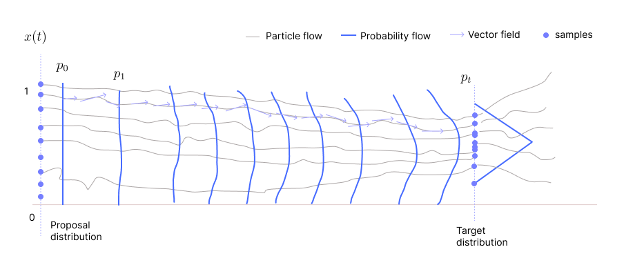
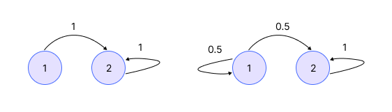
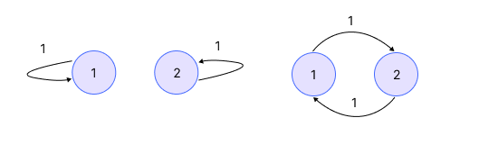

What are the consequences of choosing a wrong $v_t$? We have to choose $v_t$ carefully.

* TOC
{:toc}

## Particle and Probability Flow
Assume the distribution is one-dimensional. Each particle $x_t$ moves according to the particle flow ODE defined by the velocity field $v_t(x_t)$. As these are random particles, there is a distribution associated with these particles at each time $t$. The distribution of these particles evolves according to the probability flow ODE. The figure below illustrates this concept:

<figure markdown="0" class="figure zoomable">
<figcaption>
  <strong>Figure 1.</strong> Particle and Probability Flow Example
  </figcaption>
</figure>

For every particle flow, there is an associated probability flow. Similarly, for every probability flow, there is an associated particle flow.

* Given the probability flow $p_t$, we can figure out $v_t$ from the probability ODE equation. Then substitute it in the particle flow ODE equation to get the particle flow.

* Given the particle flow $x_t$, we can figure out $v_t$ from the particle flow ODE. Then substitute it in the probability flow ODE to get the probability flow.

Our assumption is that as $t \to \infty$, we get a limiting distribution. And our hope is that this limiting distribution should be our target distribution.

  
Note

  
Limiting distribution: A distribution that you converge to regardless of where you start. Every limiting distribution is stationary, but not every stationary distribution is a limiting distribution.

But once $v_t$ is fixed (known), each particle flow starting at $x_0$ can be computed deterministically. As a consequence, the probability flow can also be determined by solving the ODE equations. That is, for any given $t$, we know where the particle will be, $x(t)$, and what will be the probability distribution $p_t$. For each sample in the proposal distribution, we know where it will reach. That is, every $p_t$ will be a function of $p_0$ because every $x_t$ is a function of $x_0$. So, where we reach depends on where we start

This is in contrast with our objective about sampling. Our goal is that regardless of the distribution we start with, we should end up with the target distribution as time progresses. This implies, $p_t$ (after large $t$) should be independent of $p_0$. But this is not the case here because vector field $v_t$ is a fixed function. Therefore, there cannot be a limiting distribution to a random process if the distribution at every $t$ depends on the initial starting point.

If this is the case, that is when we know $p_0, p_1, \dots, p_t, \dots$ deterministically, then it is not necessary to look at the distribution at $t=\infty$ (which will also be a function of $p_0$). Hence, if $v_t$ were to be fixed, one rather deals with a finite time horizon, say $[0,1]$. And then ask how to choose $v_t, t\in [0,1]$ such that $X_1 \sim p^*$, i.e., $p_1 = p^*$. We start with an initial distribution, transform this distribution by going through the velocity field for finite time $T$, and we will reach some distribution. The velocity field $v_t$ is designed such that the distribution we reach after this $T$ is our target distribution.

  
NOTE

  
Later, we pose this problem as learning $v_t$. We choose $v_t$ such that the probability distribution becomes our target distribution after some $t$. Here we are assuming that $v_t$ is given or chosen carefully. 

## Stein Score as the Velocity Field
Now that we exactly know how the particles (samples) and probability (marginal likelihoods) evolve, we naturally ask which choices for the flow velocity, $v_t$, lead to samplers from a given target likelihood. Let's first try our intuitive velocity, the Stein score.

$$
v_t(x) = \nabla_x \log (p^*(x))
$$

We know that this velocity field takes us directly to the mode of the likelihood. So, we already know this may not work unless some perturbations are introduced. But we wanted to see how the formulae we derived convey this. The probability flow ODE is:

$$
\begin{align*}
\frac{\partial p_t(x)}{\partial t} & = - \nabla \cdot (p_t(x) v_{\theta}(x,t)) \\
\frac{\partial p_t(x)}{\partial t} & = - \nabla \cdot (p_t(x) \nabla_x \log (p^*(x))) \\
\end{align*}
$$

As $v_t$ is fixed here, there won't be any limiting distribution to this Stein score based flow. That is, the process will not converge to our target $p^*$ regardless of the proposal distribution. But let's see the conditions under which our target $p^*$ will at least be a stationary distribution to this flow.

Let $q$ be some probability distribution. $q$ is a stationary likelihood if and only if $q$ satisfies the continuity equation with 0 in the LHS:

$$
-\nabla \cdot (q \nabla \log p^*(x)) = 0
$$

  
NOTE

  
A probability distribution $q$ is called stationary if, when used as the initial distribution, the distribution of the process remains $q$ at all times. That is, if $p_0=q$, then $p_t=q \,\, \forall t$.

For that stationary distribution $q$ to be $p^*$, then we should have

$$
\begin{align*}
\iff & \nabla \cdot (p^* \, \nabla \log p^*(x)) = 0 \\
\iff & \nabla \cdot \left(p^* \, \frac{1}{p^*} \nabla p^* \right) = 0 \\
\iff & \nabla \cdot \nabla p^* = 0 \\
\iff & \Delta p^* = 0
\end{align*}
$$

If $x$ is $n-$ dimensional vector, then

$$
\nabla \cdot \nabla p^* = \begin{bmatrix}
\frac{\partial }{\partial x_1} \\
\frac{\partial }{\partial x_2} \\
\vdots \\
\frac{\partial }{\partial x_n} \\
\end{bmatrix} \cdot \begin{bmatrix}
\frac{\partial p^*(\mathbf{x})}{\partial x_1} \\
\frac{\partial p^*(\mathbf{x})}{\partial x_2} \\
\vdots \\
\frac{\partial p^*(\mathbf{x})}{\partial x_n} \\
\end{bmatrix} = \sum_{i=1}^n
\frac{\partial^2 p^*(\mathbf{x})}{\partial x_i^2} 
 = \Delta p^* = \text{trace}(\nabla^2 p^*(\mathbf{x}))
$$

$\Delta p^*(x) = 0$ is read as the Laplacian of $p^*$ at $x$ is 0. The Laplacian of a function $p^*$ is also the trace of the Hessian of the function $p^*$. This shows that $p^*(x)$ will be a stationary likelihood to this Markov process if and only if $\Delta p^*=0$.

  
Lemma

  
Moreover, suppose $\Delta p^*=0$ and another condition on $p^*$, then we can also show that the Stein score based flow ODE defines a process whose **unique** stationary likelihood is $p^*$, that is, the process will have only one stationary likelihood and that will be $p^*$. The proof is given in the notes.

* If $\Delta p^*\ne0$, then $p^*$ is not a stationary distribution to the process, then it can never be a limiting distribution of the process.

* If $\Delta p^*=0$ and <another condition on $p^*$>, then $p^*$ is a unique stationary distribution to the process (and as we know from earlier that the process has no limiting distribution).

## Stationary and Limiting Distributions
Consider a simple Markov chain. Start with any state distribution. And regardless of where we start, after certain time steps, we end up at 2 and stay at 2 ever after. This is an example of a Markov chain where limiting distribution exists.

<figure markdown="0" class="figure zoomable">
<figcaption>
  <strong>Figure 2.</strong> Markov chain examples
  </figcaption>
</figure>

Suppose we start with an initial distribution $p_0 = [1,0]$. The transition probability matrix $\mathbf{T} = \begin{bmatrix} 0.5 & 0.5 \\ 0 & 1 \end{bmatrix}$ for the second Markov chain. 

* $p_1 = p_0 \cdot \mathbf{T} = [0.5, 0.5]$.
* $p_2 = p_1 \cdot \mathbf{T} = [0.25, 0.75]$, and so on.

As $t\to \infty$, $p_t$ will become $[0,1]$. Thus, the limiting distribution for both the chains in the image is $p_T=[0,1]$. And every limiting distribution is also a stationary distribution.

<figure markdown="0" class="figure zoomable">
<figcaption>
  <strong>Figure 3.</strong> Markov chain examples
  </figcaption>
</figure>

* First Markov chain: where we reach finally is a function of where we start. Thus, there is no limiting distribution to this chain. But the chain has two stationary distributions $[0,1]$ and $[1,0]$.

* Second Markov chain: If we start with $p_0=[1,0]$ or $[0,1]$, after each step, the distribution is either $[1,0]$ or $[0,1]$. This sequence oscillates forever and does not converge. Thus, there is no limiting distribution to this chain. But if we start with $p_0=[0.5,0.5]$, with given $\mathbf{T} = \begin{bmatrix} 0 & 1 \\ 1 & 0 \end{bmatrix}$, then at every time step, the distribution remains the same. The chain has a unique stationary distribution but no limiting distribution.

### Example 01
Let $p^*(x)=2x, x\in (0,1)$. Then, $v_t(x)= \nabla \log 2x = \frac{1}{x}, x\in (0,1)$.

$$
\begin{align*}
\frac{dx_t}{dt} & = \frac{1}{x_t} && \forall \, t \text{ such that } x_t \in (0,1)\\
x_t dx_t & = dt \\
\end{align*}
$$

Imagine a graph with $t$ in the x-axis (infinite range $t$) and $x(t)$ in the y-axis (with the range $(0,1)$). On integrating it on both the sides

$$
\begin{align*}
\int_{x_0}^{x_T} x_t dx_t & = T \hspace{1cm} \forall \, t \leq T \text{ such that } x_t \in (0,1) \\
\frac{x_T^2}{2} - \frac{x_0^2}{2} & = T \\
x_T^2 & = x_0^2 + 2T \\
x_T & = \sqrt{x_0^2 + 2T}
\end{align*}
$$

Since $x_t \in (0,1)$, we take the positive root only. Thus, $x_t = \sqrt{x_0^2 + 2t}$. To remain in the interval $(0,1)$, we must have

$$
\begin{align*}
0 < x_0^2 + 2t < 1 \iff \frac{-x_0^2}{2} < t < \frac{1-x_0^2}{2}
\end{align*}
$$

So, the solution to the ODE is $x_t = \sqrt{x_0^2 + 2t}$ where $t \in \left(0, \frac{1-x_0^2}{2} \right)$.

* For large $t$, $x_t \approx \sqrt{2t}$ as $x_0 \leq 1$. As $t \to \infty$, the $x_t$ blows up. Thus, there is no limiting distribution.
* For small $t$, the position $x_t$ depends on $x_0$. Correspondingly, $p_t$ depends on $p_0$.

Here $\Delta p^* = 0$ and other condition is also satisfied, then from the lemma we can say that $p^*$ is a unique stationary distribution to the process. That is, if the flow starts exactly at $p^*$, it stays at $p^*$. But if we start with any other distribution, the flow diverges and doesn't converge to $p^*$. Thus, the process has a unique stationary distribution but no limiting distribution.

### Example 02
Let $p^*(x)=1, x\in (0,1)$ (uniform likelihood). Then, $v_t(x)= \nabla \log 1 = 0, x\in (0,1)$, i.e., the Stein score is 0.

$$
\frac{dx_t}{dt} = 0
$$

$x_t$ doesn't change with time. That is the particles don't move at all from their initial position for all $t\geq 0$. Therefore, any distribution we start with will be a stationary distribution to this process. And the process has no limiting distribution. The lemma doesn't apply to this $p^*$ as it is a constant probability distribution.

