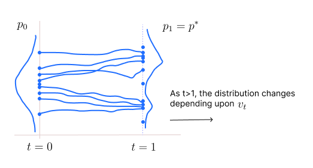
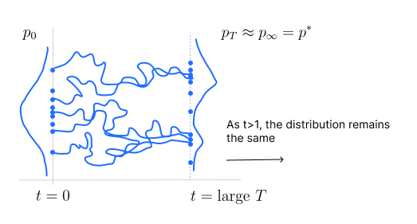

* TOC
{:toc}

## Problem Statement
Consider the case where there is no random perturbation. When $v_t$ is designed (or learned) and fixed, the particle follows a deterministic path. Thus, there is no concept of limiting distribution. So, we look at achieving the target distribution in finite time steps. 

Suppose we start with $p_0$ at $t=0$ and we reach $p_1$ at $t=1$. We want $p_1$ to be our target distribution. We want to learn $v_t$ such that $p_1=p^*$ is achieved. In general, we are given only samples from $p^*$, so learning $v_t$ will be a **learning problem**. Here from the sampling aspect, we are assuming that $p^*$ is known, so finding an appropriate $v_t$ is an **optimization problem**.

## Optimization Problem
Suppose $p_0$ is our initial distribution (fixed) and we know $p^*$ which is also fixed. If $p_0$ and $p^*$ are known, we can compute $v_t$ which takes us from $p_0$ to $p^*$.

<figure markdown="0" class="figure zoomable">
<figcaption>
  <strong>Figure 1.</strong> An example of flow ODE
  </figcaption>
</figure>

How $p_0$ becomes $p^*$ is governed by the continuity equation.

$$
\frac{\partial p_t(x)}{\partial t} = - \nabla \cdot (p_t(x) v_t(x)) \hspace{1cm} \forall x
$$

And the particle flow is governed by the flow ODE:

$$
\frac{dX_t}{dt} = v_t(X_t)
$$

We are given $p_0$ and $p^*$. The function $v_t$ will be designed in such a way that it makes the sample points travel and as they reach $t=1$, their distribution will be $p^*$. This is similar to transformation of the initial likelihood to the target likelihood.

At time steps $t>1$, it is not necessary that we remain at $p^*$. We don't care, once we reach $t=1$, we can start sampling. Thus, $p^*$ doesn't need to be a stationary distribution to the process under this setup.

## Learning $v_t$
$v_t$ is a function that can be parameterized. On unfolding the ODE and suppose $\Delta t=1$, we get

$$
\begin{align*}
x_1 & = x_0 + v_0(x_0) \\
x_2 & = x_1 + v_1(x_1) \\
\vdots \\
x_T & = x_{T-1} + v_{T-1}(x_{T-1}) \tag{1}\\
\end{align*}
$$

Here $v_0(x_0) = v(x_0, 0)$ and so on. And $x_T$ is a function of $x_0$, and this function depends on what is our velocity function. On looking at this unrolling of equations, we observe that the best way to parameterize $v_t$ is by a ResNet (or RNN with skip connections). In ResNet, we typically do

$$
\begin{align*}
x_1 & = f(x_0) + x_0 \\
x_2 & = f(x_1) + x_1 \\
\vdots \\
x_T & = f(x_{T-1}) + x_{T-1} \\
\end{align*}
$$

We usually have the same network $f$ (i.e., the same parameters for all time steps). This architecture can be used to model the function $v(x_t, t)$.

Equations in <a href="#eq:eq1">(1)</a> are discrete unfolding of the particle flow ODE. The particle ODE (which is the continuous version) has these unfoldings for every $t \in \mathbb{R}$. We can think of this as similar to RNNs (with skip connection) but with continuous set of layers. Such RNNs are known as Neural ODEs.

We learn a function $f_{\theta}(x_t,t)$ using a model (neural ODE NN) by imposing the condition that the output from the model should be distributed according to our target distribution $p^*$. The solution

$$
X_1 = X_0 + \int_0^1 f_{\theta}(X_t,t) \, dt
$$

should be distributed as the target $p^*$. It is evident that there could be multiple solutions to this problem. There can be many velocity fields that can take us from $p_0$ to $p^*$. There are multiple regularization criteria we can explore, we can look for:

* Simple particle paths: straight line paths in the input space.
* Simple likelihood paths: straight line paths in the likelihood space.
* Least energy paths

So, our objective is to learn a parameter $\theta$ (out of many possible $\theta$s) such that $X_1 \sim p^*$. If $X_0$ follows a uniform distribution, then $f_{\theta}(X_0, t)$ is a RV which is some function of $X_0$. We want to choose $\theta$ such that the distribution of this RV is the same as $p^*$.

  
Note

  
There can be many functions of a random variable having the same distribution. For example, if $X_0$ is Bernoulli distributed with $p=0.5$, then $1-X_0$ is also Bernoulli distributed with $p=0.5$, if $X_0$ is Gaussian, then $-X_0$ is also Gaussian.

Therefore, there are many $\theta$s that satisfy our objective. So, we put some more conditions (regularizations) on $\theta$ to get a unique solution (i.e., looking in the space of simple paths, etc.).

## Two Paradigms of Sampling
There are fundamentally two different ways for sampling:

* **No random perturbation** (transformation):

Here there is no noise. This setting is not a bad case: just that we cannot expect convergence (limiting distribution), but we can deal with finite time horizon as we saw above. We use neural ODE model, then transform the initial distribution to the target distribution. The transformed data points form our sample.

* **With random perturbation** (diffusion):

Here we diffuse, that is, we forget the initial condition by adding noise. If we have fixed $v_t$ along with random perturbations, then we can look at the notion of limiting distribution, i.e., the convergence of the process to the target distribution regardless of the initial distribution. Because of the presence of random noise, the initial conditions will be forgotten.

<figure markdown="0" class="figure zoomable">
<figcaption>
  <strong>Figure 2.</strong> An example of flow SDE
  </figcaption>
</figure>

Here how $p_0$ becomes $p^*$ is governed by the Fokker Planck equation.

$$
\frac{\partial p_t(x)}{\partial t} = -\nabla \cdot ( p_t(x) \, v_t(x) ) + \sum_{ij} \frac{\partial^2 (p_t(x) \cdot D_t(x)_{ij})}{\partial x_i \partial x_j}  \hspace{1cm} \forall x
$$

And the particle flow is governed by the SDE:

$$
dX_t = v_t(X_t) \, dt + \sigma_t(X_t) \, dW_t
$$

To sample, we discretize and unfold this particle flow SDE for a lot of time steps. The samples we get henceforth will all be from $p^*$.

After large $T$, that is after reaching $p^*$, the particles will be still moving, but the distribution of the particles, i.e., $p_T, p_{T+1}, \dots$ will all be the same at all future time steps (stationary distribution). Thus, after large $t$, it doesn't matter at which time step we sample from.

