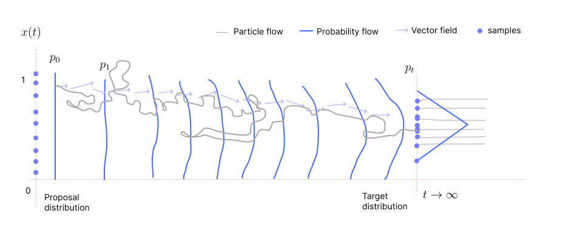
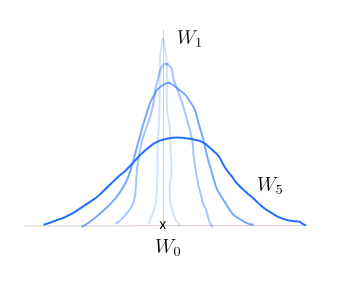
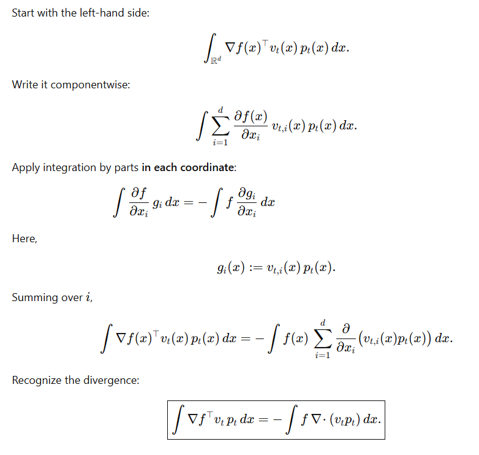

* TOC
{:toc}

## Problem Statement
We want to analyze equation of this form:

$$
X_{k+s} = X_k + s \, v_k(X_k) + s' \sigma_k(X_k)\,N_k \tag{1}
$$

Here 

* $X_k$ can be $d-$dimensional random vector.
* $v_k(X_k)$ has the same dimension as $X_k$.
* $\sigma_k(X_k)$ can be a scalar or $d$-dimensional vector or $\mathbb{R}^{d \times d}$ matrix. Element-wise product is taken if $\sigma_k$ is a vector.

If order of $s$, $o(s)$, is the same as the order of $s'$, and the velocity is the Stein score, then it is equivalent to SGD. It converges to the mode of the log-likelihood. Thus, if $o(s) = o(s')$, then it is not suitable for sampling. We need to have $o(s') > o(s)$, i.e., $s'$ should be of higher magnitude than $s$. One particular choice for $s'$ is $\sqrt{s}$. If $s$ is smaller (between 0 and 1), then $\sqrt{s}$ will be larger value than $s$.

<figure markdown="0" class="figure zoomable">
<figcaption>
  <strong>Figure 1.</strong> Particle and Probability Flow example with random perturbation
  </figcaption>
</figure>

When we start with the same $X_0$ the next time, the path will be different even though the velocity field is fixed. Therefore, particle distribution at every time step is random because of the randomness in particle initialization and randomness in its path.

Rewriting equation <a href="#eq:eq1">(1)</a> in terms of $t$ and $s=\Delta t$:

$$
\Delta X_t = v_t(X_t) \, \Delta t + \sqrt{\Delta t} \, \sigma_t(X_t)\,N_t \tag{2}
$$

Then in our previous sections, we looked at the limiting case ($s \to 0$) to ease our analysis. But on doing the same here, we get into problems because of the $\sqrt{\Delta t}$ term. When $\Delta t$ tends to 0, the rate at which $\Delta t$ tends to 0 and the rate at which $\sqrt{\Delta t}$ tends to 0 are different. We can write $\Delta t$ as $dt$ as it tends to 0, but $\sqrt{\Delta t}$ cannot be infinitesimally small as $\Delta t$ tends to 0.

## Introduction of Diffusion
A clever trick to handle this: Here $N_t \sim \mathcal{N}(0, \mathbf{I})$ is a standard normal distributed RV. Then, 

$$
\bar{N_t} = \sqrt{\Delta t} \, N_t \sim \mathcal{N}(0, \Delta t \mathbf{I})
$$

  
Note

  
At every $t$ of the process, there is a random variable $W_t$. The joint distribution of all these random variables defines a random process.

Define a new random process $\{W_t\}_{t=0}^{\infty}$ such that the increments between the random variables in the process are normal distributed:

$$
W_{t + \Delta t} - W_t \sim \mathcal{N}(0, \Delta t \mathbf{I})
$$

That is, difference in the marginal random variable $W_t$ and its increment $W_{t + \Delta t}$ is Gaussian distributed. Such a process $\{W_t\}_{t=0}^{\infty}$ is known as a **Weiner process**. For example,

* Suppose $W_0=0$: a normal distribution highly peaked at 0, $W_0$ certainly takes the value 0. Then

* $W_{0.5} \sim \mathcal{N}(0, 0.5)$
* $W_1 \sim \mathcal{N}(0, 1)$
* $W_2 \sim \mathcal{N}(0, 2)$ and so on.

As time progresses, the variance of the random variable $W_t$ increases. Eventually, the RV becomes a uniform RV.

<figure markdown="0" class="figure zoomable">
<figcaption>
  <strong>Figure 2.</strong> Weiner process example
  </figcaption>
</figure>

  
Note

  
Weiner process is a mathematical model for ink diffusion. Physically, think of this process as putting a drop of ink in a beaker of water. As time progresses, the ink spreads. After an infinite time, the ink diffuses and we observe ink almost everywhere with the same concentration.

The greater the increment, the higher is the variance of the Gaussian. This is nothing but the difference between the random variable at two points in the process (change in the random variable), thus denoted by $\Delta W_t$. Now, when ${\Delta t}$ tends to 0, we can consider $dW_t$ which corresponds to infinitesimal small change in the random variable $W_t$.

Now, as we tend ${\Delta t}$ to 0, equation <a href="#eq:eq2">(2)</a> becomes

$$
dX_t = v_t(X_t) \, dt + \sigma_t(X_t)\, dW_t \tag{3}
$$

* If the velocity field $v_t=0$, the process $\{X_t\}$ will be a pure diffusion process.
* If the diffusion coefficient $\sigma_t=0$, the process $\{X_t\}$ will be ODE flow.

We are interested in the combination of these two. When we have these components, the process is known as Ito process.

When $v_t(x) = \nabla \log p^*(x)$ and $\sigma_t(x) = \sqrt{2}$ (this is just for mathematical convenience, a value of 1 is also fine), then the process has a limiting distribution and it will be $p^*$. After large $T$, that is after reaching $p^*$, the particles will be still moving, but the distribution of particles will be exactly $p^*$ at all future time steps (stationary distribution). The Ito process $\{X_t\}$ corresponding to this choice is known as **Langevin diffusion**.

Equation <a href="#eq:eq3">(3)</a> is not a ODE, it is a stochastic differential equation (SDE) as it involves a stochastic component.

## Fokker Planck Equation
Fokker Plank Equation is analogous to continuity equation that tells us how likelihood of Ito processes evolve. We know that the expectation equation connects explicitly the random variable $X_t$ and $p_t(x)$:

$$
\mathbb{E}[f(X_t)] = \int f(x) \, p_t(x) \, dx
$$

To characterize the distribution $p_t$ using $X_t$, we need to look at all $f$.

On taking derivative with respect to $t$ on both the sides:

$$
\begin{align*}
\frac{d}{dt}\mathbb{E}[f(X_t)] & = \frac{d}{dt} \int f(x) p_t(x) dx \\
& = \int f(x) \frac{\partial p_t(x)}{\partial t} dx  \tag{4}
\end{align*}
$$

We don't know the rate of change of $\mathbb{E}[f(X_t)]$, we just know how $X_t$ changes. The Taylor series helps us connect the change in $f(x)$ values with the change in $x$ values.

$$
\begin{align*}
f(X_{t + h}) & = f(X_t) + \nabla f(X_t)^\top (X_{t+h} - X_t) + o(\|X_{t+h} - X_t \|) \\
\end{align*}
$$

From equation <a href="#eq:eq1">(1)</a>, we have 

$$
\begin{align*}
X_{t+h} & = X_t + h \, v_t(X_t) + \sqrt{h} \sigma_t(X_t)\,N_t \\
X_{t+h} - X_t & = h \, v_t(X_t) + \sqrt{h} \sigma_t(X_t)\,N_t \\
\end{align*}
$$

Earlier the magnitude of the vector $X_{t+h} - X_t$ was of order $h$ (it had just the first term). Now, it is of the order $\sqrt{h}$ (the bigger one among $h$ and $\sqrt{h}$ is $\sqrt{h}$ so it dominates). Thus, the error term is at least $o(\sqrt{h})$, the error is bigger now.

$$
\begin{align*}
\frac{f(X_{t + h}) - f(X_t)}{h} & = \frac{\nabla f(X_t)^\top (X_{t+h} - X_t)}{h} + \frac{o(\sqrt{h})}{h} \\
\end{align*}
$$

As $h \to 0$, the error term doesn't go to zero. The denominator term goes to zero faster than the numerator. So, the error blows up to $\infty$. So, we expand the Taylor series up to the second order:

$$
\begin{align*}
f(X_{t + h}) = f(X_t) & + \nabla f(X_t)^\top (X_{t+h} - X_t)\\ 
& + \frac{1}{2}(X_{t+h} - X_t)^\top \nabla^2 f(X_t) (X_{t+h} - X_t) \\
& + o(\|X_{t+h} - X_t \|^2) \\
\end{align*}
$$

The error term is now at least quadratic in $\sqrt{h}$, so the term is like $(\sqrt{h})^2$. On dividing it by $h$ and as we move $h \to 0$, the numerator grows at least as $h$ and the denominator grows as $h$. Therefore, the term will become 0.

  
Note

  
In general, the notation \(o(h)\) (little-o of \(h\)) represents a function \(f(h)\) that approaches zero faster than \(h\) does as \(h\rightarrow 0\). By definition, \(f(h)=o(h)\) means:$$\lim _{h\rightarrow 0}\frac{f(h)}{h}=0$$

On substituting the value of $X_{t+h}-X_t$:

$$
\begin{align*}
f(X_{t + h}) = f(X_t) & + \nabla f(X_t)^\top \left(h \, v_t(X_t) + \sqrt{h} \sigma_t(X_t)\,N_t \right)\\ 
& + \frac{1}{2}\left(h \, v_t(X_t) + \sqrt{h} \sigma_t(X_t)\,N_t \right)^\top \nabla^2 f(X_t) \left(h \, v_t(X_t) + \sqrt{h} \sigma_t(X_t)\,N_t \right) \\
& + o(\|X_{t+h} - X_t \|^2) \\
\end{align*}
$$

We need to compute:

$$
\begin{align*}
\frac{f(X_{t + h}) - f(X_t)}{h} = & \frac{\nabla f(X_t)^\top \left(h \, v_t(X_t)  + \sqrt{h} \sigma_t(X_t)\,N_t \right) }{h}\\ 
& + \frac{1}{2h}\left(h \, v_t(X_t) + \sqrt{h} \sigma_t(X_t)\,N_t \right)^\top \nabla^2 f(X_t) \left(h \, v_t(X_t) + \sqrt{h} \sigma_t(X_t)\,N_t \right) \\
& + \frac{o(\|X_{t+h} - X_t \|^2)}{h} \\
\end{align*}
$$

As we take $h \to 0$:

* Second component: The term $h\, v_t(X_t)$ will become $v_t(X_t)$. It is independent of $h$, so not a problem. The other term $\sqrt{h} \sigma_t(X_t) N_t$ will become $\frac{\sigma_t(X_t) N_t}{\sqrt{h}}$. This term will blow up as $h \to 0$.

* Third component: On expanding the terms, we get $h^2, h\sqrt{h}, (\sqrt{h})^2$ terms. On dividing by $h$ and as $h \to 0$,
  1. The $h^2$ term will go to 0.
  2. The term $h\sqrt{h}$ will go to 0.
  3. The $(\sqrt{h})^2$ term will be independent of $h$. So, it will be a constant.

Out of all the terms, the only term that blows up to infinity is $\sqrt{h} \sigma_t(X_t) N_t$ in the second term. This implies that the velocity of $f$, $\frac{df}{dt}$, will be $\infty$ which means that the change in $f$ is abrupt. So, $\mathbb{E}\left[\frac{df}{dt}\right]$ is $+\infty$. This is happening because of the randomness we added.

But note from equation <a href="#eq:eq4">(4)</a> that we are not interested in $\frac{df}{dt}$, rather we are interested in **average** change in the function value. The change in function value could be abrupt, but the change in average function value can be small because we are adding Gaussian noise with mean 0. That is, we need to compute $\frac{d}{dt}\mathbb{E}[f]$.

  
Warning

  
Here we cannot interchange the expectation and the derivative operators: $\frac{d}{dt}\mathbb{E}[f] \ne \mathbb{E}\left[\frac{df}{dt}\right]$. These are equal only when both of them exist and are well-defined (not being infinity).

The quantity we are interested in is:

$$
\begin{align*}
\mathbb{E}[f(X_{t + h})] = & \mathbb{E}[f(X_t)] +\mathbb{E}\left[\nabla f(X_t)^\top \left(h \, v_t(X_t) + \sqrt{h} \sigma_t(X_t)\,N_t \right)\right]\\ 
& + \frac{1}{2} \mathbb{E}\left[ \left(h \, v_t(X_t) + \sqrt{h} \sigma_t(X_t)\,N_t \right)^\top \nabla^2 f(X_t) \left(h \, v_t(X_t) + \sqrt{h} \sigma_t(X_t)\,N_t \right) \right]\\
& + o(\|X_{t+h} - X_t \|^2) \\
\\
\frac{\mathbb{E}[f(X_{t + h})]- \mathbb{E}[f(X_t)]}{h} = &  \mathbb{E}\left[\nabla f(X_t)^\top v_t(X_t)\right] + \frac{1}{\sqrt{h}} \, \mathbb{E}\left[\nabla f(X_t)^\top \sigma_t(X_t)\,N_t \right]\\ 
& + \frac{1}{2h} \mathbb{E}\left[ \left(h \, v_t(X_t) + \sqrt{h} \sigma_t(X_t)\,N_t \right)^\top \nabla^2 f(X_t) \left(h \, v_t(X_t)  + \sqrt{h} \sigma_t(X_t)\,N_t \right) \right] \\
& + \frac{o(h)}{h} \\
\end{align*}
$$

Before we tend $h \to 0$, we can observe that the expectation term in the trouble causing component, 

$$
\mathbb{E}\left[\nabla f(X_t)^\top \sigma_t(X_t)\,N_t \right] = \mathbb{E}[\nabla f(X_t)^\top \sigma_t(X_t)] \, \cdot \mathbb{E}[N_t] = 0
$$

as $N_t$ is chosen independently, and it is independent of $X$. Now, as we tend $h \to 0$:

$$
\begin{align*}
\frac{d}{dt} \mathbb{E}[f(X_t)] = &  \mathbb{E}\left[\nabla f(X_t)^\top v_t(X_t)\right]+ \frac{1}{2} \mathbb{E}\left[ (\sigma_t\, N_t)^\top \nabla^2 f(X_t) (\sigma_t \, N_t) \right] \\
& = \mathbb{E}\left[\nabla f(X_t)^\top v_t(X_t)\right]+ \frac{1}{2} \mathbb{E}\left[ N_t^\top \sigma_t^\top \nabla^2 f(X_t) \sigma_t \, N_t \right]  \\
& = \mathbb{E}\left[\nabla f(X_t)^\top v_t(X_t)\right]+ \frac{1}{2} \mathbb{E}\left[ N_t^\top M_t(X_t) \, N_t \right]  \tag{5}\\
\end{align*}
$$

where $M_t(X_t) = \sigma_t(X_t)^\top \nabla^2 f(X_t) \sigma_t(X_t)$. Simplifying the second term.

We know that the expectation of the random variable $N_t$ is 0 and the covariance is identity, $\mathbb{E}[N_t \, N_t^\top] = \mathbf{I}$. The quantity inside the expectation $N_t^\top M_t(X_t) \, N_t$ is a scalar. Then

$$
\begin{align*}
\mathbb{E}\left[ N_t^\top M_t(X_t) \, N_t \right]  & = \mathbb{E}\left[ \text{tr}\left(N_t^\top M_t(X_t) \, N_t \right) \right] \\
& = \mathbb{E}\left[ \text{tr}\left( M_t(X_t) \, N_t \, N_t^\top \right) \right] \\
\end{align*}
$$

This is from a linear algebra result that states if we have $\text{tr}(ABC)$, then we can cyclically permute $ABC$, and the trace of the cyclically permuted product will also be the same. Note that both the terms are not equal (in fact one is a scalar and other is a matrix), but their trace is the same.

$N_t$ is independent of $X_t$. So by the tower property of expectation, and using the linearity of trace and conditional expectation:

$$
\begin{align*}
\mathbb{E}\left[ \text{tr}\left(M_t(X_t) \, N_t \, N_t^\top \right) \right] & = \mathbb{E}\left[ \mathbb{E}[\text{tr}\left(M_t(X_t) \, N_t \, N_t^\top \right) | X_t ]\right]  \\
& = \mathbb{E}\left[ \text{tr}\left(M_t(X_t) \, \mathbb{E}[N_t \, N_t^\top \, | \, X_t] \right) \right] \\
& = \mathbb{E}\left[ \text{tr}\left(\sigma_t^\top \nabla^2 f(X_t) \sigma_t \right) \right] \\
& = \mathbb{E}\left[ \text{tr}\left( \nabla^2 f(X_t) \sigma_t \sigma_t^\top \right) \right] \\
& = \mathbb{E}\left[ \text{tr}\left( (\nabla^2 f(X_t))^\top \sigma_t \sigma_t^\top \right) \right] \\
& = \mathbb{E}\left[ \langle \nabla^2 f(X_t), \sigma_t \sigma_t^\top\rangle_F\right]
\end{align*}
$$

This comes from the linear-algebra identity that

$$
\text{tr}(A^\top B) = \langle A, B \rangle_F = \sum_{ij} A_{ij} B_{ij}
$$

where $\langle A, B \rangle_F$ refers to Frobenius inner product. On substituting this in equation <a href="#eq:eq5">(5)</a>

$$
\begin{align*}
\frac{d}{dt} \int f(x) \, p_t(x) \, dx & = \int \nabla f(x)^\top v_t(x) \, p_t(x) \, dx + \frac{1}{2} \int \langle \nabla^2 f(x), \sigma_t \sigma_t^\top\rangle p_t(x)\, dx \\
\int f(x) \, \frac{\partial p_t(x)}{\partial t} \, dx & = \int \nabla f(x)^\top v_t(x) \, p_t(x) \, dx + \frac{1}{2} \int \langle \nabla^2 f(x), \sigma_t \sigma_t^\top\rangle p_t(x)\, dx \tag{6}
\end{align*}
$$

**Simplification of the first term in RHS:**

We use integration by parts in $x$ technique. Suppose we need to find the following where $f(x)$ and $g(x)$ are functions of $x$:

$$
\begin{align*}
\frac{d}{dx} \int_{-\infty}^{\infty} f(x)\, g(x) dx & = \int_{-\infty}^{\infty} \frac{d}{dx} \left( f(x)\, g(x) \right) dx \\
& =  \int_{-\infty}^{\infty} f'(x) g(x) \, dx + \int_{-\infty}^{\infty} f(x) \, g'(x) \, dx \\
f(x) g(x) \big|_{-\infty}^{\infty} & = \int f'(x) g(x) \, dx + \int f(x) \, g'(x) \, dx \\
\\
\int_{-\infty}^{\infty} f'(x) g(x) \, dx & = f(x) g(x) \big|_{-\infty}^{\infty} -\int_{-\infty}^{\infty} f(x) \, g'(x) \, dx \\
\end{align*}
$$

Assume $\lim_{\|x\| \to \infty} f(x)g(x) = 0$ (boundary terms vanish), then

$$
\int f'(x) g(x) \, dx = -\int f(x) \, g'(x) \, dx
$$

We can do the same with the double derivatives as well:

$$
\begin{align*}
\frac{d}{dx} \int f'(x)\, g(x) dx & = \int \frac{d}{dx} \left( f'(x)\, g(x) \right) dx \\
f'(x) g(x) \big|_{-\infty}^{\infty} & =  \int f''(x) g(x) \, dx + \int f'(x) \, g'(x) \, dx \\
\end{align*}
$$

Assume $\lim_{\|x\| \to \infty} f'(x)g(x) = 0$, then,

$$
\int f''(x) g(x) \, dx = - \int f'(x) \, g'(x) \, dx
$$

Similarly,

$$
\begin{align*}
\frac{d}{dx} \int f(x)\, g'(x) dx & = \int \frac{d}{dx} \left( f(x)\, g'(x) \right) dx \\
f(x) g'(x) \big|_{-\infty}^{\infty} & =  \int f'(x) g'(x) \, dx + \int f(x) \, g''(x) \, dx \\
\end{align*}
$$

Assume $\lim_{\|x\| \to \infty} f(x)g'(x) = 0$, then,

$$
\int f'(x) g'(x) \, dx = - \int f(x) \, g''(x) \, dx
$$

On comparing this with the previous case, we see

$$
\int f''(x) g(x) \, dx = \int f(x) \, g''(x) \, dx
$$

In such cases, it doesn't matter if we take the derivative of the first function or the second function to compute the integration.

Assume

$$
\lim_{\|x\| \to \infty} \nabla f(x)^\top \, v_t(x) p_t(x) = 0
$$

So we can apply this property.

$$
\int \nabla f(x)^\top v_t(x) \, p_t(x) \, dx = - \int f(x) \nabla \cdot (v_t(x) \, p_t(x)) \, dx
$$

**Difference between grad and Div?**

* Gradient: $\nabla f(x) \in \mathbb{R}^d$. Gradient acts on a scalar $f$.
* Divergence

$$
\nabla \cdot g(x) = \sum_{i=1}^d \frac{\partial g_i(x)}{\partial x_i}
$$

for $g:\mathbb{R}^d \to \mathbb{R}^d$. Divergence acts on a vector field. The result from the divergence operator is a scalar.

**How grad in LHS changes to Div in RHS?**

<figure markdown="0" class="figure zoomable">
<figcaption>
  <strong>Figure 2.</strong> How grad in LHS changes to Div in RHS
  </figcaption>
</figure>

**Simplification of the second term in RHS:**

Both $\nabla^2 f(X_t)$ and $\sigma_t \sigma_t^\top$ are $d \times d$ matrices, and note $\sigma_t$ is a $d \times d$ matrix.

$$
\begin{align*}
\frac{1}{2} \int \langle \nabla^2 f(x), \sigma_t \sigma_t^\top\rangle p_t(x)\, dx & = \int \langle \nabla^2 f(x), D_t(x) \rangle p_t(x)\, dx \\
& = \int \left( \sum_{ij} \frac{\partial^2f(x)}{\partial x_i \partial x_j} D_t(x)_{ij}\right) \, p_t(x)  \, dx\\
\end{align*}
$$

where

$$
D_t(x)_{ij} = \frac{1}{2} \sum_k \sigma_t(x)_{ik} \, \sigma_t(x)_{kj}
$$

Then

$$
\begin{align*}
\int \left( \sum_{ij} \frac{\partial^2f(x)}{\partial x_i \partial x_j} D_t(x)_{ij}\right) \, p_t(x)  \, dx & = \sum_{ij}  \int \frac{\partial^2f(x)}{\partial x_i \partial x_j} D_t(x)_{ij} \cdot p_t(x)  \, dx \\
& = \sum_{ij}  \int f(x) \, \frac{\partial^2 (D_t(x)_{ij} \cdot p_t(x))}{\partial x_i \partial x_j} \, dx \\
& =  \int f(x)\, \sum_{ij} \frac{\partial^2 (D_t(x)_{ij} \cdot p_t(x))}{\partial x_i \partial x_j} \, dx \\
\end{align*}
$$

On substituting this in equation <a href="#eq:eq6">(6)</a>

$$
\int f(x) \, \frac{\partial p_t(x)}{\partial t} \, dx = - \int f(x) \nabla \cdot (v_t(x) \, p_t(x)) \, dx + \int f(x)\, \sum_{ij} \frac{\partial^2 (D_t(x)_{ij} \cdot p_t(x))}{\partial x_i \partial x_j} \, dx 
$$

This is true for all $f$, so on comparing the terms, we get

$$
\frac{\partial p_t(x)}{\partial t} = -\nabla \cdot (v_t(x) \, p_t(x)) + \sum_{ij} \frac{\partial^2 (D_t(x)_{ij} \cdot p_t(x))}{\partial x_i \partial x_j}
$$

This is the general Fokker-Planck equation. If $\sigma_t(x)$ is a scalar, then $M_t(X_t) = \sigma_t^2 \nabla^2 f(X_t)$.

$$
\begin{align*}
\frac{1}{2} \mathbb{E}\left[  N_t^\top (\sigma_t^2 \nabla^2 f(X_t)) \, N_t \right] & = \frac{1}{2} \, \mathbb{E}\left[  N_t^\top (\sigma_t^2 \nabla^2 f(X_t)) \, N_t \right] \\
& = \frac{1}{2} \, \mathbb{E}\left[  \text{tr}(N_t^\top (\sigma_t^2 \nabla^2 f(X_t)) \, N_t) \right] \\
& = \frac{1}{2} \, \mathbb{E}\left[  \text{tr}(\sigma_t^2 \nabla^2 f(X_t) \, N_tN_t^\top) \right] \\
& = \frac{1}{2} \, \mathbb{E}\left[  \text{tr}(\sigma_t^2 \nabla^2 f(X_t)) \right] \\
& = \frac{1}{2} \, \mathbb{E}\left[ \sigma_t^2\Delta  f(X_t) \right] \\
& = \frac{1}{2} \int \sigma_t^2 \Delta f(x) p_t(x) \, dx \\
& = \frac{1}{2} \int  f(x) \Delta (\sigma_t^2(x) p_t(x)) \, dx 
\end{align*}
$$

Here we have used the definition that the trace of Hessian of $f$ is the Laplacian of $f$, and also the integration by parts technique (assuming boundary terms vanish). On substituting this in equation <a href="#eq:eq6">(6)</a> and comparing terms, we get

$$
\frac{\partial p_t(x)}{\partial t} = -\nabla \cdot (v_t(x) \, p_t(x)) + \frac{1}{2} \Delta (\sigma_t^2(x) p_t(x))
$$

If $\sigma_t(x) = \sigma(t)$, i.e., it is independent of $X_t$ and is a function of only $t$, then

$$
\begin{align*}
\frac{1}{2} \, \mathbb{E}\left[ \sigma_t^2\Delta  f(X_t) \right] & = \frac{\sigma_t^2}{2} \mathbb{E}\left[ \Delta  f(X_t) \right] \\
& = \frac{\sigma_t^2}{2} \int  \Delta f(x) p_t(x) \, dx \\
& = \frac{\sigma_t^2}{2} \int  f(x) \Delta p_t(x) \, dx 
\end{align*}
$$

On substituting this in equation <a href="#eq:eq6">(6)</a> and comparing terms:

$$
\frac{\partial p_t(x)}{\partial t} = -\nabla \cdot (v_t(x) \, p_t(x)) + \frac{\sigma_t^2}{2} \Delta p_t(x)
$$

The Fokker-Planck equation that governs how likelihood evolves for Ito processes. In our previous section (flow ODE), the continuity equation just had the first term.
