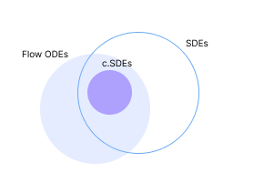
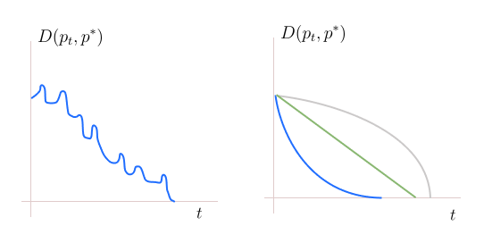

* TOC
{:toc}

## Langevin Diffusion
The flow SDE is:

$$
dX_t = v_t(X_t) \, dt + \sigma_t(X_t)\, dW_t
$$

and the Fokker Planck is:

$$
\frac{\partial p_t(x)}{\partial t} = -\nabla \cdot (v_t(x) \, p_t(x)) + \frac{\sigma_t^2}{2} \Delta p_t(x) \hspace{1cm} \forall x
$$

NOTE: There is no random variable involved in Fokker-Planck equation. This is a normal partial differential equation. The path of the likelihood is deterministic. It can be evaluated for any $(x,t)$. But the flow SDE has randomness, the paths of the particles are random.

In the special case $\sigma_t=0$, the Fokker Planck reduces to the familiar continuity equation. In the special case $v_t=0$, it reduces to the heat flow equation. We are interested in a process that has both these components. The drift helps us move towards the mode of the distribution and the diffusion term helps us forget the initial conditions by adding appropriate noise so that we converge to $p^*$.

We now study the special case, Langevin diffusion, that is helpful for sampling. Here we assume $v_t(x) = \nabla_x \log p^*(x)$ and $\sigma_t(x) = \sqrt{2}$.

Plugging these in SDE:

$$
dX_t = \nabla_x \log p^*(x) \, dt + \sqrt{2}\, dW_t
$$

This is how particle evolves in Langevin diffusion. Plugging these in Fokker Planck:

$$
\begin{align*}
\frac{\partial p_t(x)}{\partial t} & = -\nabla \cdot (p_t(x) \, \nabla_x \log p^*(x)) + \Delta p_t(x) \hspace{1cm} \forall x \\
\frac{\partial p_t}{\partial t} & = -\nabla \cdot (p_t \, \nabla \log p^*) + \Delta p_t \tag{1}
\end{align*}
$$

This is how likelihood evolves in Langevin diffusion. On further simplification:

$$
\begin{align*}
\frac{\partial p_t}{\partial t} & = -\nabla \cdot (p_t \, \nabla \log p^* - \nabla p_t) \\
& = \nabla \cdot \left( p_t \left( \frac{\nabla p_t}{p_t} - \nabla \log p^* \right)\right) \\
& = \nabla \cdot \left( p_t \left( \nabla \log p_t - \nabla \log p^* \right)\right) \tag{2} \\ 
& = \nabla \cdot \left( p_t \left( \nabla \log p_t - v_t \right)\right) \\
& = \nabla \cdot \left( p_t \, \nabla \log \frac{p_t}{p^*}  \right) 
\end{align*}
$$

Suppose $f_t \equiv \log \frac{p_t}{p^*}$, then the Fokker-Planck equation for LD becomes

$$
\begin{align*}
\frac{\partial p_t}{\partial t} & = \nabla \cdot \left( p_t \, \nabla_x f_t  \right)
\end{align*}
$$

## Similarity with Flow ODE
The final equation is similar to the continuity equation we saw in the flow ODE:

$$
\frac{\partial p_t}{\partial t} = - \nabla \cdot \left( p_t \, v_t \right) \\
$$

This in fact suggests that Langevin diffusion can also be viewed as a ODE flow process with

$$
\begin{align*}
v_t & \equiv - \nabla f_t \\
v_t & \equiv \nabla \log p^* -  \nabla \log p_t \tag{3}
\end{align*}
$$

With this choice of $v_t$ in equation <a href="#eq:eq2">(2)</a>, the continuity equation becomes Fokker-Planck. So, the likelihood evolution in SDE diffusion, is same as the likelihood evolution in ODE flow but with an additional frictional drift.

A result says that corresponding to every SDE (SDEs where $\sigma_t$ is a constant), there is a deterministic flow ODE. That is, the way the likelihood evolves in such SDEs can also be explained by a flow ODE. But flow ODEs are more general, not every flow ODE can be written as a SDE with a constant $\sigma_t$.

<figure markdown="0" class="figure zoomable">
<figcaption>
  <strong>Figure 1.</strong> Intersection of diffusion and flow ODEs in terms of likelihood view
  </figcaption>
</figure>

  
Warning

  
Here we are talking in terms of the evolution of marginal likelihood in ODEs and SDEs. We are not talking about particle movement. A stochastic particle flow can **never** be a deterministic particle flow.

Paradox: But we told that we cannot talk about convergence of flow ODEs because $p_t$ is always a function of the initial distribution for flow ODEs? Then, how do we say the corresponding SDE (Langevin diffusion) converges when equation <a href="#eq:eq3">(3)</a> is considered as $v_t$?

Look at the equation <a href="#eq:eq3">(3)</a>. The equation involves $p_t$, and $p_t$ is a function of $v_t$, so the given expression for $v_t$ is an implicit equation. As it depends on $p_t$, it is not fixed apriori. So, we can talk about the convergence of the likelihood.

There is a nice interpretation to the terms in equation <a href="#eq:eq3">(3)</a>:

* $\nabla \log p^*$: we are ascending towards $p^*$
* $- \nabla \log p_t$: we are descending away from $p_t$

So, this velocity at every time step $t$ takes us away from $p_t$ (initial conditions) towards $p^*$.

The term $\nabla \log p^*$ corresponds to velocity (which makes the likelihood drift) and $- \nabla \log p_t$ corresponds to a frictional force (a force that is opposite to the direction of velocity). The velocity pulls the likelihood towards the target, the friction helps us forget the initial conditions. They don't work independently: if there is too much velocity, we will reach the mode of the target distribution. If there is too much friction, we will reach uniform distribution.

As $p_t$ reaches $p^*$, the velocity $v_t$ of the flow ODE considered in equation <a href="#eq:eq3">(3)</a> will go to 0. That is, the particles must stop moving after reaching the target distribution to stay the same for convergence. This is when we view from the point of view of the flow ODE with velocity $v_t \equiv \nabla \log p^* - \nabla \log p_t $.

But note the velocity of Langevin diffusion is the stein score $v_t \equiv \nabla \log p^*$. This doesn't go to zero. In diffusion process, the particles keep moving even after reaching the target distribution, but the likelihood of the particles stays the same (i.e., convergence is still achieved).

# $p^*$ is Stationary for LD
Now, **suppose** at some time step $p_t=p^*$. From equation <a href="#eq:eq1">(1)</a>

$$
\begin{align*}
\frac{\partial p_t}{\partial t} & = -\nabla \cdot (p^* \, \nabla \log p^*) + \Delta p^* \\
& = -\nabla \cdot (p^* \, \frac{1}{p^*} \nabla p^*) + \Delta p^* \\
& = -\nabla \cdot (\nabla p^*) + \Delta p^* \\
& = 0
\end{align*}
$$

This says that the change in likelihood function is zero, that is, **if we happen to reach $p^*$**, then the distribution never changes from $p^*$. This is happening because of the clever choices of $v_t$ and $\sigma_t$.

  
TIP

  
This choice of $v_t$ and $\sigma_t$ is not the only possible choice to have convergence to $p^*$.

The above result shows that $p^*$ is always a stationary distribution of the Langevin diffusion process. Two challenges:

* This may not be the only stationary distribution, there may be other stationary distributions to the process, and we may converge to any other distribution.
* Even if $p^*$ is the only stationary distribution, it may happen that the process may not reach $p^*$, it may not converge to any distribution.

We need to prove that the Langevin diffusion as defined by the SDE or equivalently by the Fokker-Planck equation has a limiting distribution, and it is $p^*$. By this, we implicitly show that the process has a unique stationary distribution $p^*$, and we will converge to it regardless of our initial distribution.

Monotonic convergence: If we keep going down the sequence, we get closer and closer to a value $k$ (we won't move away), then we say that we the sequence converges monotonically to $k$. In Langevin diffusion, we even show that the likelihood $p_t$ converges monotonically to $p^*$.

## Convergence of Langevin Diffusion

Assume $p^*$ is non-zero everywhere in its domain (it doesn't have disjoint regions).

We use the Lyapunov stability method for directly proving that the limiting likelihood for Langevin diffusion is indeed $p^*$. For this, we consider a (Lyapunov) function $\mathcal{F}$ that can quantify the deviation between $p_t$ (a marginal in the diffusion process), and $p^*$.

$$
\mathcal{F}(t) \equiv D(p_t, p^*)
$$

and show that this distance goes to 0 over the time. Plotting $\mathcal{F}(t)$ as a function of $t$:

<figure markdown="0" class="figure zoomable">
<figcaption>
  <strong>Figure 2.</strong> Convergence of Langevin diffusion
  </figcaption>
</figure>

If there is convergence of $p_t$ to $p^*$, the function $\mathcal{F}(t)$ will be like the graph on the left. The lower bound for the distance function is 0, and if that function is decreasing throughout, it should converge to 0. Thus, if $D(p_t, p^*)=0$, then $p_t=p^*$.

In the Langevin diffusion case, we can even show that this function decreases strictly monotonically, that is, it keeps decreasing like the graphs on the right. The function can take any of the three forms. This happens if and only if the rate of change of $\mathcal{F}$ with respect to $t$ is negative, $\frac{d\mathcal{F}(t)}{dt} < 0 \,\, \forall t$. This is not a necessary condition for convergence, the convergence can also happen non-monotonically (as shown in the image on the left). 

Since $\mathbb{E}_{X \sim p_t}[f_t]$ is the KL divergence, it is convenient to measure the distance between $p_t$ and $p^*$ using KL divergence. So, we choose $\mathcal{F}(t)$:

$$
\begin{align*}
\mathcal{F}(t) \equiv \text{KL}(p_t \,\| \,p^*) & = \int p_t \log \frac{p_t}{p^*} \, dx \\
& = \int p_t(x) f_t(x) \, dx \\
& = \mathbb{E}_{X \sim p_t}\left[f_t(X)\right] \\
\end{align*}
$$

Then

$$
\begin{align*}
\frac{d\mathcal{F}(t)}{dt} & = \frac{d}{dt} \int p_t \, f_t \\
& = \int \frac{d}{dt} (p_t \, f_t) \\
& = \int \frac{\partial p_t}{\partial t} f_t + \int p_t \frac{\partial f_t}{\partial t} \\
& = \int \nabla \cdot \left( p_t \, \nabla f_t  \right) f_t + \int p_t \frac{1}{p_t} \frac{\partial p_t}{\partial t} \\
& = \int \nabla \cdot \left( p_t \, \nabla f_t  \right) f_t + \int \nabla \cdot \left( p_t \, \nabla f_t  \right) \\
& = \int \nabla \cdot \left( p_t \, \nabla f_t  \right) f_t + \int \sum_i \frac{\partial}{\partial x_i} \left( p_t \, \frac{\partial f_t}{\partial x_i} \right) \\
& = \int \nabla \cdot \left( p_t \, \nabla f_t  \right) f_t + \int \sum_i \frac{\partial p_t}{\partial x_i} \, \frac{\partial f_t}{\partial x_i} + p_t \frac{\partial^2 p_t}{\partial x_i^2}  \\
& = - \int  \left( p_t \, \nabla f_t  \right)^\top \nabla f_t + \int \left( \nabla p_t^\top \nabla f_t + p_t \Delta f_t \right) \\
& = - \int  p_t \, \nabla f_t^\top \nabla f_t + \int  \nabla p_t^\top \nabla f_t + \int  p_t \Delta f_t \\
& = - \int  p_t \, \nabla f_t^\top \nabla f_t  + \int  p_t \Delta f_t + \int  \nabla p_t^\top \nabla f_t  \\
& = - \int  p_t \, \nabla f_t^\top \nabla f_t  + \int  p_t \Delta f_t - \int  p_t \Delta f_t  \\
& = - \int  p_t \, \nabla f_t^\top \nabla f_t \\
& = - \int  p_t \, \| \nabla f_t \|^2 \hspace{1cm} \forall t
\end{align*}
$$

$p_t$ is always $\geq 0$ and norm of any vector is also $\geq 0$, so the integral is always $\geq 0$. With negative sign, $\frac{d\mathcal{F}(t)}{dt} \leq 0$ for any given $t$.

  
WARNING

  
Note here that we are not saying $\frac{d\mathcal{F}(t)}{dt}$ is increasing or decreasing, it just says the derivative is negative for all $t$. In the next article, we will explore how this derivative is changing with time.

It is equal to 0 if and only if the integral is 0.

$$
\begin{align*}
\frac{d\mathcal{F}(t)}{dt} &= 0 \hspace{1cm} \forall x\\
& \iff \| \nabla f_t \|^2 =0 \\
& \iff \nabla f_t =\mathbf{0} \\
& \iff \nabla \log p_t = \nabla \log p^* \\
& \iff \int \nabla \log p_t = \int \nabla \log p^* + C \\
& \iff \log p_t = \log p^* + C \\
& \iff p_t = K p^* \\
& \iff p_t = p^* \hspace{1cm} K \text{ should be 1} \\
\end{align*}
$$

The quantity $\nabla \log p_t(x)$ is defined only in the region where $p_t(x)$ is non-zero. If $p_t(x)=0$, then $\log p_t(x)$ is undefined, and its gradient is meaningless.

So, the equality $\nabla \log p_t(x) = \nabla \log p^*(x)$ must be interpreted as:

$$
\nabla \log p_t(x) = \nabla \log p^*(x) \,\, \text{for } x \in \mathcal{S}
$$

where $\mathcal{S} := \text{supp}(p_t) \cap \text{supp}(p^*)$.

Recall we assumed that $p^*$ is $> 0$ everywhere in its support. And $p_t$ should be strictly positive everywhere because we add Gaussian noise to the RV $X_t$ at each step. The third step says that the gradient equality holds for all $x$ in the support that is common between $p_t$ and $p^*$. So, $p_t$ must be having the same support as $p^*$.

In general, from the third to the fifth step: we are saying when two scores are the same, their likelihoods are the same. This can be said only when

* Both the densities are $>0$ on its support.
* Both the densities are continuously differentiable on its support.
* The support on which the equality holds is connected, i.e., no holes or disjoint regions inside of its support.

And $K$ cannot be anything other than 1, because $p_t$ and $p^*$ are likelihoods.

This proves that the function $\mathcal{F}(t)$ decreases strictly monotonically (it's derivative is always negative), and it's derivative is 0 only when $p_t$ reaches $p^*$. If $p_t$ is away from $p^*$, we will be keep getting closer and closer at every time step. Finally, we will reach $p^*$. Thus, Langevin diffusion is a good sampler.

  
NOTE

  
For convergence in flow ODEs, we have to look at either finite time horizon or with frictional forces. In the case of Langevin diffusion (SDEs), we always get convergence.

Surprising result: The Langevin diffusion always guarantees convergence. The equations look similar to stochastic gradient descent. In optimization, SGD doesn't converge for all objectives, the objective function should meet certain conditions such as convexity and smoothness so that we can guarantee global convergence with SGD. But with LD, there are no conditions, $p^*$ can be any arbitrary distribution (with a mild condition that it should be positive on the entire domain).

The LD guarantees convergence to $p^*$, but how many steps do we need? We proved that the distance function decreases, but at what rate? The convergence rate refers to how fast the iterates approach the target.

