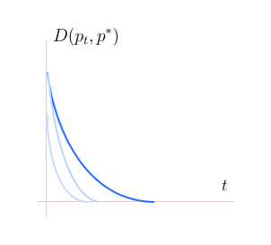
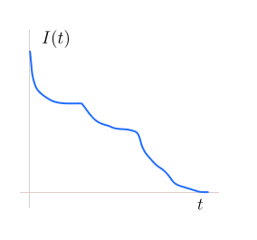

Langevin Diffusion based sampling guarantees convergence to $p^*$, but how many steps do we need? We proved that the distance function decreases, but at what rate?

* TOC
{:toc}

## Rate of Convergence
Langevin Diffusion based sampling guarantees convergence to $p^*$ for any arbitrary distribution. But the rate of convergence may be exponentially slow. But to prove that convergence happens at an acceptable rate, we need some regularity conditions on $p^*$. One such condition is log-concave likelihood.

We showed in our previous article that

$$
\frac{d\mathcal{F}(t)}{dt} = - \int  p_t \, \| \nabla f_t \|^2 \tag{1}
$$

where $f_t(x) \equiv \log \frac{p_t(x)}{p^*(x)}$ is the relative error at $x$. At time $t$, consider two distributions, and think of $f_t$ as a function over $x$.

* Then, the quantity $\int p_t f_t^2 = \mathbb{E}[f_t^2]$ is the expected total squared error. This integral is zero if and only if $f_t=0$ (assuming $p_t>0$) for all $x$.
* The quantity $\int  p_t \, \| \nabla f_t \|^2 dx = \mathbb{E}[\| \nabla f_t(X) \|^2]$ is also a measure of the total error. This is a measure of bad energy involved in the diffusion process, called as Dirichlet energy of $f_t$. It measures how rapidly the function $f_t$ changes on average under $p_t$. A large value indicates steep, oscillatory, or highly varying function over $x$. If this is the case, say at time $t$, then from equation <a href="#eq:eq1">(1)</a>, we can see that the distance function decreases very fast at this $t$. This implies that if we start far away from $p^*$, the flow will take us very quickly to near $p^*$. If we start near $p^*$, then it will take us slowly, and eventually we will converge. Thus, the larger the Dirichlet energy (i.e., the more varying $f_t$ is), the faster is the rate of decrease of $\mathcal{F}(t)$. 
  This bad energy has to be dissipated, i.e., the lower it is, the better it is. The integral is 0 if and only if $\nabla f_t =\mathbf{0}$ for all $x$ which implies that $f_t$ should be a constant for all $x$. And we know that if for all $x$

  $$
  \begin{align*}
  \| \nabla f_t \|^2 =0 & \iff \nabla f_t =\mathbf{0} \\
  & \iff \nabla \log p_t = \nabla \log p^* \\
  & \iff \log p_t = \log p^* + C \\
  & \iff p_t = K p^* \\
  & \iff p_t = p^* \hspace{1cm} K \text{ should be 1} \\
  \end{align*}
  $$

The quantity $\int  p_t \, \| \nabla f_t \|^2 dx$ is also known as **Fischer information** if $f_t(x) \equiv \log \frac{p_t(x)}{p^*(x)}$. Fischer information is one kind of Dirichlet energy. We usually denote it as:

$$
I(t) = \int  p_t \, \| \nabla_x f_t \|^2 dx = - \frac{d\mathcal{F}(t)}{dt}
$$

We know that $I(t) \geq 0$ for all $t$. A famous result shows that he rate of change of Fisher information is proportional to two energy terms:

$$
\begin{align*}
\frac{dI(t)}{dt} & = -2 \int p_t \left( \nabla f_t^\top \nabla^2U \, \nabla f_t + \| \nabla^2 f_t \|^2 \right) \\
& = -2 \int \left( p_t \nabla f_t^\top \nabla^2U \, \nabla f_t \right) -2 \int p_t \| \nabla^2 f_t \|^2 \tag{2} \\
\end{align*}
$$

If $\frac{dI(t)}{dt} > 0$, then it means $I(t)$ function is increasing. If $I(t)$ increases, the Dirichlet energy increases which we don't want. Over the time, we want the Dirichlet energy to go down. Therefore, we want $\frac{dI(t)}{dt} \leq 0$.

**First Term:**

When $\nabla^2U$ is identity, this term is similar to the Dirichlet energy (expected norm-square of gradient).

In general, the term $\nabla f_t^\top \nabla^2U \, \nabla f_t$ is a scalar, which can be negative. But,

* If the Hessian of the energy function $\nabla^2U$ is PSD, that is, $x^\top \nabla^2U \, x \geq 0$ for all vectors $x$, then, the term $\nabla f_t^\top \nabla^2U \, \nabla f_t$ will be $\geq 0$. If the Hessian of a function is PSD, then the function must be a convex function. So, to satisfy the condition, we should consider convex energy functions $U(x)$. The corresponding likelihood will be **log-concave**.

$$
p^*(x) = \frac{1}{Z} e^{-U(x)}
$$

Such likelihoods are called as log-concave likelihoods because $\log p^*(x) = -U(x)$. If $U$ is convex, then $-U$ must be concave. So, to satisfy the condition, we should consider energy functions that are convex.

**Second Term:**

The second term in the RHS looks at the curvature of $f_t$, it is the energy due to curvature.

$$
\int p_t \| \nabla^2 f_t \|^2 = \mathbb{E}[\| \nabla^2 f_t(X) \|^2]
$$

This is also bad energy but measuring the badness in terms of second-order term. It is the expected norm-squared of $\nabla^2 f_t$. It typically measures how rapidly the gradient of $f$ changes on average under $p_t$. The integral is 0 if and only if $\nabla^2 f_t =\mathbf{0}$ for all $x$ which implies that $\nabla f_t$ should be a constant for all $x$. The curvature energy (CE) is always non-negative. So, $-2CE$ is a negative quantity.

The result is that if the target likelihood $p^*$ is log-concave, then the first term will be non-negative and the second term is always non-negative, hence $\frac{dI(t)}{dt} \leq 0$ for all $t$. The Dirichlet energy will be decreasing over time.

$$
\begin{align*}
\frac{d^2\mathcal{F}(t)}{dt^2} & = \frac{d}{dt}\left(\frac{d\mathcal{F}(t)}{dt} \right) \\
& = \frac{d}{dt}(-I(t)) \\
& = -\frac{dI(t)}{dt} \\
& \geq 0 \hspace{1cm} \forall t\\
\end{align*}
$$

From our previous section we know that 

* The function $\mathcal{F}$ (which is with respect to KL-divergence) is strictly monotonically decreasing, $\frac{d\mathcal{F}(t)}{dt} < 0 \forall t$.

* Now we showed that the second derivative of $\mathcal{F}$ is $\geq 0$ for all $t$, which implies that $\mathcal{F}$ is a convex function.

A typical shape of a function that is decreasing and convex looks like any of these (of the form $D(t)= e^{-t}$):

<figure markdown="0" class="figure zoomable">
<figcaption>
  <strong>Figure 1.</strong> KL divergence based distance function when $p^*$ is log-concave
  </figcaption>
</figure>

This proves that to have faster convergence with Langevin diffusion, $p^*$ should be log-concave.

But note that $I(t)$ which is also $\geq 0$ for all $t$, and we only showed that $\frac{dI(t)}{dt} \leq 0$ for all $t$. This implies the function $I(t)$ (bad energy) decreases monotonically but not strictly:

<figure markdown="0" class="figure zoomable">
<figcaption>
  <strong>Figure 1.</strong> Fischer Information function when $p^*$ is log-concave
  </figcaption>
</figure>

To make it decrease strictly monotonically, we need to make further assumptions on $p^*$: 

* If the Hessian of the energy function $\nabla^2U$ is PD, that is, $x^\top \nabla^2U \, x > 0$ for all vectors $x$, then, the term $\nabla f_t^\top \nabla^2U \, \nabla f_t$ will be $> 0$. If the Hessian of the energy function is PD, then the energy function must be a strictly convex function.

* Even stronger, if the Hessian of the energy function $\nabla^2U$ is uniformly PD, that is, $x^\top \nabla^2U \, x \geq \mu$ for all vectors $x$ and for any $\mu >0$, then the energy function must be a $\mu-$ strongly convex function. That is, the function has uniform curvature bounded away from zero.

In other words, a function $f$ is $\mu-$ strongly convex if the minimum eigen value of the Hessian of $f$ is at least $\mu$ for all $x$.

$$
\lambda_{\text{min}}( \nabla^2f(x)) \geq \mu >0 \,\, \forall x
$$

Examples:
  1. $f(x)=x^2 \implies f''(x)=2$ is 2-strongly convex function. The Gaussian likelihood $p^*(x) = \frac{1}{Z} e^{\frac{-x^2}{2}}$ satisfies the condition.
  2. The function $f(x)=x^4 \implies f''(x)=12x^2$ is a strictly convex function but not a strong convex as $f''(0)=0$. Note that $f''(x)>0 \, \forall x$, then $f$ is strictly convex. But the converse is not true.

Suppose the energy function is $\mu-$ strongly convex, that is, $\nabla f_t^\top \nabla^2U \, \nabla f_t \geq \mu \| \nabla f_t \|^2$, then from equation <a href="#eq:eq2">(2)</a>

$$
\begin{align*}
\frac{dI(t)}{dt} & = -2 \int \left( p_t \nabla f_t^\top \nabla^2U \, \nabla f_t \right) -2 \int p_t \| \nabla^2 f_t \|^2 \\
& \leq  -2 \int \left( p_t \nabla f_t^\top \nabla^2U \, \nabla f_t \right)  \\
& \leq  -2\mu \int p_t \| \nabla f_t \|^2  \\
& \leq -2\mu I(t)
\end{align*}
$$

From this inequality, we can read out the rate of convergence of $I$. This is an ODE, we can solve for $I(t)$:

$$
\begin{align*}
\frac{dI(t)}{I(t)} &= -2 \mu dt \\
\int_{I(0)}^{I(T)} \frac{1}{I(t)} dI(t) &= -2\mu \int_0^T dt \\
\log I(t) \bigg|_{I(0)}^{I(T)} &= -2\mu T \\
\log I(T) &= -2\mu T + \log I(0) \\
I(T) & = e^{-2\mu T} \cdot e^{\log I(0)} \\
I(t) & = I(0) \cdot e^{-2 \mu t}
\end{align*}
$$

With inequality, it becomes $I(t) \leq I(0) \cdot e^{-2\mu t}$. We can see that the Fischer information (or Dirichlet energy) $I(t)$ is exponentially decreasing with $t$. Using this, we can also show that the KL-divergence distance function also decreases exponentially:

$$
\frac{d\mathcal{F}(t)}{dt} = -I(t)
$$

On integrating both sides w.r.t $t$:

$$
\begin{align*}
\mathcal{F}(\infty) - \mathcal{F}(0) & = \int_0^\infty -I(t) \, dt \\
& \geq - \int_0^\infty I(0) \cdot e^{-2 \mu t} \, dt \\
& = - I(0) \left( \frac{e^{-2 \mu t}}{-2\mu} \right) \Bigg|_0^\infty \\
& =  \frac{- I(0)}{2\mu}\\
\end{align*}
$$

We know $\mathcal{F}(t) \to 0 \text{ as } t \to \infty$, then

$$
\begin{align*}
-\mathcal{F}(0) & \geq \frac{- I(0)}{2\mu} \\
\mathcal{F}(0) & \leq \frac{I(0)}{2\mu} \\
I(0) & \geq 2\mu \cdot \mathcal{F}(0) \\
\int p_0 \| \nabla \log \frac{p_0}{p^*} \|^2 & \geq 2\mu \int p_0 \log \frac{p_0}{p^*}
\end{align*}
$$

Here $p_0$ is arbitrary, so the inequality holds for all likelihoods and in particular for those in the paths, $p_t$.

$$
\begin{align*}
\int p_t \| \nabla \log \frac{p_t}{p^*} \|^2 \, dx & \geq 2\mu \int p_t \log \frac{p_t}{p^*} \, dx \\
\end{align*}
$$

This inequality is known as **Log-Sobolev Inequality** (LSI) inequality. This is a fundamental inequality that governs the rate of convergence of diffusion processes. In our analysis, we show that strong convexity is a sufficient condition for LSI to hold.

This implies $I(t) \geq 2\mu \cdot \mathcal{F}(t) \,\, \forall t$:

$$
\begin{align*}
I(t) & \geq 2\mu \cdot \mathcal{F}(t) \\
& \iff - \frac{d\mathcal{F}(t)}{dt} \geq 2\mu \cdot \mathcal{F}(t) \\
& \iff \mathcal{F}(t) \leq \mathcal{F}(0) \cdot e^{-2\mu t}
\end{align*}
$$

This shows that $p_t$ converges to $p^*$ exponentially fast w.r.t KL-divergence when the energy function of $p^*$ is $\mu-$ strongly convex. Greater the $\mu$, faster the convergence is.

## Slow Convergence Example
The Langevin diffusion guarantees convergence, but the rate of convergence is not the same for all target likelihoods. For some likelihoods, it will be exponentially slow.

If we try to sample from a uniform mixture of Gaussian and if we start with an initial distribution which is not a uniform mixture, it takes an exponentially long time for the Langevin diffusion to jump to one mode from the other. The process converges to the target in infinite time, but for all practical purposes, we may not find convergence at all.

