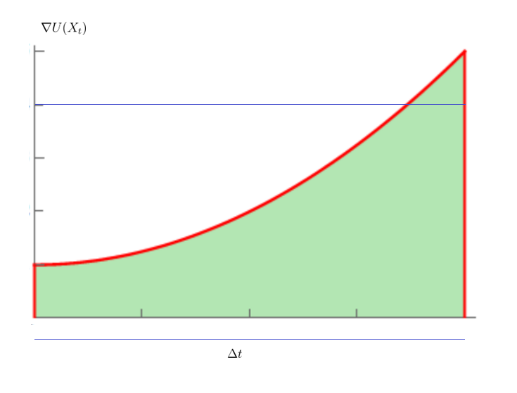
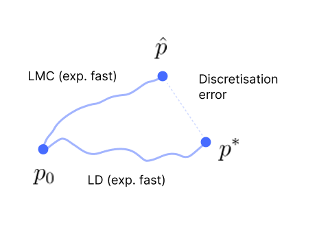
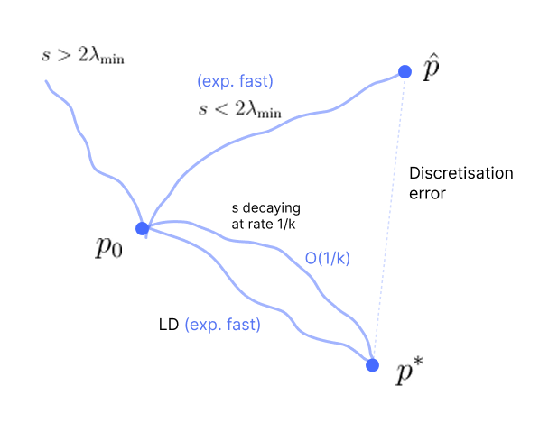

In practice, how do we use Langevin diffusion to produce samples from the target distribution?

* TOC
{:toc}

## Discretization of Langevin Diffusion SDE

Let the target distribution be:

$$
p^*(x) = \frac{1}{Z} e^{-U(x)}, \hspace{1cm} \text{ so that } \nabla \log p^*(x) = -\nabla U(x)
$$

The goal is to construct a Markov chain whose stationary distribution is $p^*$.

The overdamped Langevin SDE (continuous-time LD) is

$$
dX_t = \nabla \log p^*(X_t) \, dt + \sqrt{2} \, dW_t \tag{1}
$$

Under mild regularity conditions, $p^*$ is the unique stationary distribution of this SDE. If we were to unfold this, we need to solve the integrals:

$$
\begin{align*}
X_T & = X_0 + \int_0^T \nabla \log p^*(X_t) \, dt + \sqrt{2} \int_0^T dW_t \\
& = X_0 - \int_0^T \nabla U(X_t) \, dt + \sqrt{2} \int_0^T dW_t \\
\end{align*}
$$

If the energy function is from a neural network, we won't be able to solve these integrals. There is no practical way of solving these continuous-time differential equations in general. So, we should resort to discretization of equation <a href="#eq:eq1">(1)</a>, and unfold it multiple times.

The Euler–Maruyama discretization of the SDE is

$$
\Delta X_t = - \nabla U(X_t) \, \Delta t + \sqrt{2} \, \Delta W_t \tag{2}
$$

Here the integral has been replaced by a product term, i.e., we are approximating the integral $\int_0^T \nabla U(X_t) \, dt$ by $\nabla U(X_t) \, \Delta t $, which essentially computes the area of the rectangle instead of the area under the curve.

<figure markdown="0" class="figure zoomable">
<figcaption>
  <strong>Figure 1.</strong> Zoomed version of integral approximation
  </figcaption>
</figure>

As $\Delta t \to 0$, the area of the rectangle and the area under the curve will be the same.

In our case $\Delta t$ is the step size, and it can't be 0. So, we incur some error due to this approximation. The error accumulates as we take more steps. When we take lots of such finite steps (which are not infinitesimal) in order to achieve convergence, does the accumulated error be high enough to affect the rate of convergence?

## Langevin Monte Carlo
Equation <a href="#eq:eq2">(2)</a> can be written as:

$$
\begin{align*}
X_{t + \Delta t} & = X_t - \nabla U(X_t) \, \Delta t + \sqrt{2} \, N_t \hspace{1cm} \text{where  } N_t \sim \mathcal{N}(0,\Delta t \mathbf{I}) \\
& = X_t - \nabla U(X_t) \, \Delta t + \sqrt{2 \Delta t} \, N_t \hspace{1cm} \text{where  } N_t \sim \mathcal{N}(0,\mathbf{I}) \tag{3} \\
\end{align*}
$$

Increments in the Weiner process are distributed as Gaussian with 0 mean and $\Delta t \mathbf{I}$ variance. On unfolding this, we get

$$
\begin{align*}
X_0 & \sim p_0 \\
X_{k+1} & = X_k - s \, \nabla U(X_k) + \sqrt{2s} \,N_k, \hspace{1cm} N_k \sim \mathcal{N}(0, \mathbf{I}) \\
\end{align*}
$$

The procedure of using this equation to produce samples is known as Langevin Monte Carlo (LMC) or Unadjusted Langevin Algorithm (ULA).

  
NOTE

  
The original underlying process is called Langevin diffusion, and the discretization of it, in the way we wrote it as in equation <a href="#eq:eq3">(3)</a>, is called LMC or ULA.

## An Example with Gaussian
Let $p^*$ be the Gaussian distribution

$$
p^*(x) = \frac{1}{Z} e^{-\frac{1}{2} (x-\mu)^\top \Sigma^{-1} (x-\mu)}
$$

Here the energy function is

$$
U(x) = \frac{1}{2} (x-\mu)^\top \Sigma^{-1} (x-\mu)
$$

The Hessian of the energy function is $\nabla^2 U(x) = \Sigma^{-1}$, which is constant for all $x$. Here the covariance matrix is a positive definite matrix. So, the minimum eigen value of the Hessian is not 0; it is a positive number $\mu$. Thus, this energy function is definitely a $\mu-$ strongly convex function. Therefore, this likelihood has exponentially fast convergence for Langevin diffusion. But what happens when we discretize the process?

$$
\begin{align*}
X_{t + \Delta t} & = X_t - \Sigma^{-1} (X_t-\mu) \Delta t + \sqrt{2 \Delta t} \, N_t \\
X_{k+1} & = X_k - \Sigma^{-1} (X_k-\mu) \, s + \sqrt{2s} \, N_k \tag{4}\\
\end{align*}
$$

where $\nabla U(X_t) = \Sigma^{-1} (X_t-\mu)$. Notation is changed from $t$ to $k$. But what should be the step size $s$ here, and how does it affect convergence? We need to analyze how the distribution of $X_k$ will be, and if it converges to the target.

If we start with $X_0$ from a Gaussian distribution, and as $N_t$ is a Gaussian, the RHS is a linear function of Gaussians. So, $X_{k+1}$ is always a Gaussian random variable. Thus, it is enough to look at the mean and covariance of $X_k$ to analyze the convergence. We need to understand how the mean and covariance evolve with time.

### Convergence of Mean
On subtracting both the sides by $\mu$

$$
\begin{align*}
X_{k+1} - \mu & = X_k - \mu- \Sigma^{-1} (X_k-\mu) \, s + \sqrt{2s} \, N_k \\
& = (I- s\,\Sigma^{-1}) (X_k-\mu) + \sqrt{2s} \, N_k \\
\mathbb{E}[X_{k+1} - \mu] & = \mathbb{E}[(I- s\,\Sigma^{-1}) (X_k-\mu) + \sqrt{2s} \, N_k] \\
& = (I- s\,\Sigma^{-1}) \mathbb{E}[X_k-\mu]
\end{align*}
$$

where $(I- s\,\Sigma^{-1})$ is a constant matrix and $\mathbb{E}[N_k]=0$. This is a recursive equation. On unfolding this, we get

$$
\begin{align*}
\mathbb{E}[X_{k+1} - \mu] & = (I- s\,\Sigma^{-1})^{k+1} \, \mathbb{E}[X_0-\mu] \\
\mu_{k+1} - \mu & = (I- s\,\Sigma^{-1})^{k+1} \, (\mu_0 - \mu) \tag{5}\\
\end{align*}
$$

If everything works well, as $k \to \infty$, $\mathbb{E}[X_k]$ should converge to $\mu$. And we also expect the rate of convergence to be exponentially fast.

$\Sigma$ is symmetric positive definite, so $\Sigma^{-1}$ is also symmetric positive definite. It follows that $S =I- s\,\Sigma^{-1}$ is symmetric, because it is a linear combination of symmetric matrices. Every real symmetric matrix admits an orthogonal eigenvalue decomposition.

Let the eigen decomposition of $\Sigma$ be $\Sigma = V D V^\top$, where $D = \text{diag}(\lambda_1, \dots, \lambda_n), \,\, \lambda_i >0$ and $VV^\top = I$. Then,

* $\Sigma^{-1} = V D^{-1} V^\top$
* $s\Sigma^{-1} = V sD^{-1} V^\top$
* $S = I -s\Sigma^{-1} = VV^\top -V sD^{-1} V^\top = V (I -sD^{-1}) V^\top $
* $S^{k+1} = V (I -sD^{-1})^{k+1} V^\top$

On substituting this in equation <a href="#eq:eq5">(5)</a>

$$
\mu_{k+1} - \mu = V (I -sD^{-1})^{k+1} V^\top \, (\mu_0 - \mu)
$$

So the eigenvalues of $S^{k+1}$, i.e., the diagonal elements of $(I -sD^{-1})^{k+1}$ are

$$
\left( 1 - \frac{s}{\lambda_i} \right)^{k+1}, \hspace{1cm} i=1, \dots, n
$$

where $\lambda_i$ are eigenvalues of $\Sigma$, and more importantly, the eigenvectors of $S$ are the same as those of $\Sigma$. As $k\to \infty$, these eigenvalues go to zero if 

$$
\begin{align*}
\left| 1 - \frac{s}{\lambda_i} \right| & < 1 \hspace{1cm} \forall i=1,\dots,n \\
-1 < 1 - \frac{s}{\lambda_i} & < 1  \\
-1 < \frac{\lambda_i - s}{\lambda_i} & < 1 \\
-\lambda_i < \lambda_i - s & < \lambda_i \hspace{1cm} \text{as } \lambda_i > 0\\
-2\lambda_i < - s & < 0  \\
2\lambda_i > s & > 0 \\
0 < s & < 2\lambda_i \hspace{1cm} \forall i=1,\dots,n \\
0 < s & < 2 \lambda_{\text{min}}(\Sigma) \\
\end{align*}
$$

If the step size $s$ is less than twice the minimum eigenvalue of $\Sigma$, then $\mu_{k+1} - \mu$ goes exponentially fast to 0. This proves that the mean of the Markov chain <a href="#eq:eq4">(4)</a> converges exponentially fast to the target mean provided $s < 2 \lambda_{\text{min}}(\Sigma)$.

### Convergence of Covariance
The covariance matrix of the random vector $X_{k+1}$ is given by

$$
\Sigma_{k+1} = \mathbb{E}[(X_{k+1} - \mu_{k+1}) (X_{k+1} - \mu_{k+1})^\top]
$$

Let $e_{k+1} = X_{k+1} - \mu$.

$$
\begin{align}
e_{k+1} & = X_{k+1} - \mu + \mu_{k+1} - \mu_{k+1} \\
& = (X_{k+1} - \mu_{k+1}) + (\mu_{k+1} - \mu)  \\
& = (X_{k+1} - \mu_{k+1}) + m_{k+1}
\end{align}
$$

Note $m_{k+1}$ is deterministic. Then,

$$
\begin{align}
e_{k+1}e_{k+1}^\top & = (X_{k+1} - \mu_{k+1} + m_k)(X_{k+1} - \mu_{k+1} + m_{k+1})^\top \\
& = \left((X_{k+1} - \mu_{k+1}) + m_k\right) \left((X_{k+1} - \mu_{k+1})^\top + m_{k+1}^\top\right) \\
& = (X_{k+1} - \mu_{k+1}) (X_{k+1} - \mu_{k+1})^\top + 
(X_{k+1} - \mu_{k+1}) \, m_{k+1}^\top + m_{k+1} (X_{k+1} - \mu_{k+1})^\top + m_{k+1} m_{k+1}^\top\\
\end{align}
$$

On taking expectation

$$
\begin{align}
\mathbb{E}[e_{k+1}e_{k+1}^\top] & = \Sigma_{k+1} + \mathbb{E}[X_{k+1} - \mu_{k+1}] \, m_{k+1}^\top + m_{k+1} \, \mathbb{E}[(X_{k+1} - \mu_{k+1})^\top] + m_{k+1} m_{k+1}^\top \\
& = \Sigma_{k+1} + m_{k+1} m_{k+1}^\top
\end{align}
$$

We know that $\mu_{k+1} \to \mu$ exponentially fast, which implies $m_{k+1} \to 0$ exponentially fast. Then

$$
\mathbb{E}[e_{k+1}e_{k+1}^\top] \to \Sigma_{k+1} \text{ (exponentially fast)}
$$

So, let's analyze $\mathbb{E}[e_{k+1}e_{k+1}^\top]$. This is harmless in terms of rate of convergence. That is,

* The rate of convergence of $\mathbb{E}[(X_{k+1} - \mu) (X_{k+1} - \mu)^\top]$
* And the rate of convergence of $\mathbb{E}[(X_{k+1} - \mu_{k+1}) (X_{k+1} - \mu_{k+1})^\top]$

remain the same.

$$
\begin{align}
\mathbb{E}[e_{k+1}e_{k+1}^\top] & = \mathbb{E}[(X_{k+1} - \mu) (X_{k+1} - \mu)^\top] \\
& = \mathbb{E}[\left( (I- s\,\Sigma^{-1}) (X_k-\mu) + \sqrt{2s} \, N_k \right) \left( (I- s\,\Sigma^{-1}) (X_k-\mu) + \sqrt{2s} \, N_k \right)^\top] \\
& = \mathbb{E}[\left( (I- s\,\Sigma^{-1}) (X_k-\mu) + \sqrt{2s} \, N_k \right) \left((X_k-\mu)^\top (I- s\,\Sigma^{-1})  + \sqrt{2s} \, N_k^\top \right)] \\
& = \mathbb{E}[(I- s\,\Sigma^{-1}) (X_k-\mu) (X_k-\mu)^\top (I- s\,\Sigma^{-1}) + 2s N_k N_k^\top] \\
& = (I- s\,\Sigma^{-1}) \mathbb{E}[(X_k-\mu) (X_k-\mu)^\top] (I- s\,\Sigma^{-1}) + 2s \mathbb{E}[N_k N_k^\top] \\
& = (I- s\,\Sigma^{-1}) \, \mathbb{E}[e_ke_k^\top] \, (I- s\,\Sigma^{-1}) + 2sI \\
\end{align}
$$

As we are more interested in the long-term behavior, let's assume $\mathbb{E}[e_{k+1}e_{k+1}^\top] = \Sigma_{k+1}$. Then,

$$
\Sigma_{k+1} = (I- s\,\Sigma^{-1}) \, \Sigma_k \, (I- s\,\Sigma^{-1}) + 2sI
$$

This is a good recursive equation. On unfolding it, we get

$$
\begin{align}
\Sigma_{k+1} & = (I- s\,\Sigma^{-1}) \, \left( (I- s\,\Sigma^{-1}) \, \Sigma_{k-1} \, (I- s\,\Sigma^{-1}) + 2sI\right) \, (I- s\,\Sigma^{-1}) + 2sI \\
& = (I- s\,\Sigma^{-1})^2 \, \Sigma_{k-1} \, (I- s\,\Sigma^{-1})^2 + 2s \, (I- s\,\Sigma^{-1})^2 + 2sI \\
& = (I- s\,\Sigma^{-1})^2 \, \Sigma_{k-1} \, (I- s\,\Sigma^{-1})^2 + 2s (I + (I- s\,\Sigma^{-1})^2)  \\
\end{align}
$$

Since $(I- s\,\Sigma^{-1})$ is a square matrix, $(I- s\,\Sigma^{-1}) (I- s\,\Sigma^{-1}) = (I- s\,\Sigma^{-1})^2$. On unfolding it to $k$ steps, we get

$$
\begin{align}
\Sigma_{k+1} & = (I- s\,\Sigma^{-1})^{k+1} \, \Sigma_0 \, (I- s\,\Sigma^{-1})^{k+1} + 2s \left(I + (I- s\,\Sigma^{-1})^2 + \dots + (I- s\,\Sigma^{-1})^{k+1}\right) \tag{6}  \\
\end{align}
$$

We can observe that the second term has matrix geometric series with $A= I$ and $R =(I- s\,\Sigma^{-1})^2$.

A matrix geometric series $I + R + R^2 + \dots = \sum_{k=0}^\infty R^k$ converges if and only if the maximum absolute eigenvalue of $R$ is less than 1. We know that the eigenvalues of $R$ are $(1 - \frac{s}{\lambda_i})^2$, where $\lambda_i$ are the eigenvalues of $\Sigma$. Then, we need

$$
\begin{align*}
\left( 1 - \frac{s}{\lambda_i} \right)^2  & < 1 \hspace{1cm} \forall i \\
\left| 1 - \frac{s}{\lambda_i} \right|  & < 1 \\
\end{align*}
$$

For a step size $0 < s < 2 \lambda_{\text{min}}(\Sigma)$, the condition is satisfied. The matrix geometric series converges if and only if the step size is in this range. Given step size in this range,

$$
I + R + R^2 + \dots = \sum_{k=0}^\infty R^k = I (I - (I- s\,\Sigma^{-1})^2)^{-1}
$$

Substituting this in equation <a href="#eq:eq6">(6)</a>, and as we are adding infinite terms, it will be

$$
\begin{align*}
\Sigma_{k+1} & \leq (I- s\,\Sigma^{-1})^{k+1} \, \Sigma_0 \, (I- s\,\Sigma^{-1})^{k+1} + 2s (I - (I- s\,\Sigma^{-1})^2)^{-1}  \\
\end{align*}
$$

The second term can be simplified as below:

$$
\begin{align*}
2s (I - (I- s\,\Sigma^{-1})^2)^{-1} & = 2s \left(I - (I + s^2 \Sigma^{-2} - 2s \Sigma^{-1}) \right)^{-1} \\
& = 2s \left(2s \Sigma^{-1} - s^2 \Sigma^{-2} \right)^{-1} \\
& = 2s \left(2s \Sigma^{-1} \left(I - \frac{s}{2} \Sigma^{-1}\right) \right)^{-1} \\
& = 2s \left(I - \frac{s}{2} \Sigma^{-1}\right)^{-1} (2s \Sigma^{-1})^{-1} \\
& = \left(I - \frac{s}{2} \Sigma^{-1}\right)^{-1} \Sigma \\
\end{align*}
$$

Let $B = \frac{s}{2} \Sigma^{-1}$. If the maximum absolute eigenvalue of $B$ is less than 1, then we can write

$$
(I-B)^{-1} = \sum_{k=0}^\infty B^k = I + B + B^2 + \dots
$$

The eigenvalues of $B$ are $\frac{s}{2\lambda_i}$, where $\lambda_i$ are the eigenvalues of $\Sigma$.

$$
\begin{align*}
\left| \frac{s}{2\lambda_i} \right| & < 1 \hspace{1cm} \forall i \\
-1 < \frac{s}{2\lambda_i} & < 1 \\
-2\lambda_i < s & < 2 \lambda_i \\
\end{align*}
$$

$\lambda_i > 0$ and step size cannot be negative. So, the condition is $s < 2 \lambda_{\text{min}}(\Sigma)$. Given this condition holds, we can write the discretization error as:

$$
\left(I - \frac{s}{2} \Sigma^{-1}\right)^{-1} = I + \frac{s}{2} \Sigma^{-1} + \left( \frac{s}{2} \Sigma^{-1}\right)^2 + \dots 
$$

If $s$ is very small, then higher-order terms are small, and we may approximate:

$$
\left(I - \frac{s}{2} \Sigma^{-1}\right)^{-1} \approx I + \frac{s}{2} \Sigma^{-1} \hspace{1cm} \text{for small } s
$$

Then the discretization error is:

$$
2s (I - (I- s\,\Sigma^{-1})^2)^{-1} \approx \left( I + \frac{s}{2} \Sigma^{-1}\right) \Sigma = \Sigma + \frac{s}{2}
$$

The discretization error is in order $s$, $O(s)$. That is, it is linear in $s$ if the target is Gaussian.

Therefore,

$$
\Sigma_{k+1} \leq (I- s\,\Sigma^{-1})^{k+1} \, \Sigma_0 \, (I- s\,\Sigma^{-1})^{k+1} + \left( \Sigma + \frac{s}{2} \right) \tag{7}
$$

* From the mean convergence analysis, we know that, as $k \to \infty$, the term $(I- s\,\Sigma^{-1})^{k+1}$ goes exponentially fast to 0. So, the first term is not a problem.

* The second term is the discretization error for the multi-variate Gaussian. It doesn't have $k$ because we have taken the sum of infinite terms in the geometric series. Even it had $k$ (if we had taken the sum of finite terms), the resulting term doesn't go to 0 as $k \to \infty$. Thus, the second term is the accumulation of all the errors due to discretization across all the time steps ($k \to \infty$).

The covariance $\Sigma_{k+1}$ does not converge to the target covariance $\Sigma$, but still exponentially rapidly converges to $\Sigma + \frac{s}{2} $, which is a close approximation.

  
NOTE

  
If $s$ is infinitesimally small $(s \to 0)$, then we indeed have convergence. It confirms that there is no discretization error if we take infinitesimal step sizes (retrieving Langevin diffusion).
  

Even for a good distribution which has exponentially faster convergence if we follow Langevin diffusion doesn't even convergence to the target distribution if we follow Langevin Monte Carlo.

We got a condition on the step size that it should be less than twice the minimum eigenvalue of $\Sigma$. This will take us to an approximate $\hat{p}$ exponentially fast. But the discretization error is unavoidable. In general (for any other distribution as well), the Langevin Monte Carlo doesn't converge to $p^*$.

<figure markdown="0" class="figure zoomable">
<figcaption>
  <strong>Figure 2.</strong> Convergence of Langevin Monte Carlo
  </figcaption>
</figure>

But the good thing is, the Langevin Monte Carlo converges to an approximate distribution $\hat{p}$ which can be made as close as possible to $p^*$ by appropriate step sizes. And note that, it converges exponentially fast to $\hat{p}$.

  
WARNING

  
If the step size is very small, then the discretization error will be small. But we should take too many such small steps to achieve convergence; the practical convergence speed deteriorates. Thus, the effective convergence rate may not be exponential in a useful sense. For example: compare $e^{-k}$ and $e^{-sk}$. Both are exponential in $k$, but for the second one, the exponent shrinks proportionally to $s$.
  

Then, What is the optimal step size? And if we take those steps what is the effective convergence rate?

From equation <a href="#eq:eq7">(7)</a>, the error can be defined as:

$$
\begin{align*}
\Sigma_{k+1} & \leq (I- s\,\Sigma^{-1})^{k+1} \, \Sigma_0 \, (I- s\,\Sigma^{-1})^{k+1} + \left( \Sigma + \frac{s}{2} \right) \\
\Sigma_{k+1} - \Sigma & \leq (I- s\,\Sigma^{-1})^{k+1} \, \Sigma_0 \, (I- s\,\Sigma^{-1})^{k+1} + \frac{s}{2} \\
\Sigma_k - \Sigma & \leq (I- s\,\Sigma^{-1})^k \, \Sigma_0 \, (I- s\,\Sigma^{-1})^k + \frac{s}{2}
\end{align*}
$$

We can ignore the constant terms and write in order of magnitude:

$$
\begin{align*}
\text{error} & \leq O\left( \left( 1 - \frac{s}{\lambda_{\text{min}}(\Sigma)}\right)^{2k} \right)  + O(s) \\
& \leq O\left( \left( 1 - \frac{s}{d}\right)^{2k} \right)  + O(s) \\
& = C_1 \, \left( 1 - \frac{s}{d}\right)^{2k} + C_2s 
\end{align*}
$$

where $C_1$ and $C_2$ are some constants. Consider this as a function of $s$.

$$
g(s) = C_1 \, \left( 1 - \frac{s}{d}\right)^{2k} + C_2s 
$$

We can write:

$$
\left( 1 - \frac{s}{d}\right)^{2k} = \text{exp} \left( \ln \left( 1 - \frac{s}{d}\right)^{2k}  \right) = \text{exp} \left( 2k \, \ln \left( 1 - \frac{s}{d}\right)  \right)
$$

The Taylor expansion for $\ln(1-x)$ centered at $x=0$ is given by:

$$
\ln(1-x) = -x -\frac{x^2}{2} - O(x^3) \hspace{1cm} \text{for } |x| < 1
$$

Set $x = \frac{s}{d}$, then

$$
\begin{align*}
\ln \left(1-\frac{s}{d} \right) & = -\frac{s}{d} -\frac{s^2}{2d^2} - O(s^3) \hspace{1cm} \text{for } \big|\frac{s}{d} \big| < 1 \\
2k \, \ln \left(1-\frac{s}{d} \right) & = -\frac{2ks}{d} -\frac{ks^2}{d^2} - O(ks^3)
\end{align*}
$$

Then,

$$
\left( 1 - \frac{s}{d}\right)^{2k} = \text{exp} \left( -\frac{2ks}{d} -\frac{ks^2}{d^2} - O(ks^3) \right)
$$

If $s$ is small, the dominant term is

$$
\begin{align*}
\left( 1 - \frac{s}{d}\right)^{2k} & \approx \text{exp} \left( -\frac{2ks}{d} \right) \\
\end{align*}
$$

Then, 

$$
g(s) \approx C_1 \,  \text{exp} \left( -\frac{2ks}{d} \right) + C_2s
$$

We can find $s$ such that the error $g(s)$ is minimum. This gives us an optimal step size. Differentiating $g$ and setting it to 0:

$$
\begin{align*}
C_1 \,  \text{exp} \left( -\frac{2ks^*}{d} \right) \cdot \left( -\frac{2k}{d} \right) + C_2 & = 0 \\
\text{exp} \left( -\frac{2ks^*}{d} \right) \cdot \left( -\frac{2k}{d} \right) & = -\frac{C_2}{C_1} \\
\text{exp} \left( -\frac{2ks^*}{d} \right) & = \frac{C_2 d}{2k C_1 } \\
-\frac{2ks^*}{d} & = \log \left( \frac{C_2 d}{2k C_1 } \right) \\
\frac{2ks^*}{d} & = \log \left( \frac{2k C_1 }{C_2 d} \right) \\
s^* & = \frac{d}{2k}\log \left( \frac{2k C_1 }{C_2 d} \right) \\
\end{align*}
$$

The optimal step size is a function of $k$. Asymptotically, the dominating terms are $s^* = \frac{\log k}{k}$. And since the logarithm grows slowly, we sometimes loosely say: it is of order $O\left( \frac{1}{k} \right)$. On substituting the optimal step size in $g$, we get the best discretization error possible.

$$
g(s^*) = C_1 \frac{C_2 d}{2k C_1 } + C_2 \frac{d}{2k}\log \left( \frac{2k C_1 }{C_2 d} \right)
$$

The error is also of order $O\left( \frac{1}{k} \right)$. This goes to zero as $k \to \infty$.

LMC also converges to $p^*$ if we choose a **decaying** step-size, and the effective rate of convergence to $p^*$ is $O\left( \frac{1}{k} \right)$ (slower than exponential decay, but okay) if $p^*$ is a Gaussian.

<figure markdown="0" class="figure zoomable">
<figcaption>
  <strong>Figure 3.</strong> Convergence of Langevin Monte Carlo
  </figcaption>
</figure>

## Convergence for General Distributions
For any other general distribution, with LMC, the rate of convergence to the target may be worse than $O\left( \frac{1}{k} \right)$ even on taking decay step sizes.

If the target is not Gaussian, but strongly convex and smooth, then we get the error of the order $O(\sqrt{s})$. An error of order $s$ decreases faster than the error of order $\sqrt{s}$ as $s \to 0$. So, this is worse than the Gaussian case. The error function is then

$$
g(s) \approx C_1 \,  \text{exp} \left( -\frac{2ks}{d} \right) + C_2 \, \sqrt{s}
$$

With this, we get the optimal step size as a function of $k$, which is of order $O\left( \frac{1}{\sqrt{k}} \right)$. The error will be also of order $O\left( \frac{1}{\sqrt{k}} \right)$. So, the effective rate of convergence is $O\left( \frac{1}{\sqrt{k}} \right)$. This is a very slow convergence rate.

If we were doing $k=100$ iterations, then the error will be $0.1$. On increasing it by 100 folds, say $k=10,000$, the error will be $0.01$. The error is decreased only by 10 folds.

To increase the rate of convergence, we can do the momentum trick; we add momentum to the LMC algorithm. This accelerated version of LMC is called as **underdamped Langevin sampling**. This is like rolling a ball down the hill compared to sliding the ball. Rolling will have additional momentum because of friction; thus the ball will go faster. By under-damped version of LMC, we can improve the convergence rate from $O\left( \frac{1}{\sqrt{k}} \right)$ to $O\left( \frac{1}{k} \right)$.

## Need to Check
Differentiating $g$ and setting it to 0:

$$
\begin{align*}
C_1 \,  \text{exp} \left( -\frac{2ks^*}{d} \right) \cdot \left( -\frac{2k}{d} \right) + C_2 \cdot \frac{1}{2\sqrt{s^*}}  & = 0 \\
\text{exp} \left( -\frac{2ks^*}{d} \right) \cdot \left( -\frac{2k}{d} \right) & = -\frac{C_2}{C_1 \cdot 2\sqrt{s^*}} \\
\sqrt{s^*} \, \text{exp} \left( -\frac{2ks^*}{d} \right) & = \frac{C_2 d}{4k C_1 } \\
\log \sqrt{s^*} -\frac{2ks^*}{d} & = \log \left( \frac{C_2 d}{4k C_1} \right) \\
\frac{d \, \log \sqrt{s^*} -2ks^*}{d} & = \log \left( \frac{C_2 d}{4k C_1} \right) \\
\frac{2ks^*}{d} & = \log \left( \frac{4k C_1 \sqrt{s} }{C_2 d} \right) \\
s^* & = \frac{d}{2k}\log \left( \frac{4k C_1 \sqrt{s} }{C_2 d} \right) \\
\end{align*}
$$

Then

$$
g(s^*) = C_1 \frac{C_2 d}{4k C_1 \sqrt{s} } + C_2 \frac{d}{2k}\log \left( \frac{2k C_1 }{C_2 d} \right)
$$