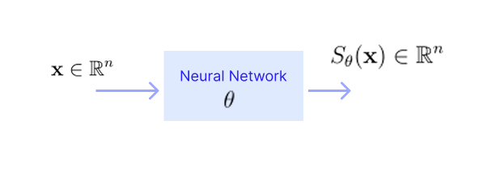

* TOC
{:toc}

## Introduction
As we know there are two ways to solve the generation problem. Given the knowledge now, given samples, we can estimate the target likelihood $p^*$ using energy-based models, and then produce more samples using the LMC algorithm.

**Experiment to try:**

1. Take a Gaussian distribution with known mean and covariance.
2. Produce synthetic samples using the pseudo-random number generator.
3. Input these samples to the energy-based model, and estimate the energy function using MLE, which will encode the mean and covariance inside it.
4. Produce samples using LMC.
5. Compare these samples with the pseudo-random number generated samples.
6. As a next step, try the experiment with exponential distribution whose energy function is not strongly convex.

Also observe how the quality of samples is changing with variance, dimension, step sizes, etc.

In energy-based models, we model the energy function, i.e.,

$$
p_{\theta}(x) = \frac{e^{-f_{\theta}(x)}}{Z(\theta)} 
$$

We model $f_{\theta}(x)$ using a neural network and estimate the parameters $\theta$. This helps us find the numerator term. Even though we estimate the parameters, the normalization constant $Z(\theta)$ is not available. So, essentially we are modelling the likelihood only up to the normalization constant. And this $Z(\theta)$ is not required anywhere in Langevin sampling; which is a good thing.

## Motivation for Score-based models
Do we actually need the likelihood (up to the normalization constant) for sampling (both during training and while generating new samples)? Can we simplify our model even further? Instead of modelling beyond what is required, can we model only the essential component? The only component we need is the Stein score; we don't need the likelihood. Then, why don't we model the score function directly instead of the energy function?

$$
S_{\theta}(x) \equiv \nabla_x \log p_{\theta}(x)
$$

If we model the score function (Stein score) of the target distribution directly, then such models are called as score-based models.

<figure markdown="0" class="figure zoomable">
<figcaption>
  <strong>Figure 1.</strong> Score-based model diagram
  </figcaption>
</figure>

If Stein score is the same for two distributions, then the distributions are the same, provided the densities are strictly positive and smooth on their support, with no holes or disjoint regions. Then, modelling score is equivalent to modelling the likelihood.

  
NOTE

  
Note that learning the score function is enough for sampling and generative modelling.

## Loss Function for Score-based Models
In the case of likelihoods, we typically use KL divergence to know how close the likelihood $p_{\theta}$ is to the target $p^*$. Minimizing the KL divergence led us to the MLE that we use in classical probabilistic modelling. Given samples from $p^*$, we need to estimate $p^*$. So, we model $p^*$ by $p_{\theta}$ and bring $p_{\theta}$ as close as possible to $p^*$.

$$
\min_{\theta} \text{KL}(p^* \, || \, p_{\theta})
$$

This simplifies to MLE with sample based approximation:

$$
\max_{\theta} \sum_i \log p_{\theta}(x_i) 
$$

If the number of samples goes to infinity, solving the MLE is equally the same as minimizing the KL divergence. By solving MLE, we are finding a distribution which is closest to $p^*$ in terms of KL divergence.

Now, let $S^*$ be the score function of the target likelihood. With samples given from $p^*$, we model $S^*$ by $S_{\theta}$ (say, by a neural network) and bring $S_{\theta}$ as close as possible to $S^*$. We can measure how close two score functions (or any functions) are by using the mean squared error. As they involve (continuous) random variable, we need to look at the expected (average) squared error.

$$
\min_{\theta} \int \| S_{\theta}(x) - S^*(x)  \|^2 \, p^*(x) \, dx \tag{1}
$$

This loss function is known as **Fischer Divergence**, and score matching with this objective is known as **explicit or basic score matching**. From this, we need to get to a form which doesn't involve $S^*$; something similar to MLE in the likelihood case, which does not involve $p^*$ but only samples from it. Then, as the number of samples tends to infinity, this form should converge to the original problem.

$$
\begin{align*}
\min_{\theta} \int \| S_{\theta}(x) \|^2 \, p^*(x) \, dx + \int \| S^*(x) \|^2 \, p^*(x) \, dx  +   2 \int S_{\theta}(x)^\top S^*(x) \, p^*(x) \, dx \\
\end{align*}
$$

* Given samples from $p^*$, we can approximate the first term by sample mean.
* The second term can be ignored as it is a constant with respect to $\theta$.
* For the third term:

$$
p^*(x) \, \nabla \log p^*(x) = p^*(x) \, \frac{1}{p^*(x)} \nabla p^*(x)
$$

Then, using IBP trick:

$$
\begin{align*}
\int S_{\theta}(x)^\top S^*(x) \, p^*(x) \, dx & = \int S_{\theta}(x)^\top \nabla p^*(x) \, dx \\
& = - \int \nabla \cdot \nabla \log p_{\theta}(x) \, p^*(x) \, dx \\
& \approx \frac{1}{m} \sum_{i=1}^m \Delta \log p_{\theta}(x_i)
\end{align*}
$$

Substituting these back in our original problem <a href="#eq:eq1">(1)</a> and approximating them with sample-based estimates, we get the loss function:

$$
\begin{align*}
\approx & \min_{\theta} \frac{1}{m} \sum_{i=1}^m \left( \| S_{\theta}(x_i) \|^2 - 2 \, \nabla \cdot  S_{\theta}(x_i) \right) \tag{2}\\
= & \min_{\theta} \frac{1}{m} \sum_{i=1}^m \left( \| \nabla \log p_{\theta}(x_i) \|^2 - 2\Delta  \log p_{\theta}(x_i) \right) \\
= & \min_{\theta} \frac{1}{m} \sum_{i=1}^m \sum_{j=1}^n \left[ \left(\frac{\partial \log p_{\theta} (x_i)}{\partial x_j}\right)^2 - 2 \frac{\partial^2 \log p_{\theta}(x_i)}{\partial x_j^2} \right]
\end{align*}
$$

where $m$ is the number of samples and $n$ is the dimension of the data $x$. As the number of samples tends to infinity, this problem converges to the original problem in <a href="#eq:eq1">(1)</a>. This objective is known as **implicit score matching**.

Once we solve this, we get the score function $S_{\theta}(x)$, which can then be used to do Langevin sampling to generate new samples.

  
NOTE

  
Note that in score-based modelling, we model $S_{\theta}$ where $\theta$ here denote the parameters of the score-based neural network. The first equation above is in terms of the model output, and all other equations are just expansions of it. Don't get confused with $\theta$ in $p_{\theta}$.

**Approaches for generative modelling:**

We can do:

* Energy-based modelling + Langevin sampling. Here there is an additional complication: we need samples from the model $p_{\theta}$ to compute the gradient $\nabla f_{\theta}(x)$. So, during training as well, we need to use Langevin sampling. The gradient doesn't need to be exact; so we can usually take one or two steps in LMC to generate samples to compute the gradient while training.

* Score-based modelling + Langevin sampling. Here we don't need Langevin sampling while training.

## Computational Cost
Let

$$
S_{\theta}(x) = \nabla_x \log p_{\theta}(x) = \begin{bmatrix} S_1(x) \\ S_2(x)  \\ \vdots \\ S_n(x) \end{bmatrix} = \begin{bmatrix} \frac{\partial \log p_{\theta}(x)}{\partial x_1} \\ \frac{\partial \log p_{\theta}(x)}{\partial x_2}  \\ \vdots \\ \frac{\partial \log p_{\theta}(x)}{\partial x_n} \end{bmatrix} \in \mathbb{R}^n
$$

be the score network output for a given $x \in \mathbb{R}^n$. Here each component $S_j(x)$ is a function of $n$ variables. Then, we need to compute the objective:

$$
\frac{1}{m} \sum_{i=1}^m \left( \| S_{\theta}(x_i) \|^2 - 2 \, \nabla \cdot  S_{\theta}(x_i) \right)
$$

* For a given data point $x$, the computational cost for the first term is $O(n)$; we need to square $n$ terms and add them.
* The second term is the Laplacian of $\log p_{\theta}(x)$:

$$
\Delta \log p_{\theta}(x) = \nabla \cdot S_{\theta}(x) = \sum_{j=1}^n \frac{\partial S_{\theta,j}(x)}{\partial x_j} = \sum_{j=1}^n \frac{\partial^2 \log p_{\theta}(x_i)}{\partial x_j^2}
$$

So computationally, this is the trace of the Jacobian of the score network output. The Jacobian of the score function or the Hessian of the log likelihood function is:

$$
J(x)=
\begin{bmatrix}
\frac{\partial}{\partial x_1} \left( \frac{\partial \log p_{\theta}(x)}{\partial x_1} \right)  & \frac{\partial}{\partial x_2} \left( \frac{\partial \log p_{\theta}(x)}{\partial x_1} \right) &
\dots & 
\frac{\partial}{\partial x_n} \left( \frac{\partial \log p_{\theta}(x)}{\partial x_1} \right)  \\ 
\frac{\partial}{\partial x_1} \left( \frac{\partial \log p_{\theta}(x)}{\partial x_2} \right)  & \frac{\partial}{\partial x_2} \left( \frac{\partial \log p_{\theta}(x)}{\partial x_2} \right) &
\dots & 
\frac{\partial}{\partial x_n} \left( \frac{\partial \log p_{\theta}(x)}{\partial x_2} \right)  \\
\\  \vdots \\
\frac{\partial}{\partial x_1} \left( \frac{\partial \log p_{\theta}(x)}{\partial x_n} \right)  & \frac{\partial}{\partial x_2} \left( \frac{\partial \log p_{\theta}(x)}{\partial x_n} \right) &
\dots & 
\frac{\partial}{\partial x_n} \left( \frac{\partial \log p_{\theta}(x)}{\partial x_n} \right)  \\ \end{bmatrix} = 
\begin{bmatrix}
\frac{\partial^2 \log p_{\theta}(x)}{\partial x_1^2} & \frac{\partial^2 \log p_{\theta}(x)}{\partial x_2 \partial x_1} &
\dots & 
\frac{\partial^2 \log p_{\theta}(x)}{\partial x_n \partial x_1}  \\ 
\frac{\partial^2 \log p_{\theta}(x)}{\partial x_1 \partial x_2} & \frac{\partial^2 \log p_{\theta}(x)}{\partial x_2^2 } &
\dots & 
\frac{\partial^2 \log p_{\theta}(x)}{\partial x_n \partial x_2}  \\  \vdots \\
\frac{\partial^2 \log p_{\theta}(x)}{\partial x_1 \partial x_n} & \frac{\partial^2 \log p_{\theta}(x)}{\partial x_2 \partial x_n} &
\dots & 
\frac{\partial^2 \log p_{\theta}(x)}{\partial x_n^2} \end{bmatrix}
$$

Focus on the first row $j=1$ of the Jacobian matrix.

$$
\left( \frac{\partial S_1}{\partial x_1}, \dots, \frac{\partial S_1}{\partial x_n} \right) = \nabla_x S_1(x)
$$

where 

$$
S_1(x) = \frac{\partial \log p_{\theta}(x)}{\partial x_1} 
$$

This is simply the gradient of the scalar function $S_1(x)$ with respect to $x$.

In Automatic differentiation, if we take a scalar output and call backward(), we obtain its gradient with respect to all inputs $x_1, \dots, x_n$ in one pass. So, it requires order $O(n)$ computations. Each row of the Jacobian costs one backward pass with $O(n)$ computations. So, to compute $n$ rows, we need $n$ backward passes; the full Jacobian requires $O(n^2)$ computations for a given data point $x$.

But we need only the trace of the Jacobian, but since backprop computes the whole vector (each row of $J$) with one backward pass, we will be computing the whole vector first and extracting the required component from it. Thus, the computational cost for the second term is $O(n^2)$ for a given data point $x$.

  
NOTE

  
Suppose we model the log-likelihood function instead, that is, our network output is $\log p_{\theta}(x)$ which is a scalar. Even in this case, we first need to compute the gradient $\nabla_x \log p_{\theta}(x)$, which will be a vector of size $n$. Then, we need to compute the gradient of the first component, which is of order $O(n)$. We repeat this for $n$ rows, so the total computations is $O(n^2)$ to obtain the Hessian matrix.

The computation of order $O(n^2)$ is not feasible for high-dimensional data. So, the score-based modelling objective function <a href="#eq:eq2">(2)</a> has practical issues; its computation is not feasible for modern-day data sets.
