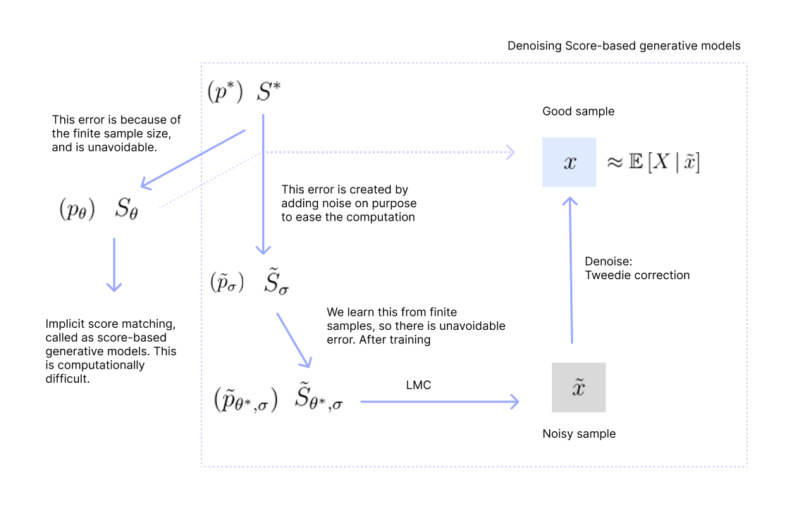
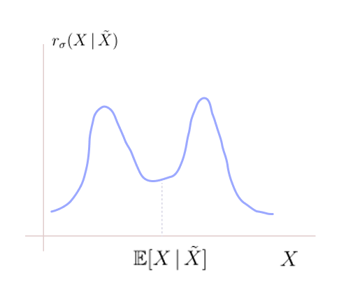

* TOC
{:toc}

## Introduction
We know the score-based modelling objective function which then we simplified to:

$$
\begin{align*}
& \min_{\theta} \int \| S_{\theta}(x) - S^*(x)  \|^2 \, p^*(x) \, dx \\ \approx
& \min_{\theta} \frac{1}{m} \sum_{i=1}^m \left( \| S_{\theta}(x_i) \|^2 - 2 \, \nabla \cdot  S_{\theta}(x_i) \right)
\end{align*}
$$

where $i$ denotes the training samples.

We observed that it requires $O(n^2)$ computations. The computation of order $O(n^2)$ is not feasible for high-dimensional data. So, the score-based modelling objective function has practical issues. In general, it is computationally expensive to compute the trace of the Hessian of any function, $\text{tr}(\nabla^2 f(x)) = \Delta f$. The trace of the Hessian of any function is the Laplacian of the function.

## Efficient way to compute the trace of the Hessian

Consider a Gaussian random vector $v$ whose mean is 0 with unit covariance matrix, $v \sim \mathcal{N}(0,I)$. And, assume $\nabla^2 f$ is deterministic:

$$
\begin{align*}
\text{tr}(\nabla^2 f(x)) & = \text{tr}(\nabla^2 f \cdot I) \\
& = \text{tr}(\nabla^2 f \cdot \mathbb{E}[v\, v^\top]) \\
& = \mathbb{E}[\text{tr}(\nabla^2 f \cdot vv^\top)] \\
& = \mathbb{E}[\text{tr}(v^\top \nabla^2 f v)] \\
& = \mathbb{E}[v^\top \nabla^2 f v] \\
& \approx \frac{1}{m} \sum_{i=1}^m v_i^\top \nabla^2f(x)\, v_i
\end{align*}
$$

* Third: Expectation and trace are linear operators, so we have pulled it out: $\text{tr}(A \mathbb{E}[X]) = \mathbb{E}[\text{tr}(AX)]$.
* Fourth: Cyclic permutation of the matrices inside the trace. The quantity inside the trace changes, but the resulting trace is not affected.
* Fifth: The quantity inside the trace is a number, hence the trace is dropped.

At first glance, computing $v_i^\top \nabla^2f(x)\, v_i$ seems to require forming the Hessian which costs $O(n^2)$. But we don't have to form the Hessian explicitly.

## Hutchinson's Trace Estimator
Suppose we want to compute $(\nabla^2 f) v$, where the Hessian is evaluated at $x$. One way to rewrite this efficiently is (this is how the `autodiff` implements the Hessian computation):

$$
(\nabla^2 f) v = \nabla (v^\top \nabla f)
$$

* LHS: We compute the whole Hessian, and do the vector multiplication. This costs $O(n^2)$.
* RHS: Compute the gradient of $f$ at $x$, which costs $O(n)$. Take dot product with $v$ to get a scalar quantity. Compute the gradient of the resulted scalar, which again costs $O(n)$. The total computation costs only $O(n)$.

Note that to compute the Hessian explicitly, assume $v=[1,0, \dots, 0]$, and compute the RHS. This gives us the first column of the Hessian matrix. The cost is $O(n)$. Repeat this with other basis vectors to get the other $(n-1)$ columns. So, the total computation to compute the Hessian explicitly is anyway $O(n^2)$ using either of the methods. But to compute the matrix-vector product, $(\nabla^2 f) v$, we don't need to form the Hessian explicitly. Similarly

$$
\begin{align*}
\text{tr}(\nabla^2 f(x)) & \approx \frac{1}{m} \sum_{i=1}^m v_i^\top \nabla^2f(x)\, v_i \\
& = \frac{1}{m} \sum_{i=1}^m v_i^\top \nabla (v_i^\top \nabla f)
\end{align*}
$$

The LHS costs $O(n^2)$, but the RHS requires only $O(mn)$, where $m$ is the number of data points. If $m <n$, then this approach gives us computational advantage. But when $m \geq n$ (i.e., we require a lot of samples), then efficiency is not observed with this method.

If we use Hutchinson's trace estimator in the context of score-based learning, it is called as sliced score-based learning.

## Noise is all we need
The objective is to avoid the computationally heavy score-based learning objective and replace it with a simple procedure. The Hessian in the score-based learning objective is coming from the IBP trick from the following term:

$$
\begin{align*}
\int S_{\theta}(x)^\top S^*(x) \, p^*(x) \, dx & = \int S_{\theta}(x)^\top \nabla p^*(x) \, dx \tag{1} \\
& = - \int \nabla \cdot \nabla \log p_{\theta}(x) \, p^*(x) \, dx \\
\end{align*}
$$

So, instead of using the IBP trick, can we somehow deal with $\nabla p^*(x)$ in <a href="#eq:eq1">(1)</a> more efficiently?

Suppose $z$ is a $n$-dimensional random vector which can be broken down into $(z', z'')$. And let the joint distribution $p^*(z', z'')$ has some kind of factorization $p^* = q \cdot r$, i.e., the joint over these $n$ variables is factorized into two factors. Then

$$
\begin{align*}
p^*(z', z'') & = q(z' \, | \, z'') \cdot r(z'') \\
\log p^* & = \log(q\cdot r) \\
\log p^* & = \log q + \log r\\
\nabla \log p^*(z', z'') & = \nabla \log q(z' \, | \, z'') + \nabla \log r(z'') \\
\end{align*}
$$

The score functions of the factors can be related to the score function of the joint. That is, adding two score functions $\nabla \log q + \nabla \log r$ is the same as factorizing the joint $p^*$.

Now, let $p(\tilde{x})$ be a mixture model. We factorize the joint $p^*$ into two, but after that we marginalize with respect to $x$.

$$
p(\tilde{x}) = \int q(\tilde{x} \, | \, x) \, r(x) \, dx
$$

  
NOTE

  
Suppose $r(x)$ is a discrete distribution with $x$ taking two values 1 and 0. If $x=1$, then we choose $q(\tilde{x} \, | \, x=1)$ else $q(\tilde{x} \, | \, x=0)$. Thus, $p(\tilde{x})$ is a mixture of $q(\tilde{x}\, | \, x=0)$ and $q(\tilde{x} \, | \, x=1)$.
  
  In terms of random variables, we sample $x$ from $r(x)$ and then sample $\tilde{x}$ from $q(\tilde{x} \, | \, x)$. This gives us a sample $(x, \tilde{x})$ from the joint $p(x, \tilde{x})$. We discard $x$ from the pair and retain only $\tilde{x}$.

This is a very general setting, any $p$ can be written as the RHS for some $q$ and $r$. In the worst case, we can always have $q=1$ and $r=p$. On taking the gradient with respect to $\tilde{x}$ on both sides:

$$
\nabla p(\tilde{x}) = \int \left( \nabla  q(\tilde{x}\, | \, x) \right) \, r(x) \, dx \tag{2}
$$

Here $r$ doesn't involve $\tilde{x}$, hence it is a constant. We observe that the gradient of $p$ is only a function of gradient of $q$, and it is not a function of gradient of $r$. Now, suppose

* $q$ is a Gaussian distribution where computing its gradient is easy.
* Sampling from $r$ is easy.

Under these two conditions, we can approximate <a href="#eq:eq2">(2)</a> very well with sample mean. Let $r=p^*$ where $p^*$ be the true data distribution:

$$
p(\tilde{x}) = \int   q(\tilde{x}\, | \, x) \, p^*(x) \, dx \tag{3}
$$

$\tilde{x}$ is a sample that we want from $p$ (the LHS), but we are not picking it directly. We are first picking a proxy $x$ from $p^*$, and given this $x$, we are generating $\tilde{x}$ from $q(\tilde{x} \, | \, x)$. Then, the pair $(x,\tilde{x})$ is a sample from the joint $p(x,\tilde{x})$. From this pair, discarding $x$ leaves us with a valid sample $\tilde{x}$ from the marginal distribution $p(\tilde{x})$. The marginal $p$ will be exactly $p^*$ when $q$ is a Dirac delta function:

$$
q(\tilde{x} \, | \, x) = \begin{cases} 1 & \text{if } \tilde{x}=x \\
0 & \text{otherwise } \\
\end{cases}
$$

In such case, the equation <a href="#eq:eq3">(3)</a> is just a way of rewriting $p^*$:

$$
p^*(\tilde{x}) = \int   q(\tilde{x}\, | \, x) \, p^*(x) \, dx
$$

Suppose we have samples $x$ from $p^*$, we can get the empirical distribution of $p^*$ using the RHS:

$$
p^*(\tilde{x}) \approx \frac{1}{m} \sum_i q(\tilde{x} \, | \, x_i) 
$$

We are doing nothing; just writing a formula for the empirical distribution. But we are not interested in approximating $p^*$, we need to approximate $\nabla p^*$.

$$
\nabla p^*(\tilde{x}) = \int   \nabla q(\tilde{x} \, | \, x) \, p^*(x) \, dx
$$

If $q$ is a Dirac delta distribution, then the gradient is not defined because the distribution is defined only at one point. So, let's have a smooth approximation of the Dirac delta: a Gaussian with very less variance.

 
$$
\begin{align*}
\tilde{p}_{\sigma}(\tilde{x}) & = \int   q_{\sigma}(\tilde{x} \, | \, x) \, p^*(x) \, dx \\
\nabla \tilde{p}_{\sigma}(\tilde{x}) & = \int  \nabla q_{\sigma}(\tilde{x} \, | \, x) \, p^*(x) \, dx \tag{4}
\end{align*}
$$

where $q_{\sigma} \sim \mathcal{N}(x, \sigma^2I)$. In this case, the distribution $p^*$ is approximated by $\tilde{p}_{\sigma}$. This approximation depends on the variance of $q$. If the variance $\sigma^2$ tends to 0, we will get the best approximation, i.e., the Gaussian will become Dirac delta. We are doing this because by equation <a href="#eq:eq4">(4)</a>, we get a way to approximate $\nabla p^*$, and this can be computed efficiently using our training samples. The above view is from the point of view of likelihoods.

The above equations can also be viewed from the point of view of random variables:

$$
\begin{align*}
X & \sim p^* \\
\tilde{X} \, | \, X & \sim q_{\sigma}( \cdot | \, X=x)  = \mathcal{N}(x, \sigma^2I) \propto \text{exp}\left(-\frac{1}{2\sigma^2} \|\tilde{x} - x \|^2 \right)
\end{align*}
$$

The generation process of $\tilde{x}$ as follows:

* First, $x$ is sampled from $p^*$ (clean samples from $p^*$ - our training data points).
* Then, $\tilde{x}$ is sampled from the Gaussian $q_{\sigma}( \cdot | \, x)$. This Gaussian is peaked at $x$, so $\tilde{x}$ is almost close to $x$. That is, $\tilde{x}$ is a noisy version of $x$. Thus, $\tilde{x}$ are not samples from $p^*$, but from a distribution $\tilde{p}_{\sigma}$ which is close to $p^*$.

To write explicitly:

$$
\tilde{X} = X + N \hspace{1cm} \text{where } N \sim \mathcal{N}(0, \sigma^2I)
$$

We are essentially adding noise to our original data points. The distribution is:

$$
p(\tilde{X} \, | \, X=x) = \mathcal{N}(x, \sigma^2I)
$$

Then, score-based learning can be carried out easily with these noisy samples. We will get this advantage just because of equation <a href="#eq:eq4">(4)</a>.

### Score learning for the perturbed distribution
Ideally we wanted the score function of the original distribution $p^*$ which is $S^*$. But we can't get it because we only have finite samples from $p^*$. So, our objective was to learn a score function $S_{\theta}(x)$ using a model that is as close as possible to the score function of the original distribution:

$$
\min_{\theta} \int \| S_{\theta}(x) - S^*(x)  \|^2 \, p^*(x) \, dx
$$

The error between $S^*$ and $S_{\theta}$ we learn is a function of number of samples, i.e., it might be $\frac{1}{\sqrt{m}}$. As the number of training samples $m$ increases, this error can be reduced. So, for all practical purposes, $S_{\theta}$ is a good approximation of $S^*$.

We came up with implicit score matching method to solve the above optimization problem, but it had computational issues. So, we perturb the original distribution to form its noisy version $\tilde{p}_{\sigma}$, that is, in terms of RV, we take the original data points and add noise to them. The distribution of those noisy samples is $\tilde{p}_{\sigma}$. Let's use $\tilde{x}$ for noisy version of $x$.

$$
\tilde{p}_{\sigma}(\tilde{x}) = \int q_{\sigma}(\tilde{x} \, | \, x) \, p^*(x) \, dx
$$

Now, we have the noisy version of our training data points $\tilde{x}$. Then, the score learning of $\tilde{p}_{\sigma}$ will be as follows. Note that the resulting $S_{\theta}$ will be a function of $\sigma$ as well. So, our score learning objective is now:

$$
\min_{\theta} \int \| \tilde{S}_{\theta, \sigma}(\tilde{x}) - \tilde{S}_{\sigma}(\tilde{x})  \|^2 \, \tilde{p}_{\sigma}(\tilde{x}) \, d\tilde{x} \tag{5}
$$

On learning this, we get the score function $\tilde{S}_{\theta^*, \sigma}$ which will be close to the score function $\tilde{S}_{\sigma}$ of the perturbed distribution. We can only get close to $\tilde{S}_{\sigma}$ because we are working with finite samples; and this error is unavoidable. On expanding this as before:

$$
\begin{align*}
& \min_{\theta} \int \left( \|\tilde{S}_{\theta, \sigma}(\tilde{x}) \|^2 -  2 \tilde{S}_{\theta, \sigma}(\tilde{x})^\top \tilde{S}_{\sigma}(\tilde{x}) \right) \,  \tilde{p}_{\sigma}(\tilde{x}) \, d\tilde{x} \\
& = 
\min_{\theta} \int  \|\tilde{S}_{\theta, \sigma}(\tilde{x}) \|^2 \, \tilde{p}_{\sigma}(\tilde{x}) \, d\tilde{x} -  2 \int \tilde{S}_{\theta, \sigma}(\tilde{x})^\top \tilde{S}_{\sigma}(\tilde{x}) \, \tilde{p}_{\sigma}(\tilde{x}) \, d\tilde{x}   \\
\end{align*}
$$

We know that

$$
\begin{align*}
\tilde{p}_{\sigma}(\tilde{x}) & = \int  q_{\sigma}(\tilde{x} \, | \, x) \, p^*(x) \, dx \\
\nabla \tilde{p}_{\sigma}(\tilde{x}) & = \int  \nabla q_{\sigma}(\tilde{x} \, | \, x) \, p^*(x) \, dx \\
\end{align*}
$$

The first term:

$$
\begin{align*}
\int \|\tilde{S}_{\theta, \sigma}(\tilde{x}) \|^2 \, \tilde{p}_{\sigma}(\tilde{x}) \, d\tilde{x} & = \int \|\tilde{S}_{\theta, \sigma}(\tilde{x}) \|^2 \, \left[ \int  q_{\sigma}(\tilde{x} \, | \, x)  \, p^*(x) \, dx \right] \, d\tilde{x} \\
& = \int \int  \|\tilde{S}_{\theta, \sigma}(\tilde{x}) \|^2 \, q_{\sigma}(\tilde{x} \, | \, x)  \, p^*(x) \, dx  \, d\tilde{x} \\
& = \int \int  \|\tilde{S}_{\theta, \sigma}(\tilde{x}) \|^2 \, q_{\sigma}(\tilde{x} \, | \, x)  \, p^*(x) \, d\tilde{x} \, dx  \\
& = \int \left[ \int \|\tilde{S}_{\theta, \sigma}(\tilde{x}) \|^2 \, q_{\sigma}(\tilde{x} \, | \, x)  \, d\tilde{x} \right] \cdot p^*(x) \, dx  \\
\end{align*}
$$

The second term:

$$
\begin{align*}
\int \tilde{S}_{\theta, \sigma}(\tilde{x})^\top \tilde{S}_{\sigma}(\tilde{x}) \, \tilde{p}_{\sigma}(\tilde{x}) \, d\tilde{x} & = \int \tilde{S}_{\theta, \sigma}(\tilde{x})^\top \nabla_{\tilde{x}} \log \tilde{p}_{\sigma}(\tilde{x}) \, \tilde{p}_{\sigma}(\tilde{x}) \, d\tilde{x} \\
& = \int \tilde{S}_{\theta, \sigma}(\tilde{x})^\top \nabla  \tilde{p}_{\sigma}(\tilde{x}) \, d\tilde{x} \\
& = \int \tilde{S}_{\theta, \sigma}(\tilde{x})^\top \, \int  \nabla q_{\sigma}(\tilde{x} \, | \, x) \, p^*(x) \, dx \, d\tilde{x}\\
& = \int  \int \tilde{S}_{\theta, \sigma}(\tilde{x})^\top  \nabla q_{\sigma}(\tilde{x} \, | \, x) \, p^*(x) \, dx \, d\tilde{x} \\
& = \int  \int \tilde{S}_{\theta, \sigma}(\tilde{x})^\top  \nabla q_{\sigma}(\tilde{x} \, | \, x) \, p^*(x) \,  d\tilde{x} \, dx \\
& = \int  \left[ \int \tilde{S}_{\theta, \sigma}(\tilde{x})^\top  \nabla q_{\sigma}(\tilde{x} \, | \, x) \, \,  d\tilde{x} \right] \cdot p^*(x) \, dx
\end{align*}
$$

Then, our objective become:

$$
\begin{align*}
& \min_{\theta} \int \left[ \int \|\tilde{S}_{\theta, \sigma}(\tilde{x}) \|^2 \, q_{\sigma}(\tilde{x} \, | \, x)  \, d\tilde{x} \right] \cdot p^*(x) \, dx  -  2 \int  \left[ \int \tilde{S}_{\theta, \sigma}(\tilde{x})^\top  \nabla q_{\sigma}(\tilde{x} \, | \, x) \, d\tilde{x} \right] \cdot p^*(x) \, dx \\
& = \min_{\theta} \int \left[ \int \left[ \|\tilde{S}_{\theta, \sigma}(\tilde{x}) \|^2 \, q_{\sigma}(\tilde{x} \, | \, x) - 2 \tilde{S}_{\theta, \sigma}(\tilde{x})^\top  \nabla q_{\sigma}(\tilde{x} \, | \, x) \right] \, d\tilde{x} \right] \, \cdot p^*(x) \, dx \\
& = \min_{\theta} \int \left[ \int \left[ \|\tilde{S}_{\theta, \sigma}(\tilde{x}) \|^2 \, q_{\sigma}(\tilde{x} \, | \, x) - 2 \tilde{S}_{\theta, \sigma}(\tilde{x})^\top  S^q_{\sigma}(\tilde{x} \, | \, x) \,  q_{\sigma}(\tilde{x} \, | \, x) \right] \, d\tilde{x} \right] \, \cdot p^*(x) \, dx \\
& = \min_{\theta} \int \left[ \int \left[ \|\tilde{S}_{\theta, \sigma}(\tilde{x}) \|^2 - 2 \tilde{S}_{\theta, \sigma}(\tilde{x})^\top  S^q_{\sigma}(\tilde{x} \, | \, x) \right] \, q_{\sigma}(\tilde{x} \, | \, x)\, d\tilde{x} \right] \, \cdot p^*(x) \, dx \\
& = \min_{\theta} \int \left[ \int \left[ \|\tilde{S}_{\theta, \sigma}(\tilde{x})  -  S^q_{\sigma}(\tilde{x} \, | \, x) \|^2 \right] \, q_{\sigma}(\tilde{x} \, | \, x)\, d\tilde{x} \right] \, \cdot p^*(x) \, dx \tag{6}
\end{align*}
$$

where $S^q_{\sigma}(\tilde{x} \, | \, x) = \nabla \log q_{\sigma}(\tilde{x} \, | \, x)$ is the score function of $q_{\sigma}(\tilde{x} \, | \, x)$. Then, the quantity inside the bracket (the inner integral term) is the score matching for $q_{\sigma}(\tilde{x} \, | \, x)$ for a given $x$.

This optimization problem is easy to solve because the score of $q_{\sigma}(\tilde{x} \, | \, x)$ is known.

$$
\begin{align*}
q_{\sigma}(\tilde{x} \, | \, x) & \propto \text{exp}\left( -\frac{1}{2\sigma^2} (\| \tilde{x} - x\|^2)\right) \\
\log q_{\sigma}(\tilde{x} \, | \, x) & \propto -\frac{1}{2\sigma^2} \| \tilde{x} - x\|^2 \\
\nabla_{\tilde{x}} \log q_{\sigma}(\tilde{x} \, | \, x) & = -\frac{(\tilde{x} - x)}{\sigma^2}  \\
\end{align*}
$$

Substituting this in our objective gives us:

$$
\min_{\theta} \int \int \left\| \tilde{S}_{\theta, \sigma}(\tilde{x})  -  \frac{(x - \tilde{x} )}{\sigma^2} \right\|^2  \, q_{\sigma}(\tilde{x} \, | \, x) \, p^*(x) \, d\tilde{x} \, dx 
$$

Now, this integral can be approximated by taking samples from $q_{\sigma}(\tilde{x} \, | \, x) \, p^*(x)$. Then, the objective is

$$
\approx \min_{\theta} \frac{1}{m} \sum_{i=1}^m \left\| \tilde{S}_{\theta, \sigma}(\tilde{x}_i)  -  \frac{(x_i - \tilde{x}_i )}{\sigma^2} \right\|^2
$$

## Denoising Score Matching

**Score Network Learning Procedure:**

1. Get training data points $x_i$ which are samples from $p^*$. Assume there are $m$ training data points
2. Add noise to them $\tilde{x}_i = x_i + n_i$ where $n_i \sim \mathcal{N}(0, \sigma^2I)$ which will then be samples from $\tilde{p}_{\sigma}$, where $i=1, \dots, m$.
3. Pass these noisy samples $\tilde{x}_i$ through the score network to get $\tilde{S}_{\theta, \sigma}(\tilde{x}_i)$. These are our model predictions $\hat{y_i}$.
4. Compute $\frac{(x_i - \tilde{x}_i )}{\sigma^2} $. These are our ground truth $y_i$.
5. Then the objective

$$
\min_{\theta} \frac{1}{m} \sum_{i=1}^m \left\| \tilde{S}_{\theta, \sigma}(\tilde{x}_i)  -  \frac{(x_i - \tilde{x}_i )}{\sigma^2} \right\|^2
$$

is nothing but the least squares optimization problem. The score learning of the perturbed distribution is just a least squares problem. This optimization problem has a closed form solution which gives us the optimal parameters of the score network $\theta^*$.

<figure markdown="0" class="figure zoomable">
<figcaption>
  <strong>Figure 1.</strong> Denoising score matching procedure
  </figcaption>
</figure>

6. With the score network learnt, we can now run LMC to generate new samples $\tilde{x}$. We start with a sample from a Gaussian distribution $\tilde{x}_0$. Run this for say 10 steps. 

$$
\begin{align*}
\tilde{x}_1 & = \tilde{x}_0 + h \, \tilde{S}_{\theta^*, \sigma}(\tilde{x}_0) + \sqrt{2h} \, n_0 \\
\dots \\
\tilde{x}_{10} & = \tilde{x}_9 + h \, \tilde{S}_{\theta^*, \sigma}(\tilde{x}_9) + \sqrt{2h} \, n_9 \tag{7}\\
\end{align*}
$$

Then, $\tilde{x}_{10}$ is a sample from $\tilde{p}_{\theta^*, \sigma}$ which is an approximation of $\tilde{p}_{\sigma}$. These samples will be noisy; not in usable form. We should denoise these samples to get clear samples.

7. **Tweedie Denoising Correction:**

From the least squares formulation, we can see that we are expressing the ground truth $\frac{(x_i - \tilde{x}_i )}{\sigma^2} $ by a score-network. Once the optimal parameters $\theta^*$ are found, then (this is same as writing $y = f(x)$)

$$
\begin{align*}
\frac{(x_i - \tilde{x}_i )}{\sigma^2} & = \tilde{S}_{\theta^*, \sigma}(\tilde{x}_i) \\
x_i - \tilde{x}_i & = \sigma^2 \, \tilde{S}_{\theta^*, \sigma}(\tilde{x}_i) \\
x_i & = \tilde{x}_i + \sigma^2 \, \tilde{S}_{\theta^*, \sigma}(\tilde{x}_i) \\
\end{align*}
$$

The last equation is known as Tweedie denoising formula. Once we generate a sample from LMC as in equation <a href="#eq:eq7">(7)</a>, we do Tweedie denoising:

$$
x_{11} = \tilde{x}_{10} + \sigma^2 \, \tilde{S}_{\theta^*, \sigma}(\tilde{x}_{10})
$$

$x_{11}$ is the clean sample. Equations in <a href="#eq:eq7">(7)</a> are diffusion steps and the above equation is a denoising step. In the diffusion steps, we are adding noise at each step, and in the (single) denoising step, we are removing the noise completely.

The quality of these denoised samples will then be equivalent to the quality of those samples generated using the score function of $p_{\theta}$ (which we get by solving the implicit score matching - the computationally difficult problem).

**How to choose $\sigma$?**

* There is no problem with $\sigma$ being large during training. But it will be difficult during inference when we try to denoise the generated samples.

* When $\sigma$ is close to 0, the target blows up to infinity. Even when it is very low, the problem will be numerically unstable.

So, $\sigma$ should be moderately low.

## Expected Clean Sample
When we model $y=f(x)$ in linear regression, the output from the model is actually the approximation of the expected value of $Y$ given $X$, that is, $f(x) \approx \mathbb{E}[Y \, | \, X=x]$. Similarly

$$
\begin{align*}
\mathbb{E}\left[ 
  \frac{(X - \tilde{x} )}{\sigma^2} \, | \, \tilde{X} = \tilde{x}
\right] & \approx \tilde{S}_{\theta^*, \sigma}(\tilde{X}) \\
\frac{1}{\sigma^2}\mathbb{E}\left[ 
  X - \tilde{x} \, | \, \tilde{x}
\right] & \approx \tilde{S}_{\theta^*, \sigma}(\tilde{X}) \\
\frac{1}{\sigma^2}\mathbb{E}\left[ 
  X  \, | \, \tilde{X} 
\right] - \tilde{X} & \approx \tilde{S}_{\theta^*, \sigma}(\tilde{X}) \\
\end{align*}
$$

Then, the Tweedie denoising is actually:

$$
\mathbb{E}\left[ 
  X  \, | \, \tilde{X} 
\right] \approx \tilde{X} + \sigma^2 \, \tilde{S}_{\theta^*, \sigma}(\tilde{X})
$$

Given the noisy sample $\tilde{X}$, the $\mathbb{E}\left[ 
  X  \, | \, \tilde{X} \right]$ is the expected clean sample, i.e., the best deterministic guess for the clean sample.

The sample $x$ after denoising is a good approximation of the true expected clean sample given the noisy sample. And given that the sample we got from LMC $\tilde{x}$ is a good approximation of a sample from the perturbed distribution, the sample $x$ can be considered as a good approximation of a sample from $p^*$.

  
WARNING

  
When $\sigma$ is large, the variance of the distribution $p(X \, | \, \tilde{X}) = r_{\sigma}(x \, | \, \tilde{x})$ will be large. From this distribution, we only pick the expected value. So, the error in the clean sample will be higher as we increase $\sigma$, and the resulting $x$ won't be a good approximation of a sample generated from $p^*$.

### Can we do better?
With Tweedie denoising step, we are at best getting only the expected value of the clean sample given the noisy sample. Can we get other better clean samples?

We know that

$$
\tilde{p}_{\sigma}(\tilde{x}) = \int q_{\sigma}(\tilde{x} \, | \, x)  \, p^*(x) \, dx
$$

Using Bayes rule, we can write

$$
\frac{q_{\sigma}(\tilde{x} \, | \, x)  \, p^*(x)}{\tilde{p}_{\sigma}(\tilde{x})} = r_{\sigma}(x \, | \, \tilde{x})
$$

$r_{\sigma}(x \, | \, \tilde{x})$ is the posterior distribution over $x$ after looking at the noisy samples. If we can somehow compute the RHS, we can produce samples from the distribution $r_{\sigma}(x \, | \, \tilde{x})$ using LMC directly. We don't have to stick with a sample that is just the expected value from this distribution.

<figure markdown="0" class="figure zoomable">
<figcaption>
  <strong>Figure 2.</strong> Posterior distribution of clean samples
  </figcaption>
</figure>

If we know $r_{\sigma}(x \, | \, \tilde{x})$, using the Bayes expression above

$$
\begin{align*}
\int r_{\sigma}(x \, | \, \tilde{x}) \, \tilde{p}_{\sigma}(\tilde{x}) \, d\tilde{x} & = \int q_{\sigma}(\tilde{x} \, | \, x)  \, p^*(x) \, d\tilde{x} \\
& = \int p(\tilde{x}, x) \, d\tilde{x} \\
& = p^*(x)
\end{align*}
$$

* RHS in the first equation: Sample $x$ from $p^*$, then sample $\tilde{x}$ from $q_{\sigma}(\tilde{x} \, | \, x)$. Then, $q_{\sigma}(\tilde{x} \, | \, x)  \, p^*(x)$ gives us a joint probability of $x$ and $\tilde{x}$.
* Then, take marginal with respect to $\tilde{x}$. From the POV of RVs, this is equivalent to removing $\tilde{x}$ from the sampled pair $(x, \tilde{x})$.

So, the LHS in the first equation proves that taking a noisy sample $\tilde{x}$ from $\tilde{p}_{\sigma}$ (the sample that we get from LMC) and sampling from $r_{\sigma}(x \, | \, \tilde{x})$ gives us a sample which is **actually** a sample from $p^*$.

  
WARNING

  
But note that we cannot sample from $r_{\sigma}$ as we don't know the score function of $r_{\sigma}$.

So right now, we are not doing this, for a given noisy sample $\tilde{x}$ from LMC, we are producing $x$ by applying Tweedie denoising. This $x$ is an approximation of the expected value $\mathbb{E}[X \, | \, \tilde{X}]$. And we believe this $x$ is a good approximation of a sample from $p^*$.

At best, this $x$ will exactly be equal to the expected value of the clean sample. But can we get a better clean sample than the expectation?

Think of it this way: a random variable can take values $[1,2,3,4,5]$, but we always pick an approximation of its expected value, say $2.9$. At best, we can pick 3. But can we get other values from this distribution?