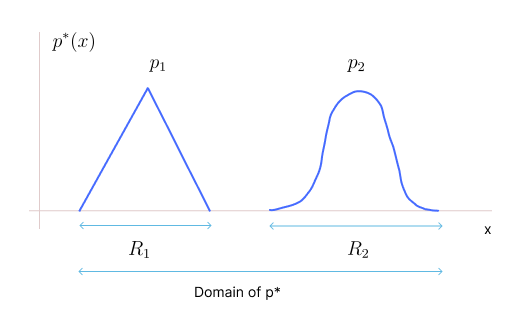
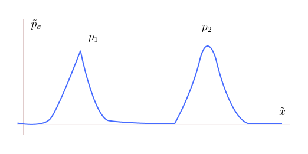
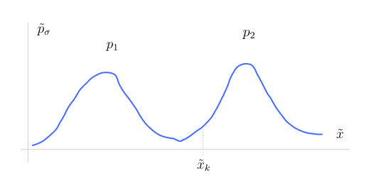

* TOC
{:toc}

## Problems with Score Matching
While it appeared that denoising mainly helps alleviate the computational issues in score matching, there are other critical roles it plays. 

Suppose the target likelihood $p^*$ is a distribution as follows. The distribution has disjoint regions inside its support. We call the first part of the density whose support is $R_1$ as $p_1$ and the other part whose support is $R_2$ as $p_2$. They are non-overlapping densities.

<figure markdown="0" class="figure zoomable">
<figcaption>
  <strong>Figure 1.</strong> Example of a disjoint likelihood 
  </figcaption>
</figure>

And assume $p_1$ and $p_2$ are individually normalized. That is,

$$
\begin{align}
\int p^*(x) & = \int_{R_1} p_1(x) + \int_{R_2} p_2(x) \\
& = 1 + 1 
\end{align}
$$

So, we divide each by 2 to make $p^*$ a valid distribution.

$$
p^*(x) = \begin{cases}
\frac{1}{2} p_1(x) & \text{if } x \in R_1 \\
\frac{1}{2} p_2(x) & \text{if } x \in R_2 \\
0 & \text{otherwise} \\
\end{cases}
$$

But there is no reason to consider $\frac{1}{2}$ weightage for each, we can be generic:

$$
p^*_r(x) = \begin{cases}
r_1 \, p_1(x) & \text{if } x \in R_1 \\
r_2 \, p_2(x) & \text{if } x \in R_2 \\
0 & \text{otherwise} \tag{1}\\
\end{cases}
$$

where $r_1, r_2 >0$ and $r_1 + r_2 = 1$. The $r_1$ and $r_2$ are mixture coefficients. And, $p^*$ is a function of $r_1 = r$ (the weightage of the first distribution). As the components are not overlapping, we can write

$$
p^*_r(x) = r_1 \, p_1'(x) + r_2 \, p_2'(x) \hspace{1cm} \forall x \in \mathbb{R} \tag{2}
$$

where 

$$
p_1'(x) = \begin{cases}
p_1(x) & \text{if } x \in R_1 \\
0 & \text{otherwise} \\
\end{cases} \hspace{1cm} \text{and} \hspace{1cm} p_2'(x) = \begin{cases}
p_2(x) & \text{if } x \in R_2 \\
0 & \text{otherwise} \\
\end{cases}
$$

$p_1'$ and $p_2'$ are extended version of $p_1$ and $p_2$ by defining them to be zero outside their respective regions. Given the densities are non-overlapping, the case statements in <a href="#eq:eq1">(1)</a> can be written as <a href="#eq:eq2">(2)</a>. The form in <a href="#eq:eq1">(2)</a> is a classical mixture model.

  
NOTE

  
In general, a mixture model is defined by the form in <a href="#eq:eq2">(2)</a> regardless of overlap. But the piecewise definition of our original distribution here $p^*$ as in <a href="#eq:eq1">(1)</a> is not a classical mixture model. We are able to write it in a mixture model form only because the regions are disjoint.

**Problem 1:**
$p^*$ is not differentiable everywhere in $\mathbb{R}^d$.

**Problem 2:**
To find $\nabla \log p^*$:

$$
\begin{align*}
\nabla \log p^*_r(x) & = \nabla \log (r_1 \, p'_1 + r_2 \, p'_2) \\
& = \frac{1}{r_1 \, p'_1 + r_2 \, p'_2} \nabla (r_1 \, p'_1 + r_2 \, p'_2) \\
& = \frac{1}{r_1 \, p'_1 + r_2 \, p'_2} (r_1 \,  \nabla p'_1 + r_2 \,  \nabla p'_2) \\
\end{align*}
$$

The gradient doesn't exist outside $R_1$ and $R_2$ as $p^*$ is defined only in $R_1$ and $R_2$. And also it doesn't exist on the boundary points of $R_1$ and $R_2$. For any $x$, only one of the components is non-zero. For $x \in \text{int}(R_1)$:

$$
\nabla \log p^*_r(x) = \frac{1}{r_1 \, p'_1} (r_1 \,  \nabla p'_1) = \nabla \log p_1'(x)
$$

because $p'_2(x)=0$ and its gradient at this $x$ is 0. Thus,

$$
\nabla \log p^*_r(x) = \begin{cases}
\nabla \log p_1(x)  & \text{if } x \in \text{int}(R_1) \\
\nabla \log p_2(x)  & \text{if } x \in \text{int}(R_2) \\
\text{undefined} & \text{otherwise}\\
\end{cases}
$$

The score function of $p^*_r$ is no longer a function of $r$; the $r$ disappeared. But $r$ is valuable information. For different values of $r$, the $p^*$ can be completely different. All those different $p^*$ distributions will have the same Stein score.

In such case, learning the Stein score is not equivalent to learning the likelihood because the same score is associated with multiple distributions. Even if we somehow magically learn this score function (by NN), we cannot expect the LMC to generate samples from our **intended** distribution by using this Stein score.

  
WARNING

  
The Stein score can characterize a likelihood uniquely only when the likelihood has no disjoints in its support, i.e., the likelihood is non-zero everywhere in its support.

**Problem 3:**
When the target distribution is a likelihood with disjoint regions, the score-matching objective (Fisher divergence) is ill-defined.

$$
\min_{\theta} \int \| S_{\theta}(x) - S^*(x)  \|^2 \, p^*(x) \, dx
$$

Suppose $p^*$ has disjoint regions, then the learnt $S_{\theta}(x)$ will approximate $S^*(x)$ where $p^*$ is not zero. But where $p^*=0$, no matching happens, so $S_{\theta}(x)$ can be anything in those regions. Then, there will be an uncountable number of score functions $S_{\theta}(x)$ that exactly match the target score in the region where target likelihood is positive and are very diverse in the regions where target likelihood is zero. That is, many score functions can be a solution to this problem.

When the target distribution is a likelihood with disjoint regions, then score-based learning is a problem. But in practice, we encounter these kinds of distributions with non-overlapping components very often. There could be many ways to tackle these problems. But denoising-score matching is one of the ways.

## Denoising Score Matching to the Rescue
In the denoising score matching, we perturb the original samples, and these will be the samples from the perturbed distribution $\tilde{p}_{\sigma}$. To each clean sample $x$, we add a Gaussian noise. Then, the original distribution becomes:

<figure markdown="0" class="figure zoomable">
<figcaption>
  <strong>Figure 2.</strong> Noised likelihood
  </figcaption>
</figure>

We approximate $p^*$ by $\tilde{p}_{\sigma}$. The perturbed distribution $\tilde{p}_{\sigma}$ is strictly positive and smooth everywhere in $\mathbb{R}^d$. It is differentiable, i.e., the gradient exists everywhere in $\mathbb{R}^d$.

The distribution now has overlapping components, so it is a classical mixture model:

$$
\tilde{p}_{\sigma}(\tilde{x}) = r_1 \, p_1(\tilde{x}) + r_2 \, p_2(\tilde{x})  \hspace{1cm} \forall \tilde{x} \in \mathbb{R}^d
$$

For a given $\tilde{x}$, both the components contribute and the sum in the RHS is the probability $\tilde{p}_{\sigma}(\tilde{x})$. When we take gradient with respect to $\tilde{x}$:

$$
\nabla \log \tilde{p}_{\sigma} = \frac{1}{r_1 \, p_1 + r_2 \, p_2} (r_1 \,  \nabla p_1 + r_2 \,  \nabla p_2) \\
$$

For a given $\tilde{x}$, both gradients contribute, so $r_1$ and $r_2$ information is preserved.

Now, with this distribution $\tilde{p}_{\sigma}$, we can carry out score-matching without any problem. This clarifies why generation using denoising-score matching is a far better practical option than the other (explicit) generative models such as energy-based models and basic score matching we studied. The main takeaways are:

1. Noising makes the score-matching computationally tractable.
2. Noising makes targets positive everywhere and hence makes score matching actually equivalent to likelihood matching. 
3. Noising makes the score-matching objective (Fisher divergence) well-defined.

There is an additional practical problem observed.

### Mode Collapse
Suppose we added very little noise and made the distribution positive everywhere, but it has almost flat regions in its domain. And we learnt the score function of this distribution using the denoising score-matching objective.

Now, in the LMC, say we start with a random sample $x_0$ which is near the mode $p_2$. The Langevin dynamics says if we run for infinite number of steps, we will be covering both the whole distribution; covering modes $p_1$ and $p_2$. But in practice, we can only run for $k$ steps and when the energy function is not strongly convex, the convergence will be very slow. So, most of the time, we will be getting samples only from $p_2$. We may need a lot of steps to move to the other mode $p_1$. Even if we move to the other mode, it will take a lot of steps again to come back.

So, adding little noise is not sufficient. We should add enough noise. This will make the curves more smooth.

<figure markdown="0" class="figure zoomable">
<figcaption>
  <strong>Figure 3.</strong> More noisy likelihood
  </figcaption>
</figure>

If we reach this point $\tilde{x}_k$ in our LMC process, there is a chance that we will nicely move to the other mode. More the noise, more overlapping of the components and smooth regions. Therefore, if we want the sampling to be efficient, i.e., in order to have diverse samples, we should add more noise. For earlier three problems, little noise is sufficient. But for this problem, we need more noise. Higher the noise, better the score-matching and diverse samples but less-accurate will be the denoising because adding more noise will take away $\tilde{p}_{\sigma}$ from $p^*$.

We are adding noise by ourselves through a Markov process. If we know all the equations, we should be able to inverse all these equations. If we can inverse all these equations properly, then adding more noise is not a problem.

Therefore, we will add enough noise, do score-matching to learn the score function, use LMC to get samples (noisy ones) from various modes, and then follow the denoising process (the reverse of noising process) to denoise those samples.