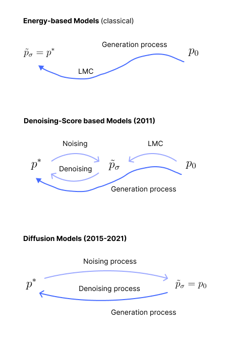
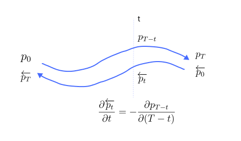
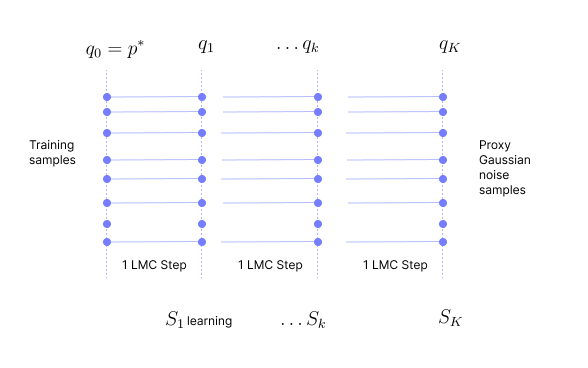
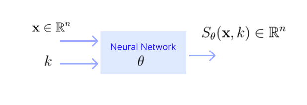

* TOC
{:toc}

## What are Diffusion Models?
Once we train the score network, the generation process is as follows:

* In the energy-based models, we estimated the likelihood $p^*$ and did Langevin sampling. There $\sigma$ was 0, so $\tilde{p}_{\sigma} = p^*$, and we used the LMC process to generate samples from $p^*$, starting from $p_0$, which is the pure noise Gaussian distribution. Here the generation process has only one step: LMC.

* In the denoising-score based models, we added noise to the training samples to get from $p^*$ to $\tilde{p}_{\sigma}$. We trained a score network to learn the score function of $\tilde{p}_{\sigma}$. Then, used LMC to generate samples from $\tilde{p}_{\sigma}$, starting from $p_0$. Then, applied the Tweedie denoising step to get samples from $p^*$. Here the generation process has two steps: LMC and denoising step.

* In the diffusion models, we add noise completely, and go from $p^*$ to $p_0$. We construct this noising process. Here $\tilde{p}_{\sigma} = p_0$. Then, we apply the inverse of this noising process to generate samples from $p^*$, starting from $p_0$.

<figure markdown="0" class="figure zoomable">
<figcaption>
  <strong>Figure 1.</strong> History of diffusion models
  </figcaption>
</figure>

## Forward Process
We have to come up with a noising process that takes us from any $p^*$ to a pure noise Gaussian $p_0$. In terms of RV, samples from $p^*$ should be converted to samples of $p_0$. We can carry out LMC with $p^*$ as the initial distribution and $p_0$ as the target distribution.

We know the Stein score function of the Gaussian distribution $\mathcal{N}(0, I)$:

$$
\begin{align*}
p_0(x) & = \text{exp}\left( -\frac{\|x\|^2}{2}\right) \\
\nabla_x \log p_0(x) & = -x \\
v_t(X_t) & = -X_t
\end{align*}
$$

We can use this to run the LMC steps. Each training data point $x_0$ is converted to a noise data point $x_k$ by this process. So, the forward process is

$$
\begin{align*}
x_1 & = x_0 + h(-x_0) + \sqrt{2h} \, n_0 = (1-h)x_0 + \sqrt{2h} \, n_0   \hspace{1cm} \text{with dist}(X_1) = q_1\\
x_2 & = (1-h)x_1 + \sqrt{2h} \, n_1 \hspace{1cm} \text{with dist}(X_2) = q_2\\
\vdots \\
x_K & = (1-h)x_{K-1} + \sqrt{2h} \, n_K \hspace{1cm} \text{with dist}(X_K) = q_K\\
\end{align*}
$$

The step size $h$ can be chosen to be a function of $k$ such as $\frac{1}{k}$ or $\frac{1}{\sqrt{k}}$, or it can be a very small constant.

We start with samples from $p^* = q_0$ (the forward process initial distribution). At each step, we evolve likelihood through $q_1, q_2, \dots, q_{K-1}$, and reach a distribution $q_K$. This $q_K$ is a proxy for Gaussian. In terms of RV, $x_K$ is a proxy for a sample from Gaussian because in practice we take only finite steps, and as a result there will be a gap between $q_K$ and the target distribution.

  
WARNING

  
In the reverse process, we need to start from $q_K$ and convert it to $q_0$. We need samples from $q_K$. If $q_K$ is close enough to Gaussian, we can generate samples easily from a Gaussian random number generator. But if we think $q_K$ is not close enough to Gaussian, we can start from Gaussian and do LMC to generate samples from $q_K$. To do this, we need to know the score function of $q_K$. If we know it, we can do LMC with $q_K$ as the target.

For our discussion, let's assume $q_K$ is close enough to Gaussian $p_0$, and $x_K$ is a good approximate sample from it.

## Reverse Process
We need to reverse the Langevin diffusion we did in the forward process. Let's do this for a general Ito process. The particle flow for a general Ito process can be characterized by the SDE:

$$
dX_t = v_t(X_t) \, dt + \sigma_t \, dW_t
$$

The likelihood flow for the Ito process is governed by the Fokker-Planck equation.

$$
\frac{\partial p_t}{\partial t} = - \nabla \cdot (v_t \, p_t) + \frac{\sigma_t^2}{2} \, \Delta p_t
$$

Note that the differentiation in $\Delta p_t$ is with respect to $x$. The following notations are based on the general Ito process and its reversing (notations are not in the context of diffusion models).

The Fokker-Planck SDE mentioned above defines the process, i.e., it gives us the path of the marginal likelihood flow from $p_0$ to $p_T$ on solving it. Let $p_t$ be the probability distribution at any time $t$ in the process. The SDE is a first order differential equation with respect to time.

Now, we wish to construct a reverse Ito process $\{\overleftarrow{X_t}\}$, i.e., we need to transform $p_T$ back to $p_0$. The construction is easy if the diffusion coefficient is independent of location, i.e., $\sigma_t$ is not a function of $x$.

In this reverse process, 

1. At each time step, we want the marginals to be exactly the same that we have seen during the forward process at that step, i.e., we want to retrace the marginals. Let $\overleftarrow{p_t}$ be the probability distribution at any time $t$ in the reverse process. Then

* At the start of the reverse process, at $t=0$, we are at $\overleftarrow{p_0} := p_T$
* At any $t$ during the reverse process, $\overleftarrow{p_t} := p_{T-t}$. The marginal at $t$ during the reverse process should be the same marginal that was at $T-t$ in the forward process. Say $T=10$, then $\overleftarrow{p_1} = p_9$.
* At the end of the reverse process, at $t=T$, we are at $\overleftarrow{p_T} := p_0$

2. We also want the rate of change of marginals with respect to time also to be exactly the same that we have seen during the forward process at that step. At any $t$, we know $\overleftarrow{p_t} = p_{T-t}$. The rate of change of these $p$ at $t$ should be same. Let $s=T-t$.

$$
\begin{align*}
\frac{\partial \overleftarrow{p_t}}{\partial t} & = \frac{\partial p_{T-t}}{\partial t} \\
& = \frac{\partial p_{T-t}}{\partial s} \cdot \frac{ds}{dt} \\
& = \frac{\partial p_{T-t}}{\partial s} \cdot (-1) \\
\frac{\partial \overleftarrow{p_t}}{\partial t} & = - \frac{\partial p_s}{\partial s}\\
\end{align*}
$$

At a given time $t$, both the process are flowing with the same velocity but in the opposite direction.

<figure markdown="0" class="figure zoomable">
<figcaption>
  <strong>Figure 2.</strong> Definition of reverse process in diffusion models
  </figcaption>
</figure>

  
NOTE

  
Our Ito processes are characterized by first-order differential equations, so a process can be uniquely identified by the position and velocity of the particle in the flow. Note here we are referring to $p$ as the particle.
  
  When position and velocity of two processes are the same, then they both define the same process, because our processes are actually defined with the first order SDE in time.

Let's see if we can write the reverse process also in the form of Ito process. On solving it

$$
\begin{align*}
\frac{\partial \overleftarrow{p_t}}{\partial t} & = - \left(- \nabla \cdot (v_{T-t} \, p_{T-t}) + \frac{\sigma_{T-t}^2}{2} \, \Delta p_{T-t} \right) \\
& = - \nabla \cdot (-v_{T-t} \, p_{T-t}) - \frac{\sigma_{T-t}^2}{2} \, \Delta p_{T-t} \\
& = -\nabla \cdot (-v_{T-t} \, p_{T-t}) - \frac{\sigma_{T-t}^2}{2} \, \Delta p_{T-t} - \frac{\sigma_{T-t}^2}{2} \, \Delta p_{T-t} + \frac{\sigma_{T-t}^2}{2} \, \Delta p_{T-t} \\
& = -\nabla \cdot (-v_{T-t} \, p_{T-t}) - \sigma_{T-t}^2 \, \Delta p_{T-t} + \frac{\sigma_{T-t}^2}{2} \, \Delta p_{T-t} \\
& = -\nabla \cdot \left(-v_{T-t} \, p_{T-t} + \sigma_{T-t}^2 \, \nabla p_{T-t} \right) + \frac{\sigma_{T-t}^2}{2} \, \Delta p_{T-t} \\
& = -\nabla \cdot \left(-v_{T-t} \, p_{T-t} + \sigma_{T-t}^2 \, p_{T-t}  \nabla \log p_{T-t} \right) + \frac{\sigma_{T-t}^2}{2} \, \Delta p_{T-t} \\
& = -\nabla \cdot \left( \left(-v_{T-t} + \sigma_{T-t}^2 \, \nabla \log p_{T-t} \right) \, p_{T-t} \right) + \frac{\sigma_{T-t}^2}{2} \, \Delta p_{T-t} \\
& = -\nabla \cdot \left( \left(-v_{T-t} + \sigma_{T-t}^2 \, \nabla \log \overleftarrow{p_t} \right) \, \overleftarrow{p_t} \right) + \frac{\sigma_{T-t}^2}{2} \, \Delta \overleftarrow{p_t} \\
\end{align*}
$$

* Third step: We are adding and subtracting the term.
* Sixth step: Using the inverse of the log trick

Now, this is in the form of Fokker-Planck equation. And this defines the probability flow for the reverse process. And, we can see that the velocity of the reverse process should be:

$$
\overleftarrow{v_t} \equiv -v_{T-t} + \sigma_{T-t}^2 \, \nabla \log p_{T-t}
$$

And the diffusion coefficient of the reverse process is

$$
\overleftarrow{\sigma_t} \equiv \sigma_{T-t}
$$

Having known these two, we can write the process in terms of the change in random variables.

$$
\begin{align*}
d \overleftarrow{X_t} & = \overleftarrow{v_t}(\overleftarrow{X_t}) \, \overleftarrow{dt} + \overleftarrow{\sigma_t}\, d\overleftarrow{W_t} \\
d \overleftarrow{X_t} & = \left( -v_{T-t}(\overleftarrow{X_t}) + \sigma_{T-t}^2 \, \nabla \log p_{T-t}(\overleftarrow{X_t}) \right) \, \overleftarrow{dt} + \sigma_{T-t}\, d \overleftarrow{W_t} \\
\end{align*}
$$

This defines the reverse process, and it is also a diffusion process.

Now, coming back to the context of Diffusion models. In our forward process using Langevin sampling, we defined $v_t(X_t) = -X_t$ and $\sigma_t=\sqrt{2}$. Then, our reverse process becomes:

$$
d \overleftarrow{X_t} = \left( \overleftarrow{X_t} + 2 \, \nabla \log p_{T-t}(\overleftarrow{X_t}) \right) \, \overleftarrow{dt} + \sqrt{2}\, d \overleftarrow{W_t} \tag{1}
$$

The forward process is a Langevin diffusion process with target as a proposal distribution (like Gaussian/uniform). Models that explicitly reverse this diffusion process are known as **Diffusion Models**. We saw that the reverse process is also a Langevin diffusion process, and this trained reverse process is indeed a convenient sampling algorithm from the target.

To implement <a href="#eq:eq1">(1)</a>, we should know the score function at each time step $\nabla \log p_{T-t}(\overleftarrow{X_t})$. Writing it in terms of forward process, we should know

$$
S_t = \nabla \log p_t(X_t) \hspace{1cm} \text{for } t=1 \text{ to } T
$$

In the context of diffusion models, we defined $p_t = q_t$ for the forward process to avoid confusion because $q_0 = p^*$ and $q_T = p_0$. So, to carry out LMC (with discrete steps), we should know

$$
S_k = \nabla \log q_k(X_k) \hspace{1cm} \text{for } k=1, \dots, K
$$

  
NOTE

  
$S_0$ is not required for our process, as we can see it shortly.

To learn the score function at $k$, we need to have samples from $q_k$. We can use denoising-score matching to learn the score function at each $k$.

* $S_1$ can be learnt using the samples from $q_1$
* Similarly, all other $S_k$ can be learnt using the respective samples from $q_k$.

<figure markdown="0" class="figure zoomable">
<figcaption>
  <strong>Figure 3.</strong> Learning score function at each step
  </figcaption>
</figure>

**Convergence rate:**
We know that the forward process (not the LMC version) converges exponentially faster at the rate of $e^{-k}$. In the reverse step, if we ignore the discretization error (step sizes) and consider the process instead of LMC, the convergence of the reverse process is also exponentially fast.

  
WARNING

  
Here we have talked only about the reverse process. We haven't talked about discretization of the reverse process.

## Diffusion Model Algorithm
A pragmatic idea is that of jointly learning the score functions at all noise levels (during forward process) using a single network that accepts data $x$ and level/instant $k$ as inputs. Such networks are known as Noise conditioned score networks (NCSNs).

<figure markdown="0" class="figure zoomable">
<figcaption>
  <strong>Figure 4.</strong> Noise Conditioned Score Networks
  </figcaption>
</figure>

**Procedure:**

1. We are given training samples from (unknown) $p^*$. We will take a mini-batch of data, say $m$ samples.
2. For these $m$ samples $i=1, \dots, m$, we will prepare the data for each noise level $k$ by passing the samples through the below linear transformations. For a training sample $x_i = x_{i0}$:

$$
\begin{align*}
x_{i1} & = (1-h)x_i + \sqrt{2h} \, n_{i1} \\
x_{i2} & = (1-h)x_{i1} + \sqrt{2h} \, n_{i2}\\
\vdots \\
x_{iK} & = (1-h)x_{i(K-1)} + \sqrt{2h} \, n_{iK} \\
\end{align*}
$$

Now, we have those $m$ initial training samples and $k$-level noise added versions of them for each time step $k$. Say $K=20$, then we will have $20 * m + m = 21*m$ samples. We have original + 20 copies (each with different noise level) for each sample $x_i$, i.e., $\{x_i, x_{i1}, x_{i2}, \dots, x_{iK}\}$.

For a sample $x_i$, a slightly perturbed version with a Gaussian noise is $\tilde{x}_i = x_i + n_i$. The denoising-score matching objective was

$$
\min_{\theta} \frac{1}{m} \sum_{i=1}^m \left\| \tilde{S}_{\theta, \sigma}(\tilde{x}_i)  -  \frac{(x_i - \tilde{x}_i )}{\sigma^2} \right\|^2
$$

Now, we are adding the noise as: $x_{ik} = (1-h)x_{i(k-1)} + \sqrt{2h} \, n_{ik}$. The objective is simply a sum over score matching objectives at each level.

$$
\begin{align*}
& \min_{\theta} \frac{1}{m} \sum_{i=1}^{m} \sum_{k=1}^K \left\| S_{\theta}(x_{ik}, k)  -  \frac{((1-h)x_{i(k-1)} - x_{ik} )}{2h} \right\|^2 \\
& = \min_{\theta} \frac{1}{m} \sum_{i=1}^{m} \sum_{k=1}^K \left\| S_{\theta}(x_{ik}, k)  +  \frac{n_{ik}}{\sqrt{2h}} \right\|^2 \\
\end{align*}
$$

where $n_{ik}$ is the noise added to the sample $x_i$ at the level $k-1$. For example, $n_{i1}$ is the noise added to the original data point $x_i$. 

This is again a least squares objective that can be trained very fast. On solving this optimization problem, we learn a score network that gives score for a given $x$ and $k$. And then, we can do reverse LMC by discretizing <a href="#eq:eq1">(1)</a>:

$$
\begin{align*}
x_{i(k-1)} - x_{ik} & = h\,x_{ik} + 2h \, S_{\theta^*}(x_{ik}, k) + \sqrt{2h} \, n_k \\
x_{i(k-1)} & = (1 + h)\,x_{ik} + 2h \, S_{\theta^*}(x_{ik}, k) + \sqrt{2h} \, n_k \\
\end{align*}
$$

Note here $n_k$ is independent; not the ones we added in the forward process.

  
WARNING

  
At every step in the reverse LMC, we are estimating the likelihood. So, there is a small error at every step. Thus, taking the same step size that we took during the forward LMC doesn't take us exactly to the distribution we started with.

In contrast, in the denoising-score matching, we use the classical LMC to go from proposal noise distribution to the (perturbed) original distribution as follows:

$$
\tilde{x}_{k+1} = \tilde{x}_k + h \, \tilde{S}_{\theta^*, \sigma}(\tilde{x}_k) + \sqrt{2h} \, n_k
$$

At each time step, we used the same score network, which has learnt the score function of the (perturbed) original distribution. There is only one reference point here. If this (single) score function is not learnt well, the LMC may not produce samples from the (perturbed) original distribution.

However, in the diffusion models, for each step, we use the score function learnt for that step. There are multiple reference points to guide here. It is analogous of having different velocities at each time step (rather than a constant velocity). Even though some initial score functions (score functions for distributions close to $p^*$ that are difficult to learn) are not well-learnt, the well-learnt score functions (close to $p_0$) regularizes them. These score functions at different levels guide the particle more carefully to move towards the target.

### Regularizer

This joint learning naturally acts as additional regularization for the initial scores that are challenging to estimate. In figure 3, learning score will be better as we increase the noise level, i.e., some of the last noise levels are good enough for better score learning. So, we can estimate $S_K$ properly than $S_1$.

And, the score function as a function of time steps doesn't change rapidly; they should be smooth. So, the score values at higher $k$ guide and correct the score values at lower $k$s. Thus, the score function is regularized across time.

$S_K$ is the score function of the proposal Gaussian distribution, so it will also be like a Gaussian spread across the whole domain. This score function encourages the particle to move freely everywhere and cover the whole domain at the beginning. Then, on decreasing the noise levels $K \to 1$, the peaks of our target distribution start emerging. The score functions $S_{K-1}, S_{k-2}, \dots, S_1$ guide these spread out particles towards these different modes. Therefore, in the end, we will be able to produce samples from multiple modes.

