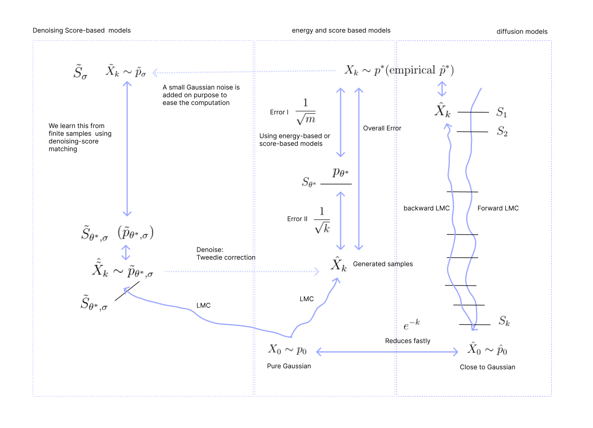

* TOC
{:toc}

## Landscape
In explicit generative models, generation happens in a two-step process:

1. Given training data, we model the likelihood $p_{\theta}$ (which is the model distribution) and estimate $p_{\theta^*}$. We solve the optimization:

$$
\min_{\theta} D(p_{\theta}, p^*)
$$

to estimate $p_{\theta^*}$. If $D$ is KL, then we get the MLE estimate. If we do score matching, we get the score-matching objective. 

2. Sampling (LMC): sample from $p_{\theta^*}$.

These are equivalent to training and inference. But both are non-trivial because each has its own convergence issue.

**Classical Models:**
In explicit generative models such as energy-based models and score-based models, we typically do:

* $X_k \sim p^*$ are samples from the target distribution. The score function associated with $p^*$ is $S^*$. In the first step,

  * We learn $p_{\theta^*}$ using energy-based models, which is an estimate of $p^*$ (or)
  * We learn $S_{\theta^*}$ using score-based models, which is an estimate of $S^*$.

The error between the actuals and estimates cannot be reduced; it will be low if we have a lot of training samples. It usually goes down at the rate of $\frac{1}{\sqrt{m}}$, where $m$ is the number of samples. This is the error incurred during training.

* In the second step, we run LMC to produce samples with the target $p_{\theta^*}$ or using the score function $S_{\theta^*}$. But as we run LMC only for finite steps, the distribution of the generated samples $\hat{X}_k$ will not be $p_{\theta^*}$. The error goes down as we take more steps; at the rate of $\frac{1}{\sqrt{k}}$, where $k$ is the number of steps. This is the error incurred during inference.

The overall error is the sum of these two in the classical models.

**Denoising Score-matching models:**
In denoising score matching models, we add noise to the training samples to get noisy samples.

* $\tilde{X}_k \sim \tilde{p}_\sigma$ are the noisy samples obtained by adding a small Gaussian noise to the original samples. The score function associated with this distribution is $\tilde{S}_\sigma$.

* As a first step, we learn $\tilde{S}_{\theta^*, \sigma}$ using a score-network, which is an estimate of $\tilde{S}_\sigma$.

The error between the actuals and estimates cannot be reduced; it will be low if we have a lot of training samples.

In the second step, we run LMC to produce samples using the score function $\tilde{S}_{\theta^*, \sigma}$. But as we run LMC only for finite steps, the distribution of the generated samples $\hat{\tilde{X}}_k$ will not exactly be $\tilde{p}_{\theta^*, \sigma}$. The error goes down as we take more steps; at the rate of $\frac{1}{\sqrt{k}}$, where $k$ is the number of steps.

We then denoise these samples to produce $\hat{X}_k$.

**Diffusion models:**
In diffusion models, we are given samples $\hat{X}_k$ from $p^*$. The empirical distribution $\hat{p}$ of the training points will be very close to $p^*$. We run LMC from this distribution with Gaussian as the target, and produce samples $\hat{X}_0$ from a Gaussian distribution. Since we run LMC for finite steps, the distribution of $\hat{X}_0$ is not exactly Gaussian. During the forward LMC, we learn a score function at each time step.

Then, on $\hat{X}_0$ samples, we run a reverse LMC using the score functions learnt. The reverse Langevin sampling process is exactly the reversal of the forward Langevin sampling process. But as we discretize to carry out these processes in practice, there is an error introduced because of step sizes.  The discretization error will be at the rate $\frac{1}{\sqrt{k}}$. Thus, when we carry out reverse LMC, the samples will not exactly follow the empirical distribution $\hat{p}$ we started with.

<figure markdown="0" class="figure zoomable">
<figcaption>
  <strong>Figure 1.</strong> Summary of explicit generative modelling.
  </figcaption>
</figure>

With the diffusion models, if we ignore the discretization (step size) error and consider the reverse **process** (instead of LMC), the convergence is exponentially faster. Whereas with other models, the convergence depends on the target. If the energy function of the target distribution is not strongly convex, then the convergence of the Langevin sampling **process** is itself is not exponentially faster.

Therefore, in theory i.e., without discretization, diffusion models act as a new sampling algorithm that is exponentially fast for any target. The energy function of the target distribution doesn't need to be strongly convex for exponentially fast convergence. The reverse process converges exponentially fast regardless of the target. But in practice, we do discretized version of the reverse process whose convergence is not exponentially fast but certainly faster than the convergence of the discretized Langevin sampling process. This is because in diffusion models, we use different score function at each time step. And as we learn them jointly, we get a better estimation of score functions.

In all these methods, we are first model either the likelihood or score function explicitly during training. During inference, we then run LMC or a diffusion process (backward denoising through reverse LMC) to obtain samples. These samples are not obtained via some trivial/straight-forward inference/computation, rather, obtained after a detailed non-trivial inference/computation. This is because what is modelled and learned is not a sampler/sampling-algorithm. What is learned is a likelihood.

  
TIP

  
As of today, among all the explicit generative modelling methods, diffusion models are the best.

