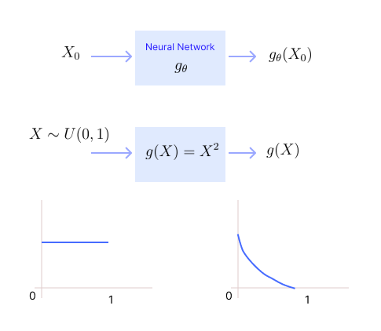
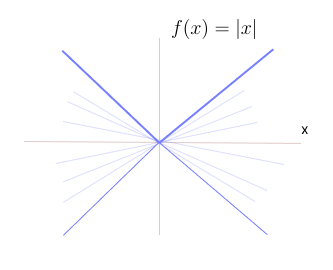
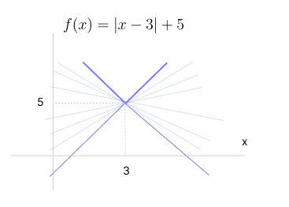
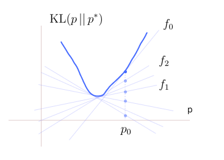
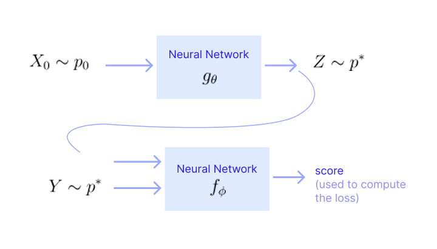
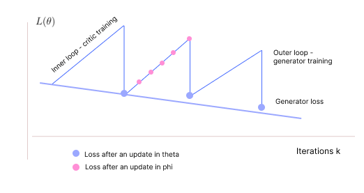

* TOC
{:toc}

## Introduction
The underlying optimization problem in explicit generative modelling is:

$$
\min_{\theta} D(p^*, p_{\theta})
$$

We model a likelihood $p_{\theta}$ that is closer to $p^*$ where $D$ is generally the KL-divergence. Or we do score-matching to just learn the score function of the target distribution.

The key idea in implicit generative modelling is to avoid the two stage (indirect) generation as in explicit models by directly modeling and learning a sampler function. Implicit models generalize the familiar idea of  inverse-cdf sampling. More specifically, in implicit models, we model and learn a function, $g_{\theta}$, which transforms samples from proposal likelihood to those from target likelihood.

Let $X_0 \sim p_0$ denote RV following the proposal likelihood. So the quintessential problem in implicit generation is to model and learn a **sampler** $g_{\theta}$ such that $g_{\theta}(X_0) \sim p^*$.

<figure markdown="0" class="figure zoomable">
<figcaption>
  <strong>Figure 1.</strong> Implicit Modelling Objective
  </figcaption>
</figure>

Function changes the distribution. Our objective here is that the samples $g_{\theta}(X_0)$ should directly be distributed as our target $p^*$. We are not explicitly trying to find the distribution of $g_{\theta}(X_0)$.

In implicit models, the inference step is very straight-forward; we can send the samples from the proposal likelihood through the learned network to get samples from the target likelihood.

## Implicit generation problem

$$
\begin{align*}
\min_{\theta} D(p^*, p) \\
\text{such that } g_{\theta}(X_0) \sim p  \tag{1}
\end{align*}
$$

where $D$ is some metric/divergence for likelihoods. We find the parameter $\theta$ of the function $g$ such that the distribution of the output $g(X_0)$ matches $p^*$. Here $p$ is not a variable of optimization explicitly; we should eliminate $p$ from the problem. If the methodology to solve this optimization problem involves $p$ explicitly, then it is not implicit anymore.

The other option is to choose a metric/loss over random variables.

$$
\min_{\theta} D(g_{\theta}(X_0), Y) \\
$$

Here we are comparing two random variables. And we know $Y$ is distributed as $p^*$, that is $Y \sim p^*$. A valid distance metric between two random variables $X$ and $Y$ is:

$$
\mathbb{E} \left[\| X- Y\|^2 \right] = \int \| x-y \|^2 \, \, p_{XY}(x,y)\, dx \, dy
$$

But this expectation is over the joint distribution of $(X,Y)$. This cannot be computed without knowing the joint likelihood. In the context of implicit modelling, it will be joint distribution of $(X_0, Y)$. The joint distribution of $(X_0, Y)$ is not even well-defined. We can assume independence between $X_0$ and $Y$ and try to solve it, but that is also not a meaningful assumption. The solution depends on the assumption we make on the joint distribution of $(X_0, Y)$. So this approach doesn't work. We should solve <a href="#eq:eq1">(1)</a> by reformulating it and eliminating $p$ from being in the equation explicitly.

## Duality in Optimization
If $D$ is the KL-divergence, then the implicit generation problem is

$$
\begin{align*}
\min_{\theta} \text{KL}(p \, || \,  p^*) \\
\text{such that } g_{\theta}(X_0) \sim p
\end{align*}
$$

The constraint is not an easy constraint to impose; it is not an inequality or equality constraint. Thus, it is not clear how to enforce such constraints in an optimization problem.

We observe that the variable of optimization $\theta$ is not in the objective explicitly; $\theta$ is present only in the constraint. So, it is not possible to do gradient descent on this objective function (under some constraint). So, we try to bring this constraint as a term in the objective.

Here is where duality in optimization helps! Because duals essentially enforce constraints using appropriate terms in the objective.

### Duality in general

**Example 01:**
Suppose we have a function $f(x)=|x|$. This function can be written in terms of two linear functions (of $x$).

$$
\begin{align*}
|x| & = \max(x, -x) \\
& = \max_{m \in \{-1,1\}} mx \\
\end{align*}
$$

We can observe that we can put any linear function having slope between -1 and 1 and still get $|x|$. We can have any of these linear functions $-0.9x, -0.5x, 0x, 0.3x, 0.5x, 0.9x$. We cannot have all linear functions, there is a constraint on the slope.

$$
|x| = \max_{|m| \leq 1 } mx
$$

<figure markdown="0" class="figure zoomable">
<figcaption>
  <strong>Figure 1.</strong> Dual of the absolute function.
  </figcaption>
</figure>

For the multidimensional case, $x \in \mathbb{R}^d$,

$$
\begin{align*}
\|x\|_1 & = \max_{\|m\|_{\infty} \leq 1 } m^\top x \\
\sum_i |x_i| & = \max_{|m_i|\leq 1} \sum_i m_i\, x_i
\end{align*}
$$

**Example 02:**
Now, suppose the function is $f(x) = |x-3|+5$.

<figure markdown="0" class="figure zoomable">
<figcaption>
  <strong>Figure 2.</strong> Dual of the shifted absolute function.
  </figcaption>
</figure>

This function can be written in terms of max over affine functions (functions of the form $wx+c$). We know that

$$
\begin{align*}
|x| & = \max_{|m| \leq 1 } mx \\
|x-3| & = \max_{|m| \leq 1 } m (x-3) \\
|x-3| + 5 & = \max_{|m| \leq 1 } m (x-3) + 5 \\
|x-3| + 5 & = \max_{|m| \leq 1 } (mx -3m+5) \\
\end{align*}
$$

The function is expressed as maximum over affine functions with constraint on the slope $w$ and an appropriate intercept term $5-3w$. Here we have imposed the constraint on the slope, but we can also equivalently impose it on the intercept term.

**The General Case:**

A convex function can always be written as:

$$
f(x) = \max_{m,c} \{mx + c\}
$$

subject to $mx + c \leq f(x)$ for all $x$. The set $\{mx + c\}$ is the supporting-lines representation of the function. The constraint is:

$$
c \leq f(x) - mx \,\, \forall x
$$

For a given slope $m$, for each $x$, we get a bound on $c$.

$$
\begin{align*}
c & \leq f(x_1) - mx_1 \\
c & \leq f(x_2) - mx_2 \\
\dots
\end{align*}
$$

$c$ should be less than all of these, so

$$
c \leq \min_{x} f(x) - mx
$$

This gives the largest intercept that still keeps the lines below the function $f(x)$.

For the function $f(x) = |x-3|+5$, the condition on the intercept becomes:

$$
c \leq \min_{x} (|x-3|+5 - mx)
$$

for a fixed $m$. Let $z=x-3$, then

$$
\begin{align*}
|x-3|+5 - mx & = |z|+5 - m(z+3) \\
& = |z|+5-mz-3m \\
& = |z|-mz + (5-3m)
\end{align*}
$$

The term $(5-3m)$ is a constant, independent of $z$. So, we have to find

$$
\min_z {|z|-mz}
$$

The minimum of $|z|-mz$ is

* $0 \text{ if } |m| \leq 1$
* $-\infty \text{ if } |m| > 1$

Then, for $|m| \leq 1$,

$$
c \leq 5-3m
$$

Then the function can be expressed as:

$$
|x-3|+5 = \max_{|m| \leq 1, \,\,\, c \leq 5-3m} \{mx+c\}
$$

For a given $m$, including any line that has intercept less than $5-3m$ is not a problem. But the maximum allowed intercept is $c=5-3m$. So, to restrict the number of lines, we can also write

$$
|x-3|+5 = \max_{|m| \leq 1} \{mx-3m+5\}
$$

**Example 03:**
Suppose the function is $f(x) = x^2$. We want to write this function in terms of maximum over affine functions.

$$
x^2 = \max_{m,c} \{mx + c\}
$$

subject to $mx + c \leq f(x)$ for all $x$. The condition on $c$ becomes:

$$
c \leq \min_{x} (x^2 - mx)
$$

for a fixed $m$. The derivative of $x^2 -mx$ with respect to $x$ is $2x-m$. Equating it to 0, gives the minimizer $x=\frac{m}{2}$. The minimum value of the function is

$$
\frac{m^2}{4}-\frac{m^2}{2} = -\frac{m^2}{4}
$$.

Then the intercept should be

$$
c \leq -\frac{m^2}{4}
$$

There is slope constraint as in the previous example because the quadratic becomes arbitrarily steep. Thus, the function can be expressed as:

$$
x^2 = \max_{m \in \mathbb{R}} \left\{ mx -\frac{m^2}{4} \right\}
$$

### Fenchel Conjugate Representation
Let $x, y\in \mathbb{R}^d$, and $f: \mathbb{R}^d \to \mathbb{R}$. The Fenchel conjugate (or convex conjugate) of $f(x)$ is defined as:

$$
f^*(y) = \max_{x \, \in \, \text{dom}(f)} \{ x^\top y - f(x) \}
$$

It represents the maximum difference between a linear function, which is the inner product $x^\top y$ and $f(x)$. And $f^*$ is always a convex function, even if $f$ is not.

We observe that we were expressing the convex functions in the form:

$$
\begin{align*}
f(x) & = \max_y \{x^\top y + C(y)\} \\
& = \max_y \{x^\top y - (- C(y))\} \\
& = \max_y \{x^\top y - f^*(y)\} \tag{1}\\
\end{align*}
$$

For a fixed $y$, we get a line of slope $y$ which is given by $x^\top y - f^*(y)$. We need this line to be below or equal to the function for all $x$.

$$
\begin{align*}
f(x) & \geq x^\top y - f^*(y) \,\, \forall x\\
f^*(y) & \geq x^\top y - f(x) \,\, \forall x\\
\end{align*}
$$

For a given slope $y$, this should hold for all $x$. So, we can rewrite this as: (because $x_1 > 5$ and $x_1 > 10$ can be written as $x_1 > \max(5,10)$):

$$
f^*(y) \geq \max_{x} \{ x^\top y - f(x) \} \\
$$

The exact offset required is given by

$$
f^*(y) = \max_{x} \{ x^\top y - f(x) \} 
$$

This is exactly the Fenchel conjugate representation of $f(x)$. This is the "offset" needed for a line of slope $y$ to be tangent to $f$.

So in general, to express a function $f(x)$ as the maximum over the affine functions, first we find its convex conjugate or Fenchel conjugate by:

$$
f^*(y) = \max_{x} \{ x^\top y - f(x) \} 
$$

Once we find the conjugate, we can substitute it in <a href="#eq:eq1">(1)</a> to get the representation.

$$
f(x) = \max_y \{x^\top y - f^*(y)\} 
$$

For each $y$, the RHS gives a linear function in $x$. The maximum of all those functions at all $x$ gives us the $f(x)$.

**Example:**
Suppose $f(x)= x^\top x = \|x\|^2$. Compute its conjugate

$$
\begin{align*}
f^*(y) & = \max_{x} \{ x^\top y - f(x) \} \\
& = \max_{x} \{ x^\top y - x^\top x\}
\end{align*}
$$

Define $g(x)= x^\top y - x^\top x$. Optimize with respect to $x$ and set it to $\mathbf{0}$.

$$
\begin{align*}
\nabla_x g(x) & = 0 \\
y-2x &= 0\\
x & = \frac{1}{2} y
\end{align*}
$$

The maximum value of $g(x)$ occurs at $x = \frac{1}{2} y$. Then, the maximum value of $g(x)$ is:

$$
f^*(y) = \frac{1}{2}y^\top y - \frac{1}{4} y^\top y = \frac{1}{4} y^\top y
$$

Therefore, $f(x)$ can be written as

$$
x^\top x = \max_y \left\{x^\top y - \frac{1}{4} y^\top y\right\} 
$$

For any quadratic function in general

$$
f(x) = x^\top Ax
$$

with $A$ positive definite, its Fenchel conjugate is

$$
f^*(y) = \frac{1}{4} y^\top A^{-1} y
$$

and

$$
x^\top Ax = \max_y \left\{x^\top y - \frac{1}{4} y^\top A^{-1} y\right\} 
$$

This helps us express complicated functions $f(x)$ in terms of linear (affine) functions of $x$.

  
TIP

  
A general result is that any convex function can be written as the maximum over some linear (affine) functions. It is true vice-versa as well. Being able to write a function as the maximum over affine function is another way of realizing convexity.

KL-divergence is a function of likelihoods and it is a convex function in both of its arguments $p$ and $p^*$. We use Fenchel conjugate to express this as the maximum over linear functions of likelihoods. Expectations are linear functions of likelihood. So, we get KL divergence as maximum over the expectations of likelihoods.

## KL-GAN
Our objective is

$$
\begin{align*}
\min_{\theta} \text{KL}(p \, || \,  p^*) \\
\text{such that } g_{\theta}(X_0) \sim p
\end{align*}
$$

Note: We consider this form of KL divergence to get a solvable optimization problem, and recall that is not symmetric. We know

$$
\begin{align*}
\text{KL}(p \, || \,  p^*) & = \int_{\mathcal{X}} p(x) \log \left[ \frac{p(x)}{p^*(x)} \right] \,\, dx \\
& = \int_{\mathcal{X}} p(x) \, \log p(x) - p(x) \,\log p^*(x) \,\, dx \\
& = \int_{\mathcal{X}} p(x) \, \log p(x) \,dx - \int_{\mathcal{X}} p(x) \,\log p^*(x) \,\, dx \\
& = -H(p) - \int_{\mathcal{X}} p(x) \,\log p^*(x) \,\, dx \\
\end{align*}
$$

The first term is the negative-entropy of $p$. The second term is a linear function in $p$ because $p^*$ is the fixed target. Thus, the KL divergence is convex in $p$.

We can write the KL-divergence as maximum over the linear functions in $p$ (we didn't see the whole derivation but assumed). The result in <a href="#eq:eq2">(2)</a> is from the Donsker-Varadhan's theorem which is nothing but a classical Fenchel-duality result.

$$
\begin{align*}
\text{KL}(p \, || \,  p^*) & = \max_{f} \left[ \int f(x) \, p(x) \, dx - \log \int e^{f(y)} \, p^*(y) \, dy \right] \tag{2} \\
& = \max_{f} \left[ \mathbb{E}_{X \sim p}[f(X)] - \log \mathbb{E}_{Y \sim p^*}[e^{f(Y)}] \right] \\
\end{align*}
$$

Comparing it with the Fenchel conjugate representation:

$$
\mathcal{F}(p) = \max_{f} \left\{ \mathbb{E}_{X \sim p}[f(X)]  - \mathcal{F^*}(f) \right\}
$$

The conjugate of KL is the log-sum exponent term. And the conjugate of log-sum exponent is KL. Here $f$ can be any function. Given a function $f$, the inner term is linear in $p$: the first term is linear in $p$ and the second term is a constant with respect to $p$.

<figure markdown="0" class="figure zoomable">
<figcaption>
  <strong>Figure 3.</strong> Dual of the KL-divergence (in the likelihood space).
  </figcaption>
</figure>

**Value Computation of KL:**

Say we want to compute the KL at $p_0$. For each $f$, we get a line (linear function in $p$). The equation of the line is given by the inner term. We get the value from all those linear functions at $p_0$ (each dot in the above graph). The maximum of all those linear functions gives us the KL.

Suppose the line, say corresponding to $f_0$, is the maximizer of all the linear functions at $p_0$. This linear function just touches the graph at $p_0$, i.e., it touches $\text{KL}(p_0 \, || \,  p^*)$. The value of the KL at $p_0$ is the value of this linear function (linear function corresponding to $f_0$) at $p_0$ (the top dot):

$$
\text{KL}(p_0 \, || \,  p^*) = \int f_0(x) \, p_0(x) \, dx - \log \int e^{f_0(y)} \, p^*(y) \, dy
$$

**Gradient Computation of KL:**

Suppose want to compute the gradient of KL at $p_0$, that is, $\frac{d}{dp} \text{KL}(p=p_0 \, || \,  p^*)$. We know

$$
\text{KL}(p=p_0 \, || \,  p^*) =  \max_{f} \left[ \int f(x) \, p_0(x) \, dx - \log \int e^{f(y)} \, p^*(y) \, dy \right]
$$

The Danskin's theorem helps us get the gradient of such functions. The **Danskin theorem** helps us compute the derivative of function $f(x)$ wrt $x$ where

$$
f(x) = \max_y r(x, y)
$$

1. We first fix $x$ and compute the $\arg \max_y r(x, y)$, say $y^*$. 
2. Now, fix $y=y^*$ and find $\nabla_x r(x,y^*)$. In this case, it would be $y^*$ (because it is a linear function and the second term doesn't involve $x$).

Using the same logic on KL:

1. Fix $p=p_0$ and compute
  $$
\arg \max_{f} \left[ \int f(x) \, p_0(x) \, dx - \log \int e^{f(y)} \, p^*(y) \, dy \right] 
  $$
  Say we get $f_0$.

2. Fix $f=f_0$. And find the gradient with respect to $p$
  $$
  \frac{d}{dp} \left[ \int f_0(x) \, p(x) \, dx - \log \int e^{f(y)} \, p^*(y) \, dy \right]
  $$
  We get $f_0(x)$ which is the slope of the linear function (the function inside the derivative above).

Thus,

$$
\frac{d}{dp} \text{KL}(p=p_0 \, || \,  p^*) = f_0(x)
$$

$f_0$ is the slope of the KL at $p_0$. Thus, with this formulation, getting the gradient of KL at any point is very simple.

Our objective is now:

$$
\begin{align*}
& \min_{\theta} \max_{f} \mathbb{E}_{X \sim p}[f(X)] - \log \mathbb{E}_{Y \sim p^*}[e^{f(Y)}]   \\
& \text{such that } g_{\theta}(X_0) \sim p
\end{align*}
$$

**How to eliminate $p$:**

Now $p$ is present in the objective only under the expectation in the first term. The second term doesn't have $p$. To calculate the expectation in the first term, we only need samples from $p$; we don't need $p$ explicitly.

Our idea is to generate the samples from $p$ by generating samples from a proposal distribution $p_0$ and then by passing them through a function $g_{\theta}$.

$$
X_0 \sim p_0 \to g(X_0) \sim p
$$

On baking this into the objective:

$$
\begin{align*}
& \min_{\theta} \max_{f} \mathbb{E}_{X_0 \sim p_0}[f(g_{\theta}(X_0))] - \log \mathbb{E}_{Y \sim p^*}[e^{f(Y)}]  \tag{3}\\
\end{align*}
$$

Now, there is no explicit constraint on the distribution of $g_{\theta}(X_0)$. Whatever the distribution of $g_{\theta}(X_0)$ is, we want it to be closer to $p^*$. Thus, we have eliminated $p$ from our optimization problem. The source distribution is $g_{\theta}(X_0)$ and the target distribution is $p^*$.

  
TIP

  
 Let $Y=f(X)$. And let $q$ be the probability distribution of $Y$. Then, we can write
  $$
  \mathbb{E}[Y] = \int y \, q(y) \, dy \hspace{1cm} \text{ or } \hspace{1cm}  \mathbb{E}[f(X)] = \int f(x) \, p(x) \, dx
  $$
  

In <a href="#eq:eq3">(3)</a>, there is no constraint on $f$. We can model it using a neural network with parameters $\phi$. This leads to what is popularly known as KL-GAN (KL-based Generative Adversarial Network).

$$
\begin{align*}
& \min_{\theta} \max_{\phi} \mathbb{E}_{X_0 \sim p_0}[f_{\phi}(g_{\theta}(X_0))] - \log \mathbb{E}_{Y \sim p^*}[e^{f_{\phi}(Y)}] \\
& \approx \min_{\theta} \max_{\phi} \frac{1}{m} \sum_i f_{\phi}(g_{\theta}(x_i)) - \log \left( \frac{1}{m} \sum_i e^{f_{\phi}(y_i)} \right) \\
\end{align*}
$$

## Network Training
We have written the KL-divergence as:

$$
\begin{align*}
\min_{\theta} \text{KL}(p \, || \,  p^*) & \equiv \min_{\theta} \max_{\phi} \frac{1}{m} \sum_i f_{\phi}(g_{\theta}(x_i)) - \log \left( \frac{1}{m} \sum_i e^{f_{\phi}(y_i)} \right) \\
& \equiv \min_{\theta} \max_{\phi} h(\phi, \theta) \\
& \equiv \min_{\theta} L(\theta)
\end{align*}
$$

This is in our usual min optimization form which can be solved using gradient descent:

$$
\theta^{k+1} := \theta^k - s \nabla_{\theta} L(\theta)
$$

We have $L(\theta) \equiv \max_{\phi} h(\phi, \theta)$, and we need to compute the gradient of this. Here we see that the optimal $\phi$ is a function of $\theta$, i.e., for a given $\theta$, we get an optimal $\phi$.

The Danskin's theorem states that if $h$ is continuous in $\phi$ and $\theta$, then the derivative of $L(\theta)$ at $\theta = \theta^k$ can be computed as follows:

1. Fix $\theta = \theta^k$.  Each choice of $\theta$ corresponds to a choice of $p$. Find the arg max

$$
\phi^k := \arg \max_{\phi} h(\phi, \theta^k)
$$

2. Now fix $\phi$ to $\phi^k$ (it is not considered as a function of $\theta$). Then, find the derivative $\nabla_{\theta} h(\phi^k, \theta)$ and evaluate it at $\theta=\theta^k$.

$$
\nabla_{\theta} L(\theta) \vert_{\theta=\theta^k} = \nabla_{\theta} h(\phi^k, \theta) \vert_{\theta=\theta^k}
$$

**Procedure:**

1. We initialize $\theta=\theta^0$.
2. Run a SGD to update $\theta$ (generator network $g$). To compute the gradient of $L(\theta)$, we should use Danskin's theorem. So, for each iteration $k=0,1,2,\dots$:
    1. Compute by fixing $\theta=\theta^k$.
    $$\phi^k := \arg \max_{\phi} h(\phi, \theta^k)$$
    To compute this, we run another SGD (SGA to be specific). Initialize $\phi=\phi^0$, and $\theta = \theta^k$ fixed. For iterations $j=0,1,2, \dots$:
    $$\phi^{j+1} := \phi^j + s \nabla_{\phi} h(\phi, \theta^k)\vert_{\phi=\phi^j}$$
    In this SGD, the gradient computation can be done using our usual backpropagation. This SGD is to update $\phi$ (adversarial or critic network $f$).

    2. Fix $\phi=\phi^j$ and compute the gradient using the usual backprop $$\nabla_{\theta} L(\theta) \vert_{\theta=\theta^k} = \nabla_{\theta} h(\phi^j, \theta) \vert_{\theta=\theta^k}$$
    3. Take the gradient step: $$\theta^{k+1} := \theta^k - s \nabla_{\theta} L(\theta)\vert_{\theta=\theta^k}$$.

In practice, for each outer iteration only 1-10 inner iterations may be run. We have to deal with two step sizes.

We observe that the same objective $h(\phi, \theta)$ is being maximized in the inner loop and minimized in the outer loop; the two learnings are opposing each other. Hence, the name adversarial learning. By doing this min-max learning, the distribution of $g_{\theta}(X_0)$ is brought close to $p^*$.

  
NOTE

  
 GANs are not SOTA as of today only because of the challenges in solving the min-max optimization problem.
  

These dual network models are known as Generative Adversarial Networks (GANs):

* As one network is a generator network that tries to minimizes gap between the model and target likelihoods. 

* The other network is a critic network that tries to maximize the same objective, essentially playing the role of an adversary.

<figure markdown="0" class="figure zoomable">
<figcaption>
  <strong>Figure 4.</strong> GAN schematic
  </figcaption>
</figure>

The $f_{\phi}$ network takes in pure samples and generated samples, and gives out a score which is then used in the loss function. The loss function gives a measure of how similar the generated samples and pure samples are.

The generator network tries to fool the critic network to say that the samples are similar. The critic network tries to prove that the samples are dissimilar.

* During the critic training, the loss function, i.e., the difference between the two terms in the objective (the gap between the samples) increases.

* During the generator training, the loss function, i.e., the gap between the samples decreases.

Having received the critics from the critic network, the generator will be tuned to correct for them and generate new samples. The loop goes on and the generator will be tuned to produce more realistic samples.

<figure markdown="0" class="figure zoomable">
<figcaption>
  <strong>Figure 5.</strong> Loss progression during training
  </figcaption>
</figure>

We stop the process once there is no enough decrease in the generator loss. At optimality, we get the best critic $f_{\phi^*}$ and the generator $g_{\theta^*}$ that can produce samples good enough to fool this best critic. After the training, we want the loss function i.e., the gap between the samples to be low (close to 0).

During inference, we only use the generator network, and can throw away the critic network.