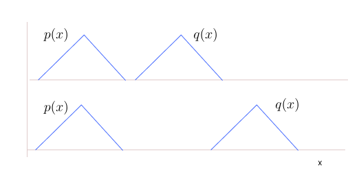
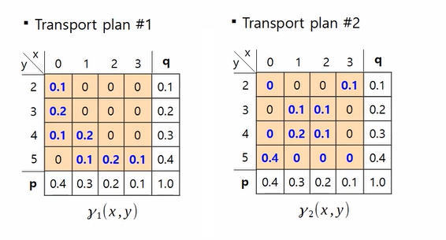
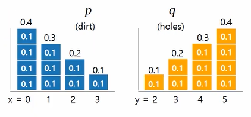
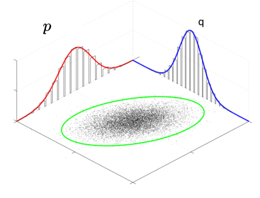
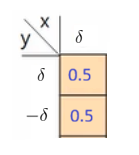
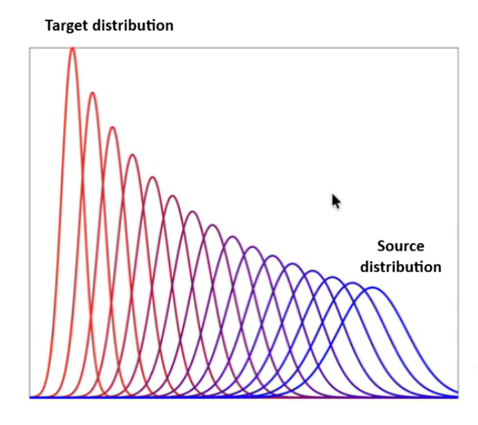

* TOC
{:toc}

## Introduction
Till now, our standard way of measuring the deviation between likelihoods is KL-divergence. The KL-divergence between $p$ and $q$ is:

$$
\text{KL}(p \, || \,  q) = \int_{\mathcal{X}} p(x) \log \left[ \frac{p(x)}{q(x)} \right] \,\, dx
$$

One limitation with KL as a loss function in generation is that it is completely agnostic to the underlying geometry of the data. That is, suppose we have two points $x$ and $x'$; KL just compares the likelihood at these points separately, i.e., $\text{KL}(p(x) \, || \,  q(x))$ and $\text{KL}(p(x') \, || \,  q(x'))$, and sum or integrate the differences over the entire domain. But no where it considers the distance between $x$ and $x'$.

KL divergence is valid only when the supports of two distributions are overlapping. The support of a distribution is the set of values that a random variable can take with positive probability. If these distributions are non-overlapping, the KL divergence is either not defined or infinite.

* If $p(x)>0$ and $q(x)=0$, then KL is infinite.
* If $p(x)=0$ and $q(x)>0$, then KL is undefined because $\log p(x)$ is undefined. But this case doesn't appear because the integration is over only the support of $p$. The KL divergence between $p$ and $q$ only looks at where $p$ puts its mass.

<figure markdown="0" class="figure zoomable">
<figcaption>
  <strong>Figure 1.</strong> Issue with KL-divergence.
  </figcaption>
</figure>

The KL-divergence doesn't give a meaningful distance measure between non-overlapping distributions. For both these cases, the KL is infinite. In such cases, it is difficult to make the distribution $p$ closer to $q$ as the distance is not defined. Ideally, we want a distance/divergence metric that says $p$ and $q$ are closer in case 1, and they are far in case 2.

One such distance that is very popular in ML is Wasserstein distance. This distance is defined based on an optimization problem called as optimal transport problem.

## Optimal Transport Problem
Suppose there are four mines $x_1, \dots, x_4$ at $0,1,2,3$ respectively. The quantity of mineral available at each mine is $p_1, \dots, p_4$. And suppose there are four refineries $y_1, \dots, y_4$ at $2,3,4,5$ respectively. Each of these refineries has a processing capacity of $q_1, \dots, q_4$. Our objective is to transport the minerals from mines to the refineries such that the entire minerals get processed.

* If $\Sigma p_i < \Sigma q_i$, then some refineries are not required to be fully utilized.
* If $\Sigma p_i > \Sigma q_i$, then some minerals are left without processing.
* We can process the entire minerals and use all the refineries completely only when $\Sigma p_i = \Sigma q_i$.

For our problem, let's assume that $\Sigma p_i = \Sigma q_i=1$. We need to find a transport plan to move minerals from each mine to each refinery.

<figure markdown="0" class="figure zoomable">
<figcaption>
  <strong>Figure 2.</strong> Various transport plans
  </figcaption>
</figure>

Each $\pi(x,y)$ matrix (the numbers in the brown cells) gives us a transport plan. Any $\pi$ matrix whose column sums are $p$ and row sums are $q$ is a feasible transport plan.

Depending upon the location of the mines and refineries, each of these transports will have different cost associated. The cost is calculated as number of units to transfer x cost of transferring one unit. For example, let $c_{11}$ denote the cost of transferring a unit of mass from $x_1$ to $y_1$. Then, the cost to transport 0.1 unit from $x_1$ to $y_1$ is $0.1 * c_{11}$. Then, the total cost of a transport plan $\pi$ is:

$$
\sum_{ij} c_{ij} \cdot \pi_{ij}
$$

where $\pi_{ij}$ are the units to be transferred from $x_i$ to $y_j$, and $c_{ij}$ is the cost of transferring a unit of mass from $x_i$ to $y_j$.

The optimal transport problem is:

$$
\begin{align*}
& \min_{\pi} \sum_{ij} c_{ij} \cdot \pi_{ij} \\
& \text{s.t.} \sum_j \pi_{ij} = q_i \,\, \forall i \hspace{0.5cm} \text{and} \hspace{0.5cm} \sum_i \pi_{ij} = p_j \,\, \forall j \hspace{1cm} \text{and} \hspace{0.5cm} \pi_{ij} \geq 0 \,\, \forall i,j
\end{align*}
$$

Here $p$, $q$ and the cost function $c$ are given.

Here we considered $p$ and $q$ to be discrete distributions, and $\pi$ gave us the joint mass function between $p$ and $q$.

<figure markdown="0" class="figure zoomable">
<figcaption>
  <strong>Figure 3.</strong> When $p$ and $q$ are discrete
  </figcaption>
</figure>

But the same problem can be extended to continuous distributions as well. And we find a joint density function between $p$ and $q$.

<figure markdown="0" class="figure zoomable">
<figcaption>
  <strong>Figure 4.</strong> When $p$ and $q$ are continuous
  </figcaption>
</figure>

So essentially, in the optimal transport problem, given the marginals $p(X)$ and $q(Y)$ of two random variables respectively, and a distance or cost function $c(x,y): \mathcal{X} \times \mathcal{Y} \to \mathbb{R}$, the objective is to find the joint distribution of $p$ and $q$, that is, $\pi(X,Y)$.

Therefore, the optimal transport problem can be written as:

$$
\begin{align*}
& \min_{\pi \in \mathcal{P}(\mathcal{X} \times \mathcal{X})} \int \int c(x,y) \cdot \pi(x,y) \, dx \, dy \equiv \min_{\pi} \mathbb{E}_{X,Y \sim \pi} [c(X,Y)] \\
& \text{s.t.} \int \pi(x,y)\, dx = q(y) \,\,\, \forall y\\
& \hspace{0.5cm} \int \pi(x,y) \, dy = p(x) \,\,\, \forall x \\
& \hspace{0.5cm} \pi(x,y) \geq 0 \,\,\, \forall x,y
\end{align*}
$$

where

* $\mathcal{X}$ is the data space
* $\mathcal{P}(\mathcal{X} \times \mathcal{X})$ is the set of all joint probability distributions over $\mathcal{X} \times \mathcal{X}$.

* $p$ and $q$ are given source and target distributions.
* $c(x,y)$ is the cost function defining cost of transporting unit mass from location $x$ to location $y$.

  
TIP

  
 Given a joint distribution, marginals are fixed. But given marginals, there can be many joints. That is, many joints can give the same marginals.
  

There can be many joint distributions $\pi$ satisfying the constraint and minimizing the cost. The unique minimizer may or may not exist.

## A short note on Wasserstein Distance
In general, the cost function $c$ can be any function, but let's consider $c$ to be a valid distance, i.e., $c(x,y)$ is the distance between $x$ and $y$. With this, on solving the transport problem, say the optimal transport plan is $\pi^*$. Then,

$$
\int \int c(x,y) \cdot \pi^*(x,y) \, \, dx \, dy
$$

is the expected optimal transport cost to transform $p$ into $q$. This value of the objective function is known as the 1-Wasserstein distance.

### Simple Example
Assume two discrete probability distributions

$$
p(X=x) = \begin{cases}
1 & x = +\delta \\
0 & \text{otherwise} \\
\end{cases} \hspace{1cm} \text{and} \hspace{1cm} q(Y=y) = \begin{cases}
\frac{1}{2} & y = +\delta \\
\frac{1}{2} & y = -\delta \\
0 & \text{otherwise} \\
\end{cases}
$$

and let's consider $c(x,y)$ to be the Euclidean distance.

KL between $p$ and $q$ is 0 only when $\delta=0$. For any $\delta > 0$, KL is $p(\delta) \log \frac{p(\delta)}{q(\delta)} =  \log 2$. But we want a distance measure that gives a higher number for higher $\delta$ and a lower number for lower $\delta$.

The optimal transport problem poses it as:

<figure markdown="0" class="figure zoomable">

</figure>

So, the objective simplifies to:

$$
\begin{align*}
& = \min_{\pi} \, c(\delta, \delta) \cdot \pi(\delta, \delta) + c(\delta, -\delta) \cdot \pi(\delta, -\delta) \\
& \hspace{1cm} \text{s.t.  } \pi(\delta, \delta) + \pi(\delta, -\delta) = 1 \\
& \hspace{2cm} \pi(\delta, \delta) = 0.5 \text{ and } \pi(\delta, -\delta) = 0.5 \\
\end{align*}
$$

As we try to satisfy the constraints, the optimal transport plan is uniquely determined. The plan is $\pi^*(\delta, \delta) = 0.5 \text{ and } \pi^*(\delta, -\delta) = 0.5$.

The optimal transport cost is

$$
\begin{align*}
W(p,q) & =  c(\delta, \delta) \cdot \frac{1}{2} + c(\delta, -\delta) \cdot \frac{1}{2} \\
& = 2\delta \cdot \frac{1}{2} \\
& = \delta
\end{align*}
$$

The Wasserstein distance between $p(x)$ and $q(y)$ is $\delta$. This distance respects the underlying geometry, i.e., the distance between the data points $x$ and $y$.

Suppose the source and target distributions are as in the figure. When we look at the midpoint of the Wasserstein distance between these two distributions in the Wasserstein space, then it corresponds to the Gaussian in the middle. It looks like a natural interpolation of the two extreme distributions.

<figure markdown="0" class="figure zoomable">

</figure>

This proves that the WD maintains the underlying geometry (the underlying distance between the given points) when defining the distance between the distributions. If you have a distribution of mass at $x=0$ and you want to move it to $x=10$, the Wasserstein distance reflects that 10-unit gap.

  
TIP

  
 In the Wasserstein space, the Wasserstein distance between two distributions corresponds to the length of the shortest curve connecting the two distributions. By definition, it is the lowest possible cost (minimum work) required to turn one distribution into another. If you imagine the distributions as piles of soil, the Wasserstein distance is the amount of soil to move multiplied by the distance it has to travel.
  

