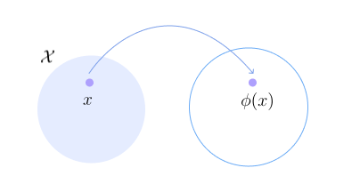

* TOC
{:toc}

## Kernels
Kernel is a function that takes two data points and gives a scalar, $k : \mathcal{X} \times \mathcal{X} \to \mathbb{R}$. Intuitively, it measures similarity.

Let $\mathcal{X}$ be a set of abstract objects such as text words, images, molecules, Euclidean vectors, etc. Assume it is a set with words such as sea, river, water, crab, etc. And we are just given this Kernel function that measures similarity. Now, say we want to come up with a vector representation of these objects.

We represent an object by measuring its similarity with other objects. For example, sea can be represented as:

$$
\mathbf{\Phi}(\text{sea}) = \begin{bmatrix}
k(\text{sea}, \text{river}) \\ 
k(\text{sea}, \text{sea}) \\
\vdots \\
k(\text{sea}, \text{crab}) \\
\end{bmatrix}
$$

<figure markdown="0" class="figure zoomable">
<figcaption>
  <strong>Figure 1.</strong> What does a kernel do? The data point $x = \text{sea}$ is mapped to $\mathbf{\Phi}(\mathbf{x})$.
  </figcaption>
</figure>

Kernels help us embed abstract objects as Euclidean vectors using the kernel function. $\mathbf{\Phi}(\mathbf{x})$ is called as canonical (default) map.

* If the set $\mathcal{X}$ is a finite set, then we represent each object $x$ by a finite-dimensional Euclidean vector.

$$
\mathbf{\Phi}(\mathbf{x}) = \begin{bmatrix}
k(\mathbf{x}, \mathbf{y}_1) \\
k(\mathbf{x}, \mathbf{y}_2) \\
\vdots \\
k(\mathbf{x}, \mathbf{y}_n) \\
\end{bmatrix}
$$

* If the set $\mathcal{X}$ is an infinite set, then $\phi(\cdot , x)$ is a function which takes two arguments as inputs. The kernel maps a data point from the input space to a function in the Hilbert space.

Having just the Euclidean vectors is not enough to define a Euclidean space. We should define how to add vectors, scale vectors, and take inner product of vectors.

The reproducing property of a kernel $k$ in a Reproducing Kernel Hilbert Space (RKHS) $\mathcal{H}$ states that the inner product of any function $r \in \mathcal{H}$ with the features $\mathbf{\Phi}(\mathbf{x})$ reproduces the function value at that point

$$
\langle r, \mathbf{\Phi}(\mathbf{x}) \rangle_{\mathcal{H}} = r(\mathbf{x})
$$

The property demonstrates that evaluating a function at a point $x$ is equivalent to computing an inner product in $\mathcal{H}$.

Consider a function $r$ that takes $\mathbf{x} \in \mathbb{R}^2$ as input and outputs a scalar $\mathbb{R}$:

$$
r(\mathbf{x}) = r_1x_1 + r_2x_2 + r_3 x_1x_2
$$

The function $r(\cdot)$ can be considered as an element of a function space (Hilbert space) $\mathbb{R}^3$:

$$
r(\cdot) = [r_1 \, \, r_2 \, \, r_3]^\top
$$

Given the function $r(\mathbf{x}) = 2x_1 + x_2 + 3 x_1x_2$, the linear function $r$ can be represented as:

$$
r = r(\cdot) = \begin{bmatrix} 2 \\ 1 \\ 3  \end{bmatrix}
$$

The mapping $\mathbf{\Phi}(\mathbf{x})$ maps $(x_1, x_2) \to (x_1, x_2, x_1x_2)$. The evaluation of $r$ at $\mathbf{x}$, $r(\mathbf{x})$, is an inner product in the Hilbert space:

$$
r(\mathbf{x}) = r(\cdot)^\top \mathbf{\Phi}(\mathbf{x}) = \langle r(\cdot),  \mathbf{\Phi}(\mathbf{x}) \rangle_{\mathcal{H}}
$$

For example, $r$ evaluated at $\mathbf{x} = (-1, 4)$ equals

$$
r((-1,4)) = \left\langle \begin{bmatrix} 2 \\ 1 \\ 3  \end{bmatrix}, \begin{bmatrix} -1 \\ 4 \\ -1 \times 4  \end{bmatrix} \right\rangle_{\mathcal{H}}
$$

Here $\mathbf{\Phi}(\mathbf{x})$ is finite-dimensional, i.e., each data point $\mathbf{x}$ is mapped to a finite-dimensional feature space. This concept naturally extends to infinite-dimensional feature (Hilbert) spaces.

If the Hilbert space is infinite-dimensional, then each data point $\mathbf{x}$ in the original space is mapped to a function, $\mathbf{\Phi}(\mathbf{x})$, in the Hilbert space. In such case, the function takes two arguments, $\mathbf{x}$ and $\mathbf{y}$:

$$
\mathbf{\Phi}(\mathbf{x})(\mathbf{y}) = k(\mathbf{x}, \mathbf{y})
$$

## MMD Definition
We know that Integral Probability Metrics (IPMs) or dual norms is:

$$
\begin{align*}
\text{IPM}_{\mathcal{G}}(s,t) \equiv \max_{r \in \mathcal{G}} \left[ \mathbb{E}_{X \sim s}[r(X)] - \mathbb{E}_{Y \sim t}[r(Y)]\right]
\end{align*}
$$

Different $\mathcal{G}$ gives different (full) metrics.

Consider a set of all functions such that the norm of the function in RKHS is less than or equal to 1.

$$
\mathcal{G} = \{r \hspace{0.2cm} \, | \, \hspace{0.3cm} \|r\|_k \leq 1 \}
$$

Every kernel $k$ has a Reproducing Kernel Hilbert Space (RKHS) associated with it. We are considering all functions whose norm is $\leq 1$ in this space.

The resulting IPM is a full metric, and is called as **Maximum Mean Discrepancy (MMD)**.

$$
\begin{align*}
\text{MMD}(s,t) \equiv \max_{\|r\|_k \leq 1} \left[ \mathbb{E}_{X \sim s}[r(X)] - \mathbb{E}_{Y \sim t}[r(Y)]\right]
\end{align*}
$$

Note here the norm is wrt the RKHS of a kernel. In 1-Wasserstein, the norm was wrt to Lipschitz constant.

$r(x)$ can be written in terms of kernel inner product.

