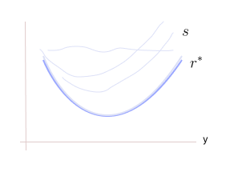

* TOC
{:toc}

## When $c$ is Squared Euclidean Distance
The dual form of the optimal transport problem is:

$$
\begin{align*}
& \max_{\bar{r}, \bar{s} \, \in \, \mathcal{C}(\mathcal{X})} \mathbb{E}_{X \sim s}[\bar{r}(X)] + \mathbb{E}_{Y \sim t}[\bar{s}(Y)]\\
& \hspace{0.5cm} \text{s.t.  } \bar{r}(x) + \bar{s}(y) \leq  c(x,y) \,\, \forall x,y \in \mathcal{X}
\end{align*}
$$

Assume the cost is the square of the Euclidean distance, i.e., $c(x,y) = \frac{1}{2}\|x-y\|_2^2$. We know that

$$
\frac{1}{2}\|x-y\|_2^2 = \frac{1}{2}\|x\|^2 + \frac{1}{2}\|y\|^2 - x^\top y
$$

Then, the constraint becomes:

$$
\begin{align*}
\bar{r}(x) + \bar{s}(y) & \leq  \frac{1}{2}\|x\|^2 + \frac{1}{2}\|y\|^2 - x^\top y \,\, \forall x,y \in \mathcal{X}
\\
x^\top y + \bar{r}(x) - \frac{1}{2}\|x\|^2  & \leq   \frac{1}{2}\|y\|^2 - \bar{s}(y) \\
\\
x^\top y -r(x)  & \leq   s(y) \\
\end{align*}
$$

where $r(x) = \frac{1}{2}\|x\|^2 - \bar{r}(x)$ and $s(y) = \frac{1}{2}\|y\|^2 - \bar{s}(y)$. This constraint has to be met for all $x,y \in \mathcal{X}$. For a given $y$, we get a scalar $s(y)$. Then, the LHS term should be less than this $s(y)$ for all $x$. So, we can write it as:

$$
\begin{align*}
\max_x & \{x^\top y - r(x)\} \leq s(y) \,\, \forall y \\
\end{align*}
$$

For each fixed $x$, the term $\{x^\top y - r(x)\}$ is an affine function in $y$. And we are taking maximum of all these affine functions for each $y$. We represent this function as $r^*(y)$, and called as conjugate of $r(x)$.

$$
r^*(y) = \max_x \{x^\top y - r(x)\} \tag{1}
$$

* By definition, $r^*(y)$ is a convex function because maximum over convex will always be convex, regardless of $r$ is convex or not.

The dual form of the OT problem is now (from <a href="#eq:eq1">(1)</a>) is:

$$
\begin{align*}
& \max_{\bar{r}, \bar{s}} \mathbb{E}_{X \sim s}[\bar{r}(X)] + \mathbb{E}_{Y \sim t}[\bar{s}(Y)]\\
& \hspace{0.5cm} \text{s.t.  } \bar{r}(x) + \bar{s}(y) \leq  c(x,y) \,\, \forall x,y \in \mathcal{X}
\end{align*}
$$

We know $\max_x -f(x) = - \min f(x)$ 

$$
\begin{align*}
& \max_{\bar{r}, \bar{s}} \mathbb{E}\left[\frac{1}{2}\|X\|^2 - r(X) \right] + \mathbb{E}\left[\frac{1}{2}\|Y\|^2 - s(Y)\right]\\
& -\min_{r,s } \mathbb{E}\left[\frac{1}{2}\|X\|^2 \right] + \mathbb{E}[r(X)] + \mathbb{E}\left[\frac{1}{2}\|Y\|^2 \right] +  \mathbb{E}[s(Y)]\\
&  -\min_{r,s} \mathbb{E}_{X \sim s}[r(X)]  +  \mathbb{E}_{Y \sim t}[s(Y)] + \mathbb{E}\left[\frac{1}{2}\|X\|^2 \right] + \mathbb{E}\left[\frac{1}{2}\|Y\|^2 \right]\\
& \hspace{0.5cm} \text{s.t.  } r^*(y) \leq s(y) \,\, \forall y \\
\end{align*}
$$

The last two terms of the objective don't involve $r$ and $s$, so the optimization problem is:

$$
\begin{align*}
& -\min_{r,s} \mathbb{E}_{X \sim s}[r(X)]  +  \mathbb{E}_{Y \sim t}[s(Y)] \\
& \hspace{0.5cm} \text{s.t.  } r^*(y) \leq s(y) \,\, \forall y \tag{2}
\end{align*}
$$

Here we have minimization over 2 variables, we can first minimize wrt $r$ and then with $s$, or vice versa. Let's first minimize with respect to $s$. That is, $r$ is a constant $\implies$ $r^*$ is also a constant. We know that $r^*$ is convex and $r,s$ don't have to be convex.

<figure markdown="0" class="figure zoomable">
<figcaption>
  <strong>Figure 1.</strong> $s$ could be any function above $r^*$ at every $y$. At optimality, we expect $s(y) = r^*(y)$ for all $y$
  </figcaption>
</figure>

$s(y)$ should be $\geq r^*(y)$ for all $y$ (that is, $s$ is lower bounded by a fixed function). And we are trying to minimize $\mathbb{E}[s(Y)]$. The expectation will be least when the value $s(y)$ is the least. The least value of the function $s(y)$ that we can achieve as per our constraint is $r^*(y)$.

So, at optimality, we expect $s(y) = r^*(y)$ for all $y$ because we are searching for $g$ over a function space that has all possible functions. And also, at optimality, $s$ is also a convex function.

With similar arguments, if we had started with the constraint:

$$
\begin{align*}
x^\top y -s(y)  & \leq   r(x) \,\, \forall x,y \in \mathcal{X} \\
\max_{y} \{x^\top y -s(y) \}  & \leq   r(x) \,\, \forall x
\end{align*}
$$

And we represent this function in LHS as $s^*(x)$, and called as conjugate of $r(x)$. Then, the constraint would have been:

$$
s^*(x) \leq r(x) \, \forall x
$$

$s^*$ is a convex function. At optimality, $s^*(x) = r(x)$ for all $x$. Thus, $r$ is also convex. Thus, we prove that the conjugate of $r$ is $s$, i.e., $r^* = s$ and the conjugate of $s$ is $r$, i.e., $s^* = r$. At optimality,

* Both $r$ and $s$ are convex functions.
* One function is the conjugate of the other.

Then, our objective <a href="#eq:eq2">(2)</a> can be written as:

$$
\begin{align*}
& -\min_{r \, \in \, \text{Conv}(\mathcal{X})} \mathbb{E}_{X \sim s}[r(X)]  +  \mathbb{E}_{Y \sim t}[r^*(Y)] \\
\end{align*} \tag{3}
$$

where $\text{Conv}(\mathcal{X})$ is the set of all closed convex functions over $\mathcal{X}$.

If the cost function is square of the Euclidean/Hilbertian metric over $\mathcal{X}$, then the dual of the optimal transport problem simplifies to the problem in <a href="#eq:eq3">(3)</a>. To solve this,

1. We can model the function $r$ and $r^*$ using neural networks with the constraint that the function induced by these should be convex functions.

2. Then, enforce conjugacy between $r$ and $r^*$ (see below for how to do this).

  
Note

  
It can be shown that 2-Wasserstein is a valid metric/distance.

In article `19_duality_of_OT`, we observed the following. For a given $(x,y) \in \mathcal{X}$:

*  $\pi(x,y)=0$ when $c(x,y) + r(x) + s(y) > 0$.
*  $\pi(x,y) > 0$, i.e., it **may** be positive (it doesn't need to be necessarily) only when $c(x,y) + r(x) + s(y) = 0 \implies c(x,y) +r(x) =  - s(y)$.

With $c(x,y)$ being the squared distance, the constraint in our case is:

$$
\begin{align*}
x^\top y -r(x) & \leq   s(y) \hspace{0.5cm} \forall x,y \in \mathcal{X} \\
\max_x \{x^\top y - r(x)\} & \leq s(y) \hspace{0.5cm} \forall y \\
r^*(y) & \leq s(y) \hspace{0.5cm} \forall y \\
\end{align*}
$$

We observed that at optimality, we get $r^*(y) = s(y) \,\, \forall y$. But what are the corresponding $x$?

For a given $y$:

* The maximizer of $\max_x \{x^\top y - r(x)\}$ can be found by taking the gradient of it wrt $x$ and setting it to zero:

$$
\begin{align*}
y - \nabla r(\bar{x}) & = 0 \\
y & = \nabla r(\bar{x}) \implies \bar{x}(y) = (\nabla r)^{-1}(y) \tag{4}
\end{align*}
$$
The maximizer $\bar{x}$ should satisfy this first-order condition.

* The gradient of $r^*(y)$ at the given $y$ will just be the arg max (i.e., $\bar{x}$) to this optimization problem. Say at the given $y$, the maximizer is $\bar{x}$:
$$
\begin{align*}
r^*(y) & = \arg \max_x \{x^\top y - r(x)\} \\
r^*(y) & = \bar{x}{^\top} y - r(\bar{x}) \\
\nabla_y r^*(y) & = \bar{x} \\
\end{align*}
$$
This is similar to Danskin's theorem. As we know, we solve a different optimization problem for each $y$, so the solution is a function of $y$, i.e., 

$$
\nabla r^*(y) = \bar{x}(y) \tag{5}
$$

For <a href="#eq:eq1">(1)</a>, the objective value at optimality gives the value of $r^*(y)$ and the maximizer gives the gradient of $r^*(y)$. We get both function value and gradient at the same time. On combining <a href="#eq:eq4">(4)</a> and <a href="#eq:eq5">(5)</a>,

$$
\nabla r^*(y) = (\nabla r)^{-1}(y)
$$

Substitute $y = \nabla r(x)$, then

$$
\begin{align*}
\nabla r^*(\nabla r(x)) & = (\nabla r)^{-1}(\nabla r(x)) \\
\nabla r^*(\nabla r(x)) & = x \tag{6}\\
\end{align*}
$$

This shows that $\nabla r$ and $\nabla r^*$ are inverses of each other. This is true only if $r$ is convex (in fact strictly convex).

**Bi-conjugate:**

* If the original function $f$ is not convex, $f^*$ is always convex. Then, $(f^*)^*$ will also be convex. A non-convex function can never be a convex function. So, the conjugate of $f^*$ is not always equal to $f$, i.e., $(f^*)^* \ne f$

* If $f$ is a convex function, then its bi-conjugate will be the original function, $(f^*)^* = f$.

From <a href="#eq:eq4">(4)</a> and <a href="#eq:eq5">(5)</a>, it is clear that $\pi(x,y)$ **can** be positive only at those $(x,y)$ where $y= \nabla r(x)$ or $x=\nabla r^*(y)$. At all other $(x,y)$, the joint $\pi(x,y)$ will definitely be 0.

$$
\pi(x,y) > 0 \iff y= \nabla r(x)
$$

That is $\pi(x,\nabla r(x)) > 0$, only these points have non-zero probability density or mass.

$$
\pi(x,y) = \begin{cases} 0 & \text{if } y\ne \nabla r(x) \\
\ >0 & \text{if } y= \nabla r(x)\\
\end{cases}
$$

The optimal transport problem says that $(X,Y) \sim \pi$, then $X \sim s$ and $Y \sim t$. Here $(X,\nabla r(X)) \sim \pi$. Then, $X \sim s$ and $\nabla r(X) \sim t$.

### OT based Generation

Consider $s$ as proposal and $t$ as the target. Once this dual OT problem in <a href="#eq:eq3">(3)</a> is solved, we get the optimal parameters of the network which induces $r$. Then, generation can be performed by simply pushing noise (samples from proposal) through $\nabla r$ (using backprop, we can easily compute $\nabla r(x)$).

This gives us a new way of doing implicit modelling; solving the dual of the OT itself gives us a generator. $\nabla r$ is acting as a generator. So, the implicit generation can be performed by just solving the dual optimal transport problem <a href="#eq:eq3">(3)</a> in this squared Euclidean distance case.

  
WARNING

  
 Infact, this means that it is an overkill if 2-Wasserstein is employed as loss in implicit generation, as OT itself provides an implicit generator!

### From the primal view POV:
The optimal transport problem from its primal also suggests that we can have implicit generation from optimal transport for any cost. The primal view of the optimal transport problem is:

$$
\begin{align*}
& \min_{\pi(x,y)} \int \int c(x,y) \cdot \pi(x,y) \, dx \, dy  \\
& \text{s.t.} \int \pi(x,y)\, dx = t(y) \,\,\, \forall y\\
& \hspace{0.5cm} \int \pi(x,y) \, dy = s(x) \,\,\, \forall x \\
& \hspace{0.5cm} \pi(x,y) \geq 0 \,\,\, \forall x,y
\end{align*}
$$

The variable of this problem is the joint likelihood, but the marginals of it are known. For a joint, if marginals are known, then the only unknown factor is the conditional. So, the actual unknown in OT problems is the conditional.

$$
\begin{align*}
& \min_{\pi(y \, | \, x)} \int \int c(x,y) \cdot \pi(y \, | \, x) \cdot s(x) \, dx \, dy  \\
& \text{s.t.} \int \pi(y \,  | \, x) \cdot s(x) \, dx = t(y) \,\,\, \forall y\\
& \hspace{0.5cm} \pi(y \, | \, x) \geq 0 \,\,\, \forall x,y
\end{align*}
$$

OT is a problem of finding a conditional $\pi(y \, | \, x)$ which when multiplied by the source distribution $s(x)$ and integrated over $x$ gives us the target distribution $t(y)$. That is, $\pi(y \,  | \, x)$ is a transformation (in fact a linear transformation) which consumes $s(x)$ and produces $t(y)$.

And our objective is to find that $\pi(y \,  | \, x)$ which minimizes the expected cost $c(x,y)$. Suppose $c(x,y) = \|x-y\|$, the distance between $x$ and $y$. This distance is minimum when $x$ is close to $y$. So, the OT is looking for a transformation $\pi(y \,  | \, x)$ that takes $x$ and gives a number close to $x$. Such a transformation should likely be a simple identity-like transformation.

Therefore, if we just find $\pi(y \, | \, x)$ by solving the OT problem, we have a generator which can help us generate samples from the target distribution.

## How to Solve the Problem

$$
\begin{align*}
& \min_{r \, \in \, \text{Conv}(\mathcal{X})} \mathbb{E}_{X \sim s}[r(X)]  +  \mathbb{E}_{Y \sim t}[r^*(Y)] \\
\end{align*}
$$

How to model a neural network that induces convex functions $r$? Neural networks that model convex function are called as ICNNs (Input convex NN) - a special architecture of NNs. Say we start with such a network, parameterized by $\theta$, that produces $r$. For the induced function $r$, how do we compute $r^*$? By definition,

$$
r^*(y) = \max_x \{x^\top y - r(x)\}
$$

If we substitute this, then this will become a min-max problem; which we don't want to do. To avoid this problem, we model two ICNNs: $r_{\theta}$ and $g_{\phi}$. And, we will enforce that $r_{\theta}$ and $g_{\phi}$ are conjugate of each other.

From <a href="#eq:eq6">(6)</a>, we know that if $r$ is convex, then $\nabla r^*$ and $\nabla r$ are inverses of each other.

$$
\nabla r^*(\nabla r(x)) = x
$$

Then we should have:

$$
\nabla g_\phi(\nabla r_{\theta}(x)) = x
$$

We add a loss function (may be a square loss function) to enforce this.

$$
\mathcal{L}(\theta, \phi) = \sum_i \left(\nabla g_\phi(\nabla r_{\theta}(x_i)) - x_i \right)^2
$$

This is similar to the reconstruction loss that we use in autoencoders. If the gradient of convex functions are inverses of each other, then the functions are conjugate of each other. This way, we solve the dual problem of the OT to get $r$, and then we do $\nabla r$ to do generation.

