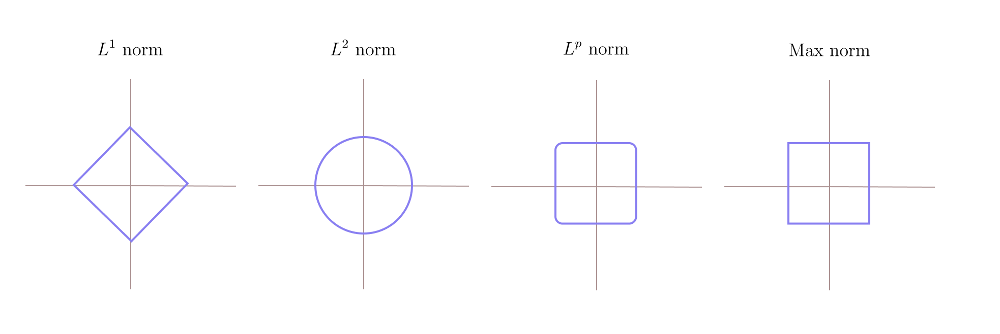
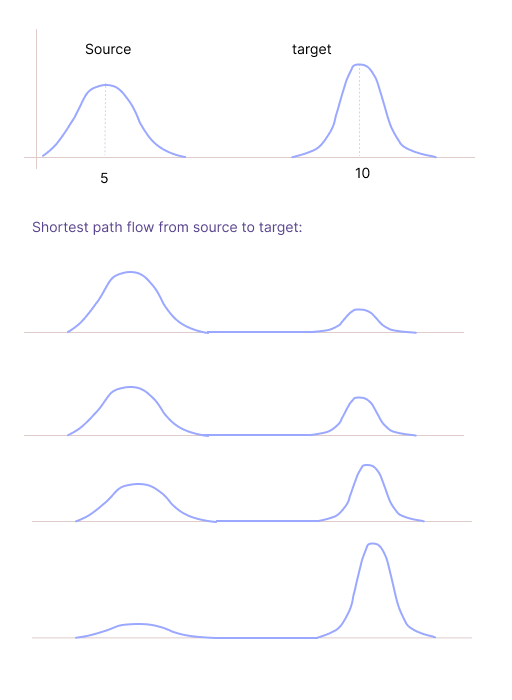
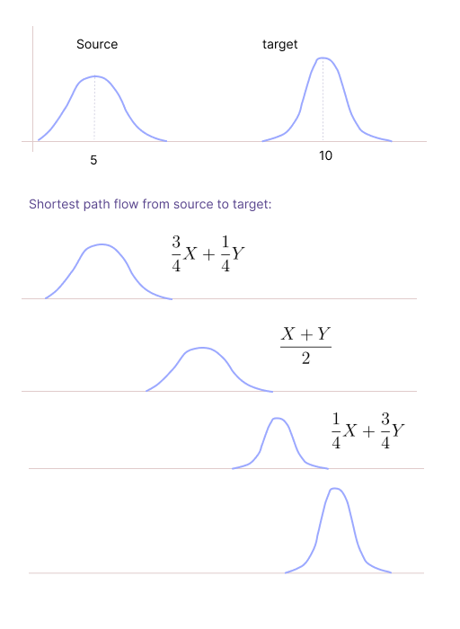
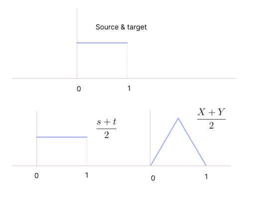
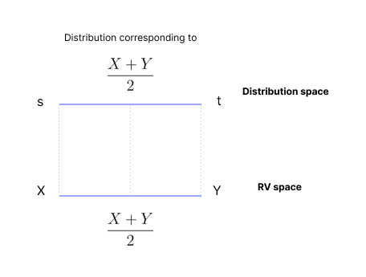
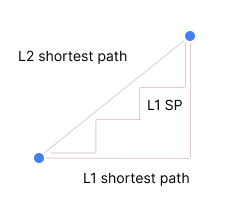

* TOC
{:toc}

## Introduction
Now that we have 8 generative models, we wish to debate their pros and cons in order to zero-in on potential SOTA for generation. The list of generative models we looked at are:

1. EBM + MLE + LMC (Classical method)
2. Score-based Generation
3. Denoising-score based generation
4. Diffusion Models
5. KL-GAN
6. Wasserstein GAN (1-Wasserstein GAN). Vanilla GAN is the one we get without enforcing the constraint that $r$ is 1-Lipschitz continuous.
7. Generation with MMD loss
8. OT based generation (via 2-Wasserstein)

Many more can be understood as their modifications.

**Comparison between pure Langevin sampling approaches vs Diffusion models:**

Pure Langevin sampling based approaches are arbitrarily slow. The convergence of these algorithms depends on the target distribution.

* For Gaussian, the convergence is exponentially fast. Even after discretization, the convergence is fast, at the rate of $\frac{1}{\sqrt{k}}$.
* For an arbitrary target distribution, the convergence may not be exponential especially after discretization.

So, pure Langevin sampling may turn out to be arbitrarily slow; we may have to run many iterations.

In diffusion models, the forward process is exponentially fast. Since we reverse this process, this will also be exponentially fast regardless of the target distribution. If we were to do Langevin sampling purely in the reverse way, it may not be exponentially fast. The exponentially fast reverse mechanism is the key advantage of diffusion models over others in explicit methods. Therefore, diffusion models are the best among explicit models.

**Comparison between Diffusion models and Implicit Models:**

Firstly, implicit generative models have an inherent advantage over explicit ones like diffusion models: inference is straight-forward by definition. Of course, diffusion models bridge this gap to some extent by reducing the inference problem to few forward passes in a network. Yet, comparatively implicit models do have an edge in inference stage by their very design.

However, training implicit models, like vanilla GAN, KL-GAN, 1-Wasserstein GAN etc., is practically challenging. This is because training involves solving a min-max optimization problem, which for today's optimization toolboxes is significantly more challenging than for min problems. The only exceptions are the MMD-based and OT (2-Wasserstein) based generation, which involve solving a min problem and can be potential competitors to diffusion models. However, to understand their efficacy, we need to understand a couple of their characteristics in more detail.

Apart from usual suspects like computational cost and optimization convergence, there are two issues that also play a critical role in generation. 

* Sample efficiency: This issue is ubiquitous to ML though.
* But the geometry induced by the metric/loss turns out to be a critical issue for generation, in particular.

## Sample Efficiency

Note that in typical generative problems or ML problems, likelihoods are specified via samples alone. The actual likelihoods are never available. For example, in an image generation problem, the likelihood of photorealistic images is not available. Instead, photorealistic images (samples) can be obtained abundantly. Hence, we can only compute distances/losses between empirical likelihoods (sample-based likelihoods) and not the actual distances between the true underlying likelihoods.

More specifically, let $s$ and $t$ be two likelihoods, and $s_m$ and $t_m$ denote corresponding empirical likelihoods with $m$ samples. Then, we compute $D(s_m, t_m)$ and hope that it is a close proxy to $D(s,t)$. The gap

$$
|D(s_m, t_m) - D(s,t)|
$$

known as **estimation error**, is expected to decay with $m$. As samples increase, how fast does the estimation error converge to 0 with various distances? If the distance $D$ is such that this decay is too slow, then generation using such losses would be inefficient as good approximation can only be guaranteed with far higher number of samples. So, it is important to ask how fast the estimation error (finite sample error) decays with the loss function/distance metric employed in our generative models.

### MMD

If $t_m$ is the empirical likelihood of $t$, then with the normalized characteristic kernels, $\text{MMD}(t_m, t) \to 0$ at the rate $O(\frac{1}{\sqrt{m}})$. Since the sample complexity is independent of the dimension of the data $n$, it is well-suited for high dimensional generation (barring the bad geometry issue given below).

### 2-Wasserstein

$W_p(t_m, t) \to 0$ at the rate $O\left(\frac{1}{m^{\frac{1}{n}}} \right)$ where $n$ is the number of dimensions. When $n$ is high, the error is almost a constant, it doesn't go to 0 as $m$ increases. This is awful for generation problems like image generation in high resolution because tremendous amounts of training data may be required for small improvements. This is the fundamental reason that is holding back OT based methods from emerging as SOTA.

When we don't converge to $t$ (the true distribution), our model generates good samples near the training points but not beyond the training points.

### Diffusion models
Denoising score-matching based generation is just a regression problem during inference. For regression problem, the estimation error goes to 0 at the rate $O(\frac{1}{\sqrt{m}})$. It is actually $O\left(\sqrt{\frac{n}{m}} \right)$, but the recent advancement has showed that this can be improved to $O(\frac{1}{\sqrt{m}})$.

For diffusion models as well, the error between the true and the empirical target distribution goes at the rate of $O(\frac{1}{\sqrt{m}})$.

## Geometry
What closeness means depends on the distance used. For example, the equidistant point to the origin depends on the metric we use:

<figure markdown="0" class="figure zoomable">
<figcaption>
  <strong>Figure 1.</strong> If the distance is Euclidean, then the equidistant points to the origin are the points on the circle.
  </figcaption>
</figure>

The geometry induced by the loss/metric must be ideally aligned with the underlying geometry of the data. That is, nearness in terms of the loss employed (MMD / Wasserstein / Fisher-score) must imply nearness in terms of the samples (data). It is crucial that these two are aligned in order that generation quality is good. The best way to understand the geometry is to understand the geodesics/shortest-path flows.

### MMD

What does it mean when we say that the two distributions are close by in terms of MMD distance?

Unfortunately, the geometry induced by MMD is completely independent of the underlying geometry of the data. Since $\text{MMD}(s,t)$ is the Euclidean (Hilbertian) distance between the kernel embeddings, $\mu_s$ and $\mu_t$, the embedding of the geodesic is (uniquely) given by

$$
\begin{align*}
(1-\lambda) \mu_s + \lambda \mu_t & = (1-\lambda) \mathbb{E}_{X \sim s}[\phi_k(X)] + \lambda \mathbb{E}_{Y \sim t}[\phi_k(Y)] \\
& = \int \phi_k(x) (1-\lambda) s \, dx + \int \phi_k(y) \lambda \, t \, dy \\
& = \int \phi_k(z) ((1-\lambda) s + \lambda t) \, dz \\
& = \mathbb{E}_{Z \sim (1-\lambda) s + \lambda t}[\phi_k(Z)]
\end{align*}
$$

which is the embedding of $(1-\lambda) s + \lambda t$ (mixture likelihood).

<figure markdown="0" class="figure zoomable">
<figcaption>
  <strong>Figure 2.</strong> Shortest path flow for MMD. Gradual change from $s$ to $t$. The distributions on the path are bi-modal (mixture distribution).
  </figcaption>
</figure>

We get the mid-point when $\lambda=0.5$. The distribution corresponding to this point will be a mixture distribution $\frac{1}{2} s + \frac{1}{2} t$. The samples will be generated from $s$ half of the time, and from $t$ half of the time.

In MMD, we want $f_\theta$ to be close to $t$ in terms of the MMD distance. When we solve the optimization problem, we solve it up to some numerical errors, i.e., say with some tolerance $\epsilon$. At optimality, we achieve a state where the MMD distance between $f_\theta$ and $t$ is less than or equal to $\epsilon$. The corresponding distribution will be $\epsilon s + (1-\epsilon) t$. 

Suppose $\epsilon=0.1$. Then, it means that the samples will be from pure noise 10% of the times even after near convergence. At near convergence, we would ideally expect a blurred version (10% noisy pixels) of the final image; not a pure noisy version. Therefore, this geometry doesn't respect distances in the Euclidean sense of data points. Hence, any MMD-based loss/metric may not be appropriate for generation.

  
WARNING

  
There is no kernel involved in the mixture likelihood expression. So, regardless of the kernel, the geometry induced by the MMD remains the same.

### 2-Wasserstein
Consider a source and target distribution, $s$ and $t$. The shortest path between these two distributions is unique if we are considering 2-Wasserstein metric to measure the distance. Then, the midpoint distribution of these two distributions can be identified (uniquely) by:

1. Solve an optimal transport problem (i.e., compute the 2-Wasserstein distance between $s$ and $t$). On solving this, we get a joint distribution $\pi$. Say $(X,Y) \sim \pi$, then $X \sim s$ and $Y \sim t$.
2. Consider the random variable $\frac{X}{2} + \frac{Y}{2}$, which is distributed as, say $\bar{p}$. This $\bar{p}$ will be the distribution at the midpoint between $s$ and $t$.

<figure markdown="0" class="figure zoomable">
<figcaption>
  <strong>Figure 3.</strong> Shortest path flow for 2-Wasserstein. The distributions on the path are unimodal.
  </figcaption>
</figure>

Note the distribution of $\frac{X+Y}{2}$ will not be $\frac{s + t}{2}$. If $s$ and $t$ are $U(0,1)$ (independent of each other), then $\frac{s + t}{2}$ will be the same $U(0,1)$. But $\frac{X + Y}{2}$ will be a triangular distribution with a peak at $0.5$ because there are more number of ways to get 0.5 from $\frac{X + Y}{2}$.

<figure markdown="0" class="figure zoomable">
<figcaption>
  <strong>Figure 4.</strong> The distribution of $\frac{X+Y}{2}$ and $\frac{s + t}{2}$ are not the same.
  </figcaption>
</figure>

At optimality, we achieve a state where the 2-Wasserstein distance between $f_\theta$ and $t$ is less than or equal to $\epsilon$. The corresponding distribution will be $\epsilon X + (1-\epsilon) Y$. It means that the samples will be blurred version of the true image.

With 2-Wasserstein distance, the geometry of the distribution is the same as the geometry of the data points. For example, the midpoint between the distributions in the 2-Wasserstein geometry corresponds to the midpoint between the RVs in the Euclidean geometry sense.

<figure markdown="0" class="figure zoomable">
<figcaption>
  <strong>Figure 5.</strong> The correspondence between distributions and the RVs. Here $X$ and $Y$ are marginals of the optimal transport plan $\pi$ that we get by computing the 2-Wasserstein distance between $s$ and $t$. That is, $(X,Y) \sim \pi$.
  </figcaption>
</figure>

When we progress towards convergence, the noise will gradually transform to physical objects of interest. Closeness in terms of distribution implies closeness in terms of data points (images). Hence, 2-Wasserstein loss/metric is very good for generation.

### Diffusion models

In explicit models such as diffusion models, we need to analyze two steps, and look at the results in conjunction.

During training, we estimate the score functions. While comparing the score functions, we used the squared error between them, $\| S_{\theta}(x) - S^*(x)  \|^2$, where $S_{\theta}(x) = \nabla_x \log p_{\theta}(x)$. The gradient lies in the same space as the Euclidean vectors (our data points), so we are using the inherent geometry of the data points (the Euclidean geometry). So, they are well-suited for generative tasks.

From the above discussion, it is clear that diffusion models are highly promising, justifying their popularity. However, their main limitation is the non-trivial inference. OT based generation is a potential alternative, provided it's sample complexity is fixed. Today's SOTA are in fact based on ideas from OT.

  
NOTE

  
MMD is the SOTA in hypothesis testing because geometry doesn't matter here as we are trying to answer a yes or no question. Given two sample sets, we may want to know if the distribution generating them are the same. As the sampling efficiency of MMD is good, we can identify if the samples are from the same distribution within few samples.

## Miscellaneous

* If the distance is Euclidean, then the shortest path between these two points is the straight line joining them. This is the path that takes us from source to target with the least distance covered. The other two paths mentioned below have different L2 distances.

* If the distance is L1 distance, then the shortest path between these two points can be any of these three paths. These are the paths that take us from source to target with the same least distance covered.

<figure markdown="0" class="figure zoomable">
<figcaption>
  <strong>Figure 2.</strong> Shortest paths in terms of L1 distance
  </figcaption>
</figure>

When we say two points are close by in terms of L1 distance, they can be close by in multiple ways.

