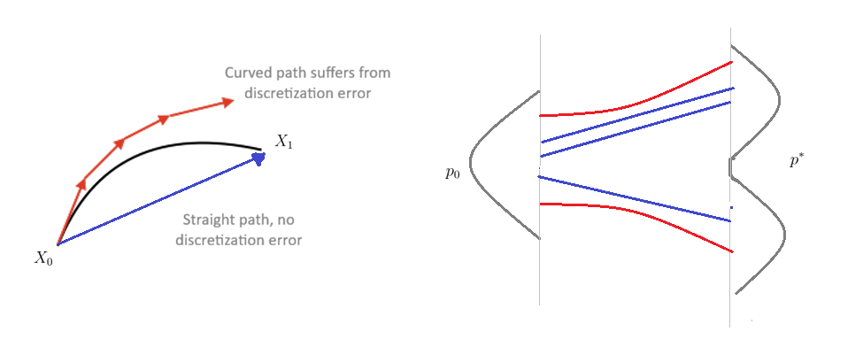
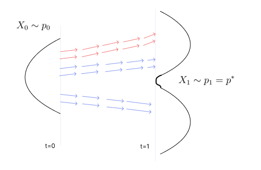
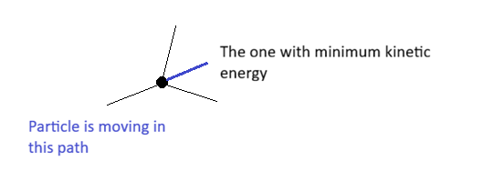
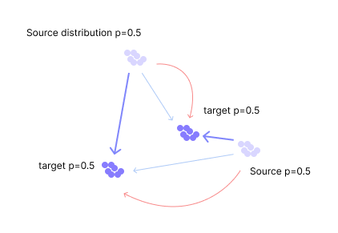
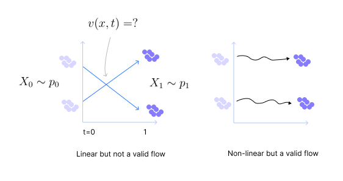
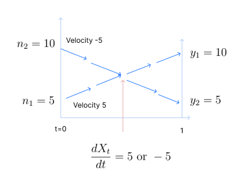
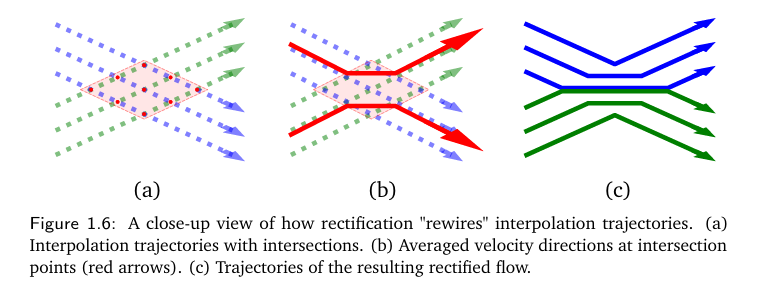
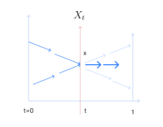

Flow-based generation models are SOTA as of today for most of the applications.

* TOC
{:toc}

## Introduction
Implicit generative models give one-step solution but the function they learn must be very complicated because the function should transform noise to data samples. We know that the deep learning systems are modular; that is, they can create complex functions by composition of many simple functions. So, why can't we use deep neural networks to model the functions for implicit generation? Two challenges in doing that:

1. The supervision is only in the initial and the final stage, there is no supervision for the hidden layers. The entire function has to be learnt based on this.
2. The distance/loss function we use in implicit generation such as Wasserstein or MMD come with its own limitations.

To bridge the gap between implicit and explicit models, we can think of a deep neural network (such as RNNs) as a generator. This generator does generation in steps; each of the hidden layer output is fed as input to the next layer, which then becomes a flow. This flow converts the initial distribution to target distribution with simple drifts at each layer, but the function induced by this DNN can be complex as we have many layers. In addition, we should also come up with a new loss function that overcomes the limitations of MMD and 2-Wasserstein.

**Problem with diffusion models:**

In standard generative models (like diffusion or score-based models), we add noise to the given samples during the forward process. Then, we do the reverse of this known forward process to transform noise to data. The resulting SDE trajectories from noise to data are often highly curved. Due to this, we need a lot of steps during inference to get reasonable samples from the target. The rectified flow model tries to address this issue.

## Rectified Flow Motivation
We know that the particle flow is governed by the following ODE (the one without the explicit noise term):

$$
\frac{dx_t}{dt} =  v(x, t) 
$$

When solved, this equation tells us how $x_0$ evolves with time, that is, the flow of the particle $x_0$, where $x_t$'s are the positions of the particle at time $t$. Thus, these are also called as flow ODEs, and $v_t$ is the velocity field or drift. We saw that we can parameterize and model $v_t$ by a neural ODE network.

  
Note

  
The flow-based model differs from diffusion/pure Langevin sampling in that there is no explicit noise term. Diffusion models are analogous to SGD and flow-based models are analogous to gradient descent.

In flow ODEs, there is no notion of convergence; because the particle path depends on the initial position. So, we start with $p_0$ at $t=0$ and expect to get $p^*$ at $t=1$ (where $t=1$ is arbitrarily chosen). And we know that the distribution after $t=1$ may change, unlike in diffusion models.

## Learning the Velocity Field
The objective is to transform a noise distribution, denoted by $p_0$, into the target distribution $p^*$. In flow models, this procedure is represented by an ordinary differential equation (ODE):

$$
\frac{dX_t}{dt} =  v(X, t)  \hspace{0.5cm} \forall t \in [0,1]
$$

Here $v_t(x) = v(x,t)$ is the velocity field, and is a learnable function to be estimated to ensure that $X_1$ follows the target distribution $p^*$ when starting from $X_0 \sim p_0$.

For an ODE flow (or velocity field) to exist between two distributions, they generally need to be "compatible" in terms of their support, dimensionality, and other criteria. But if the path is possible, it is never unique. There can be infinite velocity fields that get the particles from source to target, because if there is a single path that connects two distributions, we can always perturb that path slightly, or swap which noise point goes to which data point (the "coupling"), to create a brand new velocity field.

**Choice of the Velocity Field:**

Since there exist infinitely many velocity fields from $p_0$ to $p^*$, it is essential to be clear about which type of velocity fields we should prefer.

One option is to favor ODEs that are easy to solve at inference time. In practice, the ODEs are approximated using numerical methods, which typically construct _piecewise linear approximations_ of the ODE trajectories. For instance, a common choice is Euler’s method:

$$
\hat{X}_{t + \epsilon} = \hat{X}_{t} + \epsilon  \, v_t(\hat{X}_{t}), \hspace{0.5cm} \forall t\in \{0, \epsilon, 2\epsilon, \dots, 1\}
$$

where $\epsilon >0$ is the step size. Smaller $\epsilon$ yields high accuracy, but incurs larger number of inference steps. Therefore, we should seek ODEs that can be approximated accurately even with large step sizes. The ideal scenario arises when the ODE follows straight-line trajectories, in which case Euler approximation yields zero discretization error regardless of the choice step sizes.

<figure markdown="0" class="figure zoomable">
<figcaption>
  <strong>Figure 1.</strong> Curved trajectories suffer from discretization error when approximated by Euler’s method. We want the trajectory (velocity field) to be straight (blue line).
  </figcaption>
</figure>

Velocity field is a pre-defined function. According to that pre-defined function, the particles move. Standing at $t=0$, we ask the velocity field the direction to go. The velocity field gives us a direction. We take a step towards this direction. The distance we go in this direction depends on the step size. From the point we end up at, we again ask the velocity field the direction to go, and repeat the same procedure. This traces out the path of the particle.

* If the velocity field is curved, we deviate easily from it on taking discrete steps, especially with large step sizes as the direction we want to take at each time step is different. We must take small step sizes to reduce this error (discretization error). With small step sizes, we need a lot of steps to get reasonable samples.

* If the velocity field is linear, the direction we move at $t=0$ is exactly the same direction we need at $t=0.5$ and $t=1$. There will be no change in the direction. So, having a large step size doesn't deviate us from the true trajectory. We can reach the target in one single step without any approximation error.

These ODEs, known as straight transports, enable fast generative models that can be simulated in a single step. So, we are looking for a velocity field that is linear, i.e., velocity doesn't change along the path.

  
TIP

  
ODE = velocity field. ODE trajectory is the same as ODE flow.

## Loss Function
Now, we have two objectives: 

1. We should have a transport (velocity field) that transforms noise to data, and
2. The velocity field should be linear, i.e., velocity should be constant along the path - a straight line connecting two points.

<figure markdown="0" class="figure zoomable">
<figcaption>
  <strong>Figure 2.</strong> Both these velocity fields take us from source to target but we prefer blue over the red field.
  </figcaption>
</figure>

In practice, we can find a velocity field that transforms noise to data, but we may not achieve perfect straightness, but we can aim to make the ODE trajectories as straight as possible to maximize computational efficiency.

The objective (1) is posted as a constraint (because this is a must-have) and objective (2) is a term in the objective function:

$$
\begin{align*}
& \min_{\theta} \int \|v_t(x)\|^2 \, p_t(x) \, dx \\
& \text{such that } \\
& \frac{\partial p_t}{\partial t} = - \nabla \cdot (v_{\theta} \,p_t) \text{ and } p_1 = p^*  \tag{1}
\end{align*}
$$

The resulting $v_{\theta}$ should define a flow governed by the equation in the constraint and $p_1$ should be $p^*$. The objective function is like the total kinetic energy $mv^2$ across the path, where $p_t$ plays the role of mass.

On solving this, we get a velocity field (or an ODE flow) in which the kinetic energy of the particle along the path is the least. Such a flow is less likely to be non-linear (curved). It will be a straight flow, that is, the velocity doesn't change along the path.

Any particle moving along a path will always have a velocity component parallel to the path and a component perpendicular to the path. At any given point, there are multiple velocities possible. But we choose the one has the least kinetic energy, i.e., the one which doesn't have any perpendicular component. So, the particle will remain in the path (without moving away from the path).

<figure markdown="0" class="figure zoomable">
<figcaption>
  <strong>Figure 3.</strong> When a particle is moving along a path, it needs more kinetic energy to deviate from its path. By minimizing the kinetic energy, we choose that velocity that keeps the particle in the path.
  </figcaption>
</figure>

In addition, such a velocity will also be least (as it doesn't have perpendicular component). Assume we are travelling for 1 hour ($t=0$ to $t=1$) with less velocity (say 20kmph) and still reaching the destination. That means, we have travelled on the shortest path from source to target. So, on solving the optimization problem in <a href="#eq:eq1">(1)</a>, we get a flow that has **linear** path and also a **shorter** path.

<figure markdown="0" class="figure zoomable">
<figcaption>
  <strong>Figure 4.</strong> We get the dark blue flow on solving the above optimization problem. Both the blue transports are linear but dark blue is shorter. At any cost, we should avoid the red path as it is non-linear.
  </figcaption>
</figure>

There is no discretization error in both these blue paths as they both are straight. But in practice, we may not get a fully straight path, so there will be small discretization error. This error can be less accumulated by keeping the length of the path short.

Consider there are two paths, one is shorter than the other. We travelled these two paths fully in 1 minute. It means, to travel the long path, we should have used more velocity, and less velocity in the short path. During discretization, we approximate the displacement $\Delta X_t = \int v_t(x_t) \, dt$ by $v_t(x_t) \cdot \Delta t$. If there is error in discretization, then higher the velocity, higher the error. If the velocity is less, then the error will be less ($\Delta t$ is the same in both the cases). So, we prefer the path with less velocity, i.e., the short path.

  
WARNING

  
If our objective was just to get the shortest path, not the straight one, then the problem would have become exactly same as the optimal transport. The optimal transport flow is the one with the least cost to transport source to target. But we know that the OT based generation suffers from sample efficiency. So, we prefer not to reach there again.

Flows are paths that transport the particles from source to target, but the paths cannot intersect. That is, an ODE flow should assign a unique velocity $v(x,t)$ for any given position $x$ and time $t$.

<figure markdown="0" class="figure zoomable">
<figcaption>
  <strong>Figure 5.</strong> Valid vs non-valid flow
  </figcaption>
</figure>

What velocity should we assign at the intersection point? 

* If we assign the upward one, both the points $a$ and $b$ reach 1.
* If we assign the downward one, both the points $a$ and $b$ reach 2. 

Hence, it is not an ODE flow.

## Build Interpolation

* We have samples $\{x_1, x_2, \dots, x_m\}$ from $p^*$. Let the corresponding random variable be $X_1$, i.e., $X_1 \sim p^*$.

* We pick samples $\{n_1, n_2, \dots, n_m\}$ from proposal distribution $p_0$. Let the corresponding random variable be $X_0$, i.e., $X_0 \sim p_0$.

We pair each of the target samples with a noise sample arbitrarily. Now, we have paired data $(n_i, x_i)$. This defines a joint distribution of $(X_0, X_1)$ in which $X_0$ and $X_1$ are independent. And $(n_i, x_i)$ are samples from this joint distribution.

  
Note

  
Instead of some arbitrary joint distribution, if we were to choose the optimal transport plan $\pi^*$, then this interpolation gives us the shortest path connecting these two probability distributions in the Wasserstein space, i.e., the path representing the most efficient transport of "mass".

We can join these pairs by lines. The line joining these two RVs can be given by the below equation. The random variable at $t$ instant is given by 

$$
X_t = (1-t) X_0 + tX_1
$$

This path defines a random process $\{X_t\} = \{X_t : t \in [0, 1]\}$. This is a process (a collection of random variables) created by linear interpolating between $X_0$ and $X_1$. The velocity of this process is given by:

$$
\begin{align*}
X_{t + \Delta t} & = (1-(t + \Delta t)) X_0 + (t + \Delta t)X_1 \\
X_{t + \Delta t} & = X_0 - X_0t - X_0 \Delta t +  tX_1 + X_1 \Delta t \\
& = (1-t)X_0  +  tX_1 + (X_1 - X_0) \Delta t \\
\\
X_{t + \Delta t} - X_t & = (X_1 - X_0) \Delta t \\
\frac{X_{t + \Delta t} - X_t}{\Delta t} & = X_1 - X_0 \\ 
\frac{dX_t}{dt} & = X_1 - X_0 \hspace{0.5cm} \text{ as } \Delta t \to 0 \tag{2}
\end{align*}
$$

The velocity of this process $\{X_t\}$ is not a constant; but it is a fixed random variable. In the interpolation process $\{X_t\}$, different trajectories may have intersecting points, resulting in multiple possible values of $\frac{dX_t}{dt}$ associated with a same point $X_t$ due to uncertainty about which trajectory it was drawn from. So, for a given position and time $t$, we may not be able to compute one deterministic velocity.

<figure markdown="0" class="figure zoomable">
<figcaption>
  <strong>Figure 5.</strong> Velocity field for $\{X_t\}$
  </figcaption>
</figure>

Therefore, this process $\{X_t\}$ doesn't define a flow, i.e., this process can never be a solution to an ODE because generating $X_t$ requires knowledge of both $X_0$ and $X_1$, rather than evolving solely from $X_0$ as $t$ increases. The process has two properties: the paths are straight, and it transports $p_0$ to $p^*$, but it requires knowledge of pairing between $X_0$ and $X_1$ to define a path, so we cannot use it for generation.

## Rectification
Can we come up with a different process $\{Z_t\}$ which is almost like $\{X_t\}$ but defines a flow? That is, we should be able to assign a unique value to $v(x,t)$ for any given position $x$ and time $t$. We also want the distribution of $Z_1$ to be $X_1$, that is $p^*$.

Perhaps surprisingly, this can be achieved by simply training the ODE model $\frac{dZ_t}{dt} = v_t(Z_t)$ to match the slope $\frac{dX_t}{dt}$ of the interpolation process via:

$$
\min_v \int_0^1 \mathbb{E}\left[ \left\| \frac{dX_t}{dt} - v_t(X_t) \right\|^2 \right] \, dt
$$

The expectation is over $X_t$ that we got from interpolation. The theoretical minimum to this problem is achieved by

$$
v^*_t(x) = \mathbb{E}\left[ \frac{dX_t}{dt} \, \lvert \, X_t = x \right]
$$

which denotes the expectation of the slope $\frac{dX_t}{dt}$ of the interpolation process passing through a given point $X_t = x$. If multiple trajectories pass point $X_t=x$, the velocity $v^*_t(x)$ is the average of velocities for these trajectories.

<figure markdown="0" class="figure zoomable">

</figure>

<figure markdown="0" class="figure zoomable">
<figcaption>
  <strong>Figure 6.</strong> Averaged velocity at $X_t=x$. The new process has this average velocity at $X_t=x$. This is the closest velocity to all the velocities in the original process $\{X_t\}$ at $X_t=x$  in terms of the squared loss.
  </figcaption>
</figure>

### Rectified Flow Definition
If we were to approximate the linear interpolated process $\{X_t\}$ by a flow, the optimal way of doing it in terms of squared loss is to define an ODE process as follows:

$$
\frac{dZ_t}{dt} = v_t^*(Z_t)
$$

where 

$$
v^*_t(x) = \mathbb{E}\left[X_1 - X_0 \, \lvert \, X_t = x \right], \text{ and } Z_0 = X_0
$$

We call this ODE process the rectified flow induced by $\{X_t\}$, denoted as:

$$
\{Z_t\} = \text{Rectify}(\{X_t\})  \hspace{0.5cm}  \text{ for } t \in [0,1]
$$

This defines an ODE process (a flow) which is closest to the linear interpolated process. We are rectifying a process to make it a flow.

