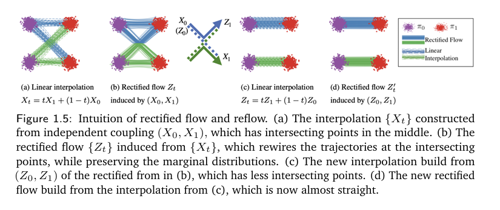

* TOC
{:toc}

## Rectified Flow
We approximate the linear interpolated process $\{X_t\}$ by defining an ODE process as follows:

$$
\frac{dZ_t}{dt} = v_t^*(Z_t)
$$

where 

$$
v^*_t(x) = \mathbb{E}\left[X_1 - X_0 \, \lvert \, X_t = x \right], \text{ and } Z_0 = X_0
$$

This defines an ODE process (a flow) which is closest to the linear interpolated process. Now, we need to answer two questions:

1. **Marginals Matching:** Is the distribution of $Z_1$ the same as the distribution of $X_1$, that is $p^*$? We can prove this by using the Fokker-Planck equation.
2. **Straightness:** Does the rectified flow be straight? The process $\{X_t\}$ was straight, but is it maintained after rectification? We get a flow that is not completely linear. But it is guaranteed to become more linear if we repeat this procedure of interpolation and rectification many times. With every iteration, the straightness is guaranteed to increase.

<figure markdown="0" class="figure zoomable">

</figure>

At times, if we are unlucky, when we interpolate between $Z_0$ and $Z_1$, we may again get back the plot in (a). 

## Marginals Matching

We can even prove that with this design of velocity field, the marginal distribution of $\{Z_t\}$, i.e., the distribution of $\{Z_{0.1}, Z_{0.2}, \dots, Z_1\}$ is exactly the same as the marginal distributions of $\{X_t\}$, that is, $\{X_{0.1}, X_{0.2}, \dots, X_1\}$, at every time $t$.

Let the marginal distributions of $\{X_t\}$ be $p_t$, and the marginal distributions of $\{Z_t\}$ be $q_t$. We want to show $p_1 = q_1$. But we end up showing $p_t = q_t$ for all $t \in [0,1]$.

