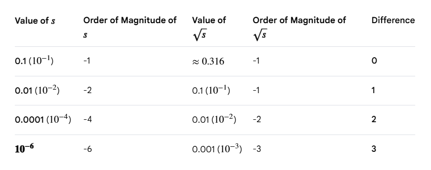

* TOC
{:toc}

## Leibniz's Rule
If we have an integral where the limits of integration are constants, i.e., independent of the variable with which we are taking the derivative, then we can swap the integral and the derivative.

$$
F(t) = \int_{a}^b f(x,t) \, dx
$$

And we are interested in:

$$
\frac{dF(t)}{dt} = \frac{d}{dt} \int_{a}^b f(x,t) \, dx
$$

We can move the derivative inside the integral:

$$
\frac{dF(t)}{dt} = \int_{a}^b \frac{\partial}{\partial t}  f(x,t) \, dx
$$

Both $f(x,t)$ and $\frac{\partial f(x,t)}{\partial t}$ must be continuous in the region of interest (for $x \in [a,b]$ and $t$ in some interval).

## Order of Magnitude
An order of magnitude is an exponential change of plus or minus 1 in the power of 10. One order of magnitude difference between two numbers means one number is roughly 10 times larger or smaller than the another.

To find the order of magnitude of a number, we generally express it in scientific notation: $A \times 10^n$, where $1 \leq A \leq 10$ and $n$ is an integer. The exponent $n$ is considered as the order of magnitude. For example, the order of magnitude of $4,500 = 4.5 \times 10^3$ is 3.

The Scientific/Rounding Rule: For more precise estimation, if the multiplier $A$ is greater than the square root of 10 ($\sqrt{10} \approx 3.16$), we round up, making the order of magnitude $n+1$.

* Example 1: $200 = 2 \times 10^2$. Since $2 < 3.16$, the order of magnitude is 2.

* Example 1: $800 = 8 \times 10^2$. Since $8 > 3.16$, the order of magnitude is 3.

A fly (1 cm) and a truck (10 m) are three orders of magnitude apart because the truck is ($1,000$ which is $10^3$) times longer.

In scientific terms, the difference in order of magnitude between two quantities $A$ and $B$  is found using the common logarithm of their ratio:

$$
\text{difference} = \log_{10} \left( \frac{A}{B} \right)
$$

The order of magnitude difference between $s$ and $\sqrt{s}$ where $0 < s < 1$ is:

$$
\text{difference} = \log_{10} \left( \frac{\sqrt{s}}{s} \right) = \log_{10}(s^{-\frac{1}{2}}) = - \frac{1}{2} \log_{10} (s)
$$

Since $s$ is between 0 and 1, $\log_{10} (s)$ is a negative number. This means as $s$ gets smaller, the order of magnitude difference increases.

<figure markdown="0" class="figure zoomable">
<figcaption>
  <strong>Figure 1.</strong> Order of magnitude difference between $s$ and $\sqrt{s}$
  </figcaption>
</figure>

For every two orders of magnitude that $s$ decreases, the difference between $s$ and $\sqrt{s}$ increases by one order of magnitude.

* Interchanging expectation and derivative

## Questions
1. How neural ODE is trained to learn $v_t(x_t)$ to transform $p_0$ to $p^*$?
